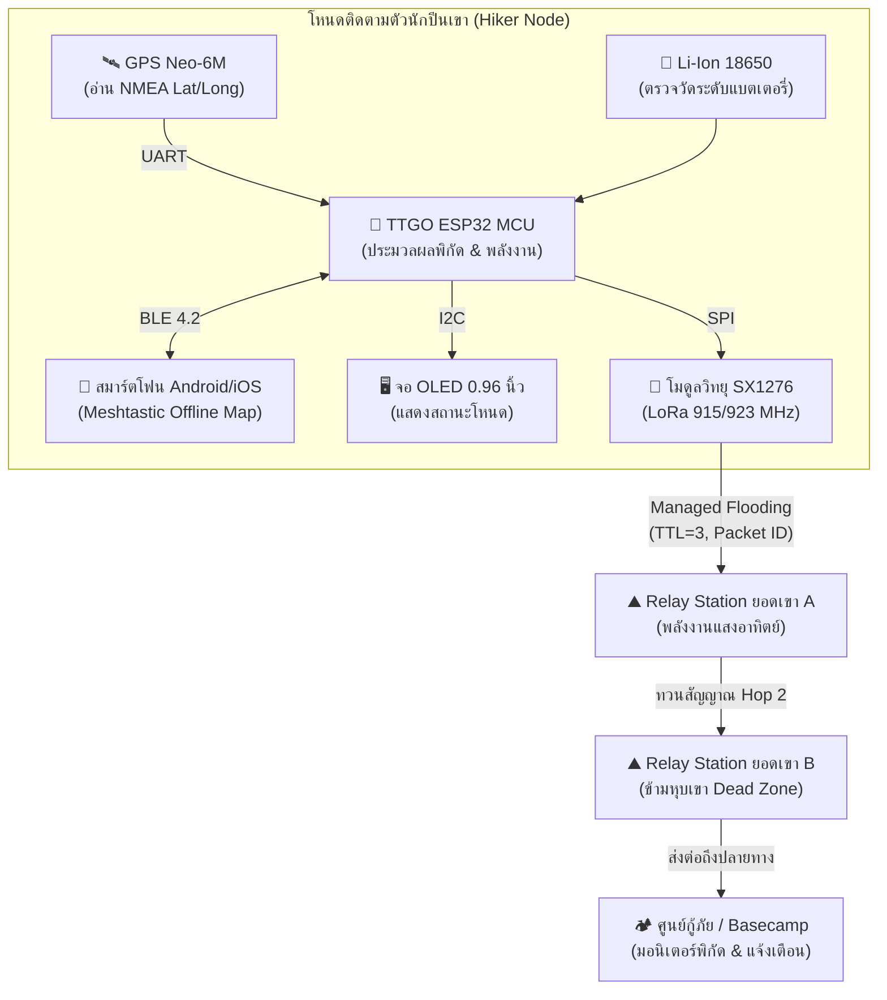

# 📄 สรุปเอกสาร: LoRa Mesh-Based IoT GPS Tracking System for Mountain Climbers

* **ไฟล์ต้นฉบับ:** [`LoRa Mesh-Based IoT.pdf`](file:///e:/file/ProjectLoRa/LoRa%20Mesh-Based%20IoT.pdf)
* **ตีพิมพ์ใน:** International Journal of Safety and Security Engineering (Vol. 14, No. 6, ธันวาคม 2024)
* **กลุ่มผู้วิจัย:** Muladi, Hisyam Wijaya, Singgih Dwi Prasetyo et al. (State University of Malang, อินโดนีเซีย & UTHM มาเลเซีย)

---

## 🖼️ ภาพรวมสถาปัตยกรรมระบบ (System Architecture Overview)

---

## 1. ปัญหาและวัตถุประสงค์ (Problem Statement & Objectives)
* **ปัญหา:** อุบัติเหตุในหมู่นักปีนเขา (หลงป่า, ภาวะอุณหภูมิร่างกายต่ำ/Hypothermia) สูงขึ้นอย่างต่อเนื่อง การกู้ภัยล่าช้าเพราะพื้นที่ภูเขาไม่มีสัญญาณโทรศัพท์มือถือ (Cellular Dead Zone)
* **วัตถุประสงค์:** พัฒนาระบบติดตามพิกัด GPS และส่งข้อความฉุกเฉินสำหรับนักปีนเขาด้วยเครือข่าย **LoRa Mesh Network** โดยใช้ซอฟต์แวร์โอเพนซอร์ส **Meshtastic** ร่วมกับสมาร์ตโฟนผ่านบลูทูธ โดยไม่ต้องพึ่งสัญญาณอินเทอร์เน็ตหรือเสามือถือ

---

## 2. โครงสร้างฮาร์ดแวร์และสถาปัตยกรรม (Hardware & Architecture)
แต่ละโหนดถูกออกแบบเป็นระบบโมดูลาร์ 3 ส่วน:
1. **Input:** โมดูล GPS Neo-6M (อ่านค่า NMEA sentences เช่น `$GPGGA`, `$GPRMC` แปลงเป็น Decimal Degree และตรวจ Fix Status)
2. **Processing:** บอร์ด **TTGO ESP32 LoRa** (จัดการ Data Acquisition, แพ็กเก็ตข้อมูล, สถานะแบตเตอรี่ และสื่อสารผ่าน Bluetooth BLE ไปยังแอปบนมือถือ)
3. **Output / RF:** โมดูลรับ-ส่งวิทยุ **SX1276 (915 MHz)** และหน้าจอ OLED แสดงสถานะ
4. **Power:** แบตเตอรี่ Li-Ion 18650 พร้อมวงจรควบคุมการชาร์จ

---

## 3. โปรโตคอลการสื่อสาร (Communication Protocol: Meshtastic)
* **รูปแบบการส่งข้อมูล:** ใช้แนวคิด **Managed Flooding / Flood Routing** (อ้างอิงหลักการของ DSR - Dynamic Source Routing และ AODV):
  * ข้อมูลถูกส่งออกเป็นระยะทุกๆ **5 นาที** (พิกัด GPS + ข้อความ + สถานะแบตเตอรี่)
  * โหนดทุกโหนดทำหน้าที่เป็นทั้งตัวรับ ตัวส่ง และตัวทวนสัญญาณ (Transmitter, Receiver, and Relay)
  * **Duplicate Prevention:** แต่ละโหนดตรวจสอบรหัสแพ็กเก็ตที่ได้รับ หากเคยได้รับและส่งต่อไปแล้วจะไม่ส่งซ้ำ เพื่อประหยัดแบนด์วิดท์และลดความแออัด
  * **Time-to-Live (TTL):** กำหนดอายุจำนวน Hop ของแพ็กเก็ตเพื่อไม่ให้ข้อมูลวิ่งวนไม่รู้จบ
  * **Acknowledgments (ACK):** มีกลไกตอบรับ หากส่งไม่สำเร็จจะพยายามส่งซ้ำอัตโนมัติ

---

## 4. ผลการทดสอบเชิงประจักษ์ (Empirical Results)
ผู้วิจัยได้ทำการทดสอบใน 2 สภาพแวดล้อมจริง:

### 4.1 สภาวะไม่มีสิ่งกีดขวาง (Line-of-Sight: LOS) — ทะเลทรายภูเขาไฟ Bromo
* **ระยะทางที่เสถียร:** สูงสุดประมาณ **1 กิโลเมตร (1,000 เมตร)**
* **Packet Loss:** 
  * 0–600 เมตร: Packet Loss = 0%
  * 700 เมตร: เริ่มพบ Loss เล็กน้อยเฉลี่ย 2.5%
  * 1,000 เมตร: Loss พุ่งขึ้นเป็น 25% (RSSI ตกไปที่ -133 ถึง -143 dBm)
* **ความหน่วง (Delay):** เพิ่มขึ้นตามระยะทาง จาก 5.5 วินาที (ที่ 0 เมตร) ไปเป็น 13.75 วินาที (ที่ 1,000 เมตร)

### 4.2 สภาวะมีสิ่งกีดขวาง (Non-Line-of-Sight: NLOS) — ในมหาวิทยาลัย Malang
* **ระยะทางที่เสถียร:** ไม่เกิน **500 เมตร** (เกินกว่านั้นสัญญาณดรอปอย่างรวดเร็วเนื่องจากอาคารและต้นไม้)
* **ความแปรปรวนของ RSSI:** ที่ระยะเกิน 200 เมตร RSSI เกิดความผันผวนสูงมาก ส่งผลให้ Packet Loss พุ่งขึ้นถึง 16.25% – 17.5% ที่ระยะ 300–400 เมตร
* **การแก้ปัญหาด้วย Relay:** เมื่อวางโหนดทวนสัญญาณขั้นกลาง (เช่น วางสถานี Relay ไว้ที่ 300–400 เมตร) พบว่าลด Packet Loss จาก 17.5% กลับลงมาเหลือเกือบ 0% ได้ทันที

---

## 5. จุดเด่นและข้อจำกัด (Pros & Cons)
* **จุดเด่น:**
  * ติดตั้งง่ายมาก ใช้งานร่วมกับแอปพลิเคชัน Meshtastic บน Android/iOS ได้ทันที
  * มีแผนที่ Offline บนมือถือช่วยนำทาง
  * โหนดไม่ต้องมีการตั้งค่า Routing Table ล่วงหน้า เชื่อมต่อกันแบบ Ad-hoc ได้ทันที
* **ข้อจำกัด:**
  * การใช้ Flooding Routing สิ้นเปลืองช่องสัญญาณ หากมีอุปกรณ์หลายสิบตัวในพื้นที่เดียวกัน จะเกิดปัญหาคลื่นชนกันรุนแรง (Broadcast Storm)
  * ใช้ค่า Spreading Factor (SF) และกำลังส่งแบบคงที่ ยังไม่มีการปรับค่าตามสภาพแวดล้อมอัตโนมัติ
  * สิ้นเปลืองแบตเตอรี่ในโหนด Relay เพราะต้องเปิดภาครับรอเกือบตลอดเวลา

---

## 6. แนวทางต่อยอดจากเอกสารฉบับนี้
1. พัฒนาปุ่มกดฉุกเฉิน (Dedicated SOS Button) พร้อมส่งเสียงเตือน/พิกัดกระพริบแบบ High-Priority
2. ปรับอัลกอริทึมการปรับกำลังส่ง (Tx Power) และ SF ตามสภาพแวดล้อม (Adaptive SF) แทนการใช้ค่าคงที่
3. เพิ่มเซ็นเซอร์ตรวจสภาพอากาศ (อุณหภูมิ, ความชื้น, ความกดอากาศ Barometric) เพื่อเตือนภัยพายุล่วงหน้า
