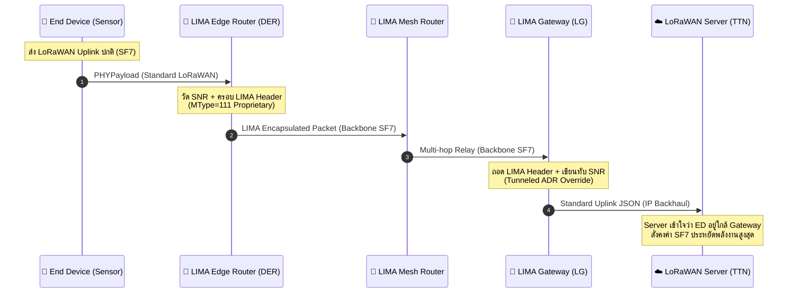

# 📄 สรุปเอกสาร: Mesh Augmentation of LoRaWAN-based IoT Networks (LIMA)

* **ไฟล์ต้นฉบับ:** [`Mesh Augmentation of LoRaWAN-based.pdf`](file:///e:/file/ProjectLoRa/Mesh%20Augmentation%20of%20LoRaWAN-based.pdf)
* **เผยแพร่เมื่อ:** arXiv (พฤศจิกายน 2025)
* **กลุ่มผู้วิจัย:** Ram Ramanathan (NLytica / อดีต goTenna), Dmitrii Dugaev (goTenna), Liang Tang (Meta), Warren Ramanathan (Raman Labs)

---

## 🖼️ ภาพรวมสถาปัตยกรรมระบบ (System Architecture Overview)

---

## 1. ที่มาและปัญหาของ LoRaWAN แบบดั้งเดิม
* **สถาปัตยกรรมเดิม (Star-of-Stars):** ทุกโหนดเซ็นเซอร์ (End Device: ED) ต้องคุยตรงกับ Gateway (GW) แบบ Single-hop เท่านั้น
* **ข้อจำกัดรุนแรง 2 ประการ:**
  1. **ระยะทางจำกัด & ปัญหาจุดอับสัญญาณ:** หากเซ็นเซอร์อยู่ในป่า เหมือง หรือจุดอับคลื่น จำเป็นต้องตั้ง Gateway เพิ่ม ซึ่งมีราคาแพงและต้องมีทั้งไฟฟ้าและอินเทอร์เน็ต Backhaul (Cellular/Fiber)
  2. **กินไฟมหาศาลเมื่ออยู่ไกล:** โหนดที่อยู่ไกล Gateway จะถูกบังคับให้ใช้ Spreading Factor สูง เช่น SF12 ซึ่งกินพลังงานต่อบิตมากกว่า SF7 ถึง **20 เท่า** และทำให้เกิด Packet Collision ในระบบสูงขึ้น
* **ข้อจำกัดของมาตรฐานทางการ (LoRaWAN Relay TS011):** รองรับการทวนสัญญาณเพียง **1 Hop เท่านั้น**, จำกัดโหนดลูกไม่เกิน 16 ตัว และต้องแก้ไขเฟิร์มแวร์ทั้งตัวลูกและ Network Server

---

## 2. หัวใจของนวัตกรรม: โปรโตคอล LIMA
LIMA เป็นโปรโตคอล **Multi-hop Mesh แบบโปร่งใส (Transparent Mesh Overlay)** ที่ทำงานร่วมกับมาตรฐาน LoRaWAN เดิมได้ 100% โดย:
* **ไม่ต้องแก้ไขโค้ดที่ End Device (เซ็นเซอร์เดิมซื้อมาใช้ได้เลย)**
* **ไม่ต้องแก้ไข The Things Network (TTN) หรือ ChirpStack Server**
* **ขยายการทวนสัญญาณได้หลาย Hop (Multi-hop Unconstrained)**

---

## 3. กลไกการทำงานหลัก 6 ฟังก์ชัน (Key Technical Mechanisms)

### 3.1 การห่อหุ้มแพ็กเก็ต (Header Encapsulation)
* LIMA Router เพิ่ม Header ขนาด 9–11 ไบต์ ครอบลงบน PHYPayload เดิม
* ตั้งค่าบิต **MType = `111`** ซึ่งเป็นค่า "Proprietary" ตามมาตรฐาน LoRaWAN เพื่อให้อุปกรณ์เซ็นเซอร์ทั่วไปที่ไม่ใช่ LIMA ทิ้งแพ็กเก็ตนี้ทันที ไม่เกิดการกวนการทำงาน
* ลดขนาด Payload ที่ส่งได้ลง 11 ไบต์ (ซึ่งปกติข้อมูล IoT ส่งเพียง 10–50 ไบต์ จึงไม่มีผลกระทบในทางปฏิบัติ)

### 3.2 การสร้างเส้นทางแบบย้อนกลับ (Reverse Path Forwarding: RPF)
* **Uplink Route:** Gateway (LG) จะบรอดแคสต์ Route Establishment Messages (REM) เป็นระยะ โหนด Router (LR) จะบันทึก Next-hop โดยเลือกเส้นทางที่มีค่า Cost ต่ำสุด (คำนวณจาก `-RSSI`)
* **Downlink Route:** ถูกสร้างขึ้นย้อนกลับโดยอัตโนมัติเมื่อมีแพ็กเก็ต Uplink ของ ED ส่งผ่านมา

### 3.3 การเลือก Designated Edge Router (DER)
* เมื่อเซ็นเซอร์ส่งข้อมูล Router หลายตัวในละแวกนั้นอาจได้ยินพร้อมกัน เพื่อไม่ให้ Router ทุกตัวแย่งกัน Relay ขึ้น Gateway จึงมีระบบ **Stagger Relaying**:
  * แต่ละตัวสุ่มรอเวลา 0–500 ms ก่อนส่ง
  * หากโหนดตัวหนึ่งได้ยินโหนดเพื่อนบ้านส่งไปก่อนด้วยค่า **SNR ที่สูงกว่า** โหนดตัวเองจะยกเลิกการส่งและถอนตัวจากการเป็น DER ทันที (ป้องกัน Broadcast Storm)

### 3.4 Tunneled Adaptive Data Rate (Tunneled ADR)
* ถือเป็นหมัดเด็ดของ LIMA: ปกติ Gateway จะส่งค่า SNR ระหว่าง ED กับ Gateway ไปให้ Network Server ซึ่งถ้าอยู่ไกล Server จะสั่งให้ ED เร่งเป็น SF12
* แต่ใน LIMA ตัว LR ตัวแรกจะวัดค่า SNR ระหว่าง ED กับ LR (ซึ่งอยู่ใกล้กันมาก) แล้วใส่ลงใน LIMA Header แอบส่งไปยัง Gateway เพื่อให้ Gateway **เขียนทับ (Override) Metadata** ก่อนส่งให้ Server
* ผลลัพธ์: Server เข้าใจว่า ED อยู่ใกล้ Gateway จึงสั่งให้ ED ใช้ **SF7 และกำลังส่งต่ำสุด** ช่วยประหยัดแบตเตอรี่เซ็นเซอร์ปลายทางได้มหาศาล

### 3.5 รายชื่อห้ามส่งต่อ (Do Not Forward - DNoF List)
* หากเซ็นเซอร์ตัวใดสามารถส่งถึง Gateway หลักได้โดยตรงด้วย SF7 อยู่แล้ว Gateway จะแจ้งชื่อ (DevAddr) ลงในลิสต์ DNoF ผ่าน REM เพื่อให้ Router ตัวอื่นๆ เมินเฉย ไม่ต้องช่วย Relay ให้เปลืองช่องสัญญาณ

### 3.6 การบริหารเวลา Downlink Receive Window (Class A Management)
* อุปกรณ์ LoRaWAN Class A จะเปิดภาครับเพื่อรอรับข้อมูลจาก Server เพียง 2 หน้าต่างสั้นๆ คือ **RX1 (หลังส่ง 1 วินาที)** และ **RX2 (หลังส่ง 2 วินาที)**
* การส่งแบบ Multi-hop อาจทำให้ข้อความ Downlink วิ่งมาไม่ทัน LIMA แก้ไขโดยให้ Router ทุกตัวส่งข้อมูลใน Backbone ด้วย **SF7 Standard Transmission Profile (STP)** ซึ่งใช้เวลาเดินทางเพียง 97 ms ต่อ Hop (รองรับได้ถึง 8 Hops ใน RX1 และ 16 Hops ใน RX2) โดย Router ตัวสุดท้ายจะเก็บเข้าคิวและยิงสัญญาณให้ตรงจังหวะ RX พอดี

---

## 4. ผลการทดสอบและประสิทธิภาพ (Evaluation Results)

### 4.1 การจำลองบน Network Simulator 3 (ns-3)
* **อัตราการส่งข้อมูลสำเร็จ (PDR):** ที่ 100 โหนด LIMA มี PDR สูงกว่า LoRaWAN เดิมมากกว่า **5 เท่า** (LoRaWAN เดิม PDR ตกเหลือต่ำกว่า 20% เนื่องจากระยะทางหลุดขอบสัญญาณ)
* **การประหยัดพลังงานของโหนด (Energy per ED):** ประหยัดพลังงานได้มากกว่าเดิม **4 ถึง 12.6 เท่า**
* **ความจุของระบบ (Scalability):** รองรับจำนวนโหนดได้มากกว่าเดิมถึง **8 เท่า** ที่เกณฑ์ PDR 85%
* **ความหน่วง (Latency):** ลดลง **2.3 เท่า** เพราะการส่ง SF7 สั้นกว่า SF12 มาก (Airtime ของแพ็กเก็ต 40 ไบต์: SF7 ใช้ ~100 ms เทียบกับ SF12 ใช้ ~2,500 ms)

### 4.2 การทดสอบฮาร์ดแวร์ต้นแบบจริง (Prototype Testbed)
* **อุปกรณ์:** Dragino LSN50v2 Sensor + โมดูล Seeed Studio WM1302 (ชิป SX1302 Baseband) ต่อกับ Raspberry Pi HAT + The Things Network (TTN)
* **การทดสอบในห้องแล็บ (RF Attenuation):** LoRaWAN ปกติรับการลดทอนสัญญาณได้ 120 dB แต่เมื่อมี LIMA รองรับการลดทอนรวมได้ถึง **200 dB**
* **การทดสอบภาคสนาม (ย่าน Brooklyn, New York):** ขยายระยะทางได้ 2 เท่า และลดกำลังส่งของเซ็นเซอร์ลงได้ถึง 12 dBm

---

## 5. จุดเด่นและข้อจำกัดสำหรับการนำไปใช้
* **จุดเด่น:** เข้ากันได้กับ Ecosystem ของ LoRaWAN ทั้งหมด, ประหยัดพลังงาน End-node สูงสุด, มีการควบคุมการชนของคลื่นอย่างเป็นระบบ
* **ข้อจำกัด:** 
  * ใช้กับ Data Rate ต่ำสุดอย่าง DR-0 (US SF10 / EU SF12 ในบางภูมิภาค) ไม่ได้เนื่องจาก Header กินที่ 11 ไบต์
  * เครือข่าย Router ต้องมีความหนาแน่นเพียงพอที่จะรักษาลิงก์ Backbone ที่ SF7 ได้ตลอดสาย
