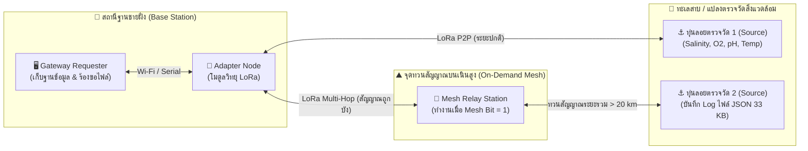
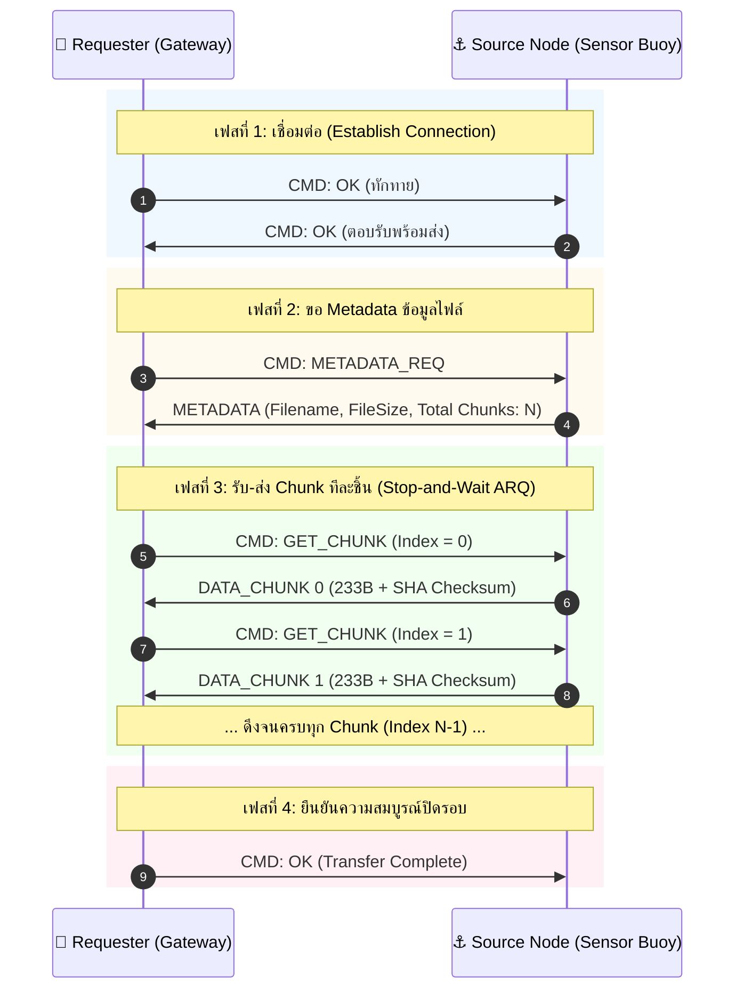

# 📄 สรุปเอกสาร: AlLoRa (Advanced Layer LoRa) for Environmental Intelligence

* **ไฟล์ต้นฉบับ:** [`1-s2.0-S0140366424000641-main_copy.pdf`](file:///e:/file/ProjectLoRa/1-s2.0-S0140366424000641-main_copy.pdf)
* **ตีพิมพ์ใน:** Computer Communications (Elsevier, Vol. 218, กุมภาพันธ์ 2024)
* **กลุ่มผู้วิจัย:** Benjamín Arratia, Erika Rosas, Carlos T. Calafate, Pietro Manzoni et al. (Universitat Politècnica de València, สเปน)
* **ซอร์สโค้ดโอเพนซอร์ส:** [GitHub SMARTLAGOON/AlLoRa](https://github.com/SMARTLAGOON/AlLoRa) (GPL-3.0)

---

## 🖼️ ภาพรวมสถาปัตยกรรมระบบ (System Architecture Overview)

---

## 1. ที่มาและวัตถุประสงค์ของโปรเจกต์
* **โครงการ:** SMARTLAGOON พัฒนาแบบจำลองดิจิทัล (Digital Twin) เพื่อเฝ้าระวังวิกฤตสิ่งแวดล้อมในทะเลสาบน้ำเค็ม Mar Menor ประเทศสเปน (พื้นที่กว่า 135 ตร.กม.)
* **ปัญหาของ LoRaWAN เดิม:** LoRaWAN ออกแบบมาเพื่อส่งข้อมูลขนาดเล็กเป็นครั้งคราว แต่ระบบเฝ้าระวังสิ่งแวดล้อมต้องการดึงข้อมูลประวัติการวัด (Data Logger) ที่มีขนาดก้อนใหญ่ (เช่น ไฟล์ JSON ขนาด 33 KB) ข้ามระยะทางไกล หากใช้ LoRaWAN ทั่วไปจะต้องเขียนโค้ดตัดแบ่งชิ้นส่วน (Fragmentation) และประกอบใหม่เองทั้งหมด ซึ่งซับซ้อนและไม่มีโปรโตคอลยืนยันระดับไฟล์
* **เป้าหมาย:** สร้างโปรโตคอล **AlLoRa** ที่รองรับการส่งเนื้อหาแบบไฟล์ (Content Transfer) ระดับกิโลไบต์ถึงเมกะไบต์ พร้อมระบบทวนสัญญาณแบบ **On-Demand Mesh** เมื่อสัญญาณขาดหาย

---

## 2. สถาปัตยกรรมและโครงสร้างโปรโตคอล (AlLoRa Architecture)
AlLoRa ทำงานบนพื้นฐาน **Half-duplex Stop-and-Wait ARQ** โดยแบ่งบทบาทของโหนดออกเป็น:
* **Source Node:** โหนดต้นทางที่มีเซ็นเซอร์หรือไฟล์ (เช่น ทุ่นตรวจวัดคุณภาพน้ำ)
* **Requester / Gateway Node:** โหนดปลายทางหรือสถานีฐานที่คอยยิงคำสั่งขอข้อมูล
* **Adapter Node:** โหนดสะพานเชื่อมอุปกรณ์ที่ไม่มี LoRa ในตัว (เช่น รับข้อมูลจาก Gateway ผ่าน Wi-Fi/Serial แล้วส่งออกด้วย LoRa)

### โครงสร้างแพ็กเก็ต (Packet Structure - สูงสุด 255 ไบต์)
* **Header รวม 20 ไบต์:**
  * Source MAC (8 Bytes)
  * Destination MAC (8 Bytes)
  * Flag Byte (1 Byte): ใช้ระบุคำสั่งและฟังก์ชันพิเศษ
  * Checksum (3 Bytes): สกัดมาจาก 3 ไบต์ท้ายสุดของรหัสแฮช **SHA-256**
  * Message ID (2 Bytes เฉพาะในโหมด Mesh): สุ่มค่าเพื่อตรวจจับและป้องกันการส่งซ้ำ
* **Payload ที่เหลือสำหรับข้อมูล:**
  * โหมด Point-to-Point: **235 ไบต์ต่อแพ็กเก็ต**
  * โหมด Mesh: **233 ไบต์ต่อแพ็กเก็ต**

### รายละเอียด Flag Byte (8 บิต)
| บิตที่ | ชื่อบิต | หน้าที่ |
| :---: | :--- | :--- |
| **0–1** | `Command bits` | รหัสคำสั่ง: `00` (DATA), `01` (OK), `10` (CHUNK), `11` (METADATA) |
| **2** | `Mesh bit` | สั่งเปิดโหมดทวนสัญญาณ (Forwarding) |
| **3** | `Sleep bit` | สั่งให้โหนดหน่วงเวลาสุ่ม (0.1–0.5s) ก่อน Forward เพื่อเลี่ยงการชนกัน |
| **4** | `Hop bit` | แจ้งให้ปลายทางทราบว่าแพ็กเก็ตนี้เดินทางผ่านการ Relay มา |
| **5** | `Debug hop bit` | โหมดพิเศษสำหรับบันทึกประวัติเส้นทาง (RSSI, Wait time) ลงใน Payload |
| **6** | `Change SF bit` | แจ้งขอสลับค่า Spreading Factor (SF) ทางไกล |
| **7** | *Reserved* | สำรองไว้สำหรับการพัฒนาในอนาคต |

---

## 3. ขั้นตอนการทำงานและโหมด Mesh (Communication Flow)

### 3.1 วงรอบการส่งไฟล์ 4 ขั้นตอน (Content Transfer Phases)
1. **Establish Connection:** Requester ส่งคำสั่ง `OK` ไปทักทาย Source รอจนกว่าจะมี `OK` ตอบกลับ
2. **Ask for Metadata:** Requester ขอชื่อไฟล์และจำนวน Chunk ทั้งหมด แล้วสร้างอ็อบเจกต์ไฟล์เปล่ารอไว้
3. **Ask for Data:** Requester ร้องขอ Chunk หมายเลข $0, 1, 2, ... n-1$ ทีละชิ้นแบบ Stop-and-Wait เมื่อได้รับครบจะประกอบไฟล์คืนรูปเดิม
4. **Final Acknowledgment:** ส่ง `OK` เพื่อยืนยันว่าได้รับไฟล์สมบูรณ์และปิดรอบการสื่อสาร

### 3.2 กลไก On-Demand Mesh

* ในสภาวะปกติ ระบบจะคุยกันแบบ **Point-to-Point (ประหยัดพลังงานที่สุด)**
* หาก Gateway ส่งคำขอไปแล้วไม่ได้รับการตอบกลับตามจำนวนครั้งที่ตั้งไว้ (Timeout) Gateway จะเปิดใช้งาน **`Mesh bit`** ในแพ็กเก็ต
* โหนดรอบข้างที่ได้ยินแพ็กเก็ตที่มี `Mesh bit` จะทำหน้าที่เป็น Forwarder นำแพ็กเก็ตไปส่งต่อให้โหนดปลายทาง
* **การป้องกันคลื่นชนกันและการส่งซ้ำ:**
  * โหนดจะสุ่มหน่วงเวลา (Random Delay 0.1–0.5 วินาที) ก่อน Relay
  * ใช้คิวจำประวัติ Message ID สองระดับ (คิวข้อความที่ได้รับ + ลิสต์ข้อความที่ Forward ไปแล้ว) เพื่อไม่ให้ Forward ข้อความเดิมซ้ำ

### 3.3 ฟังก์ชันขั้นสูง (Additional Services)
1. **Dynamic SF Change:** Gateway สามารถสั่งให้ Source Node เปลี่ยนค่า SF ผ่านสัญญาณวิทยุได้ โดยมีระบบ **Safe Fallback** ลองทดสอบสื่อสาร 3 ครั้ง หากไม่สำเร็จจะดึงกลับไปใช้ค่า SF เดิม เพื่อป้องกันโหนดหลุดการเชื่อมต่อถาวร
2. **Debug Mesh Mode:** เปิดบิต Debug เพื่อให้โหนด Router แต่ละตัวเขียนชื่อและค่า RSSI ทับลงใน Payload ทำให้ Gateway วาดแผนที่เส้นทาง (Topology Map) ได้แบบ Real-time

---

## 4. ผลการทดสอบเชิงประจักษ์ (Empirical Results)

### 4.1 ความเร็วและการใช้พลังงาน
* **Throughput:**
  * **SF7:** ความเร็วประมาณ **2 kbps (256 Byte/s)** — ส่งข้อมูล 1 KB ใช้เวลาเพียง 4 วินาที, กินพลังงาน $339\ \mu\text{Wh}$
  * **SF11:** ความเร็วลดลงเหลือ **300 bps (38 Byte/s)** — ส่งข้อมูล 1 KB ใช้เวลา 27 วินาที, กินพลังงาน $3.52\ \text{mWh}$ (กินไฟเพิ่มขึ้น ~10 เท่า)
* **ตัวอย่างจริง:** ข้อมูล Log ขนาด 33 KB จากทุ่นทะเลสาบ ใช้เวลาส่งเฉลี่ย 100 วินาที ที่ SF7

### 4.2 การทดสอบระยะทางและโหมด Mesh
* **ระยะส่งตรง Point-to-Point:** ทำได้ไกลถึง **11.69 กิโลเมตร** ในทะเลสาบ Mar Menor และ **8.4 กิโลเมตร** ในป่าทะเลสาบ Erken (สวีเดน)
* **การทดสอบ Multi-hop Mesh ทะลุสิ่งกีดขวาง:**
  * ตัดลิงก์ตรงระหว่าง Gateway บนฝั่งกับทุ่นลอยในทะเล
  * วางโหนด Relay A ไว้บนยอดเขาสูง 65 เมตร ห่างจาก Gateway 14.78 กม. และห่างจากทุ่นลอย 5.5 กม.
  * ผลลัพธ์: สามารถดึงข้อมูลไฟล์จากทุ่นลอยกลับมายัง Gateway ได้สำเร็จผ่านเส้นทางรวม **20.33 กิโลเมตร**

---

## 5. จุดเด่นและข้อสังเกต
* **จุดเด่น:** มีระบบจัดการไฟล์และชิ้นส่วนข้อมูล (Chunking) ในตัวที่แข็งแกร่งมาก, สลับเข้า Mesh เมื่อจำเป็นเท่านั้น, ป้องกันโหนดค้างด้วย Fallback SF
* **ข้อจำกัด:** 
  * ใช้สถาปัตยกรรมแบบ **Centralized Polling (Request-Reply)** ทำให้โหนดเซ็นเซอร์ไม่สามารถส่งข้อความแจ้งเตือนขึ้นมาเองได้ทันที (ต้องรอให้ Gateway ร้องขอก่อน)
  * ใช้ Single-channel LoRa Gateway ในต้นแบบ ทำให้ยังรองรับโหนดพร้อมกันได้ไม่มากนัก
