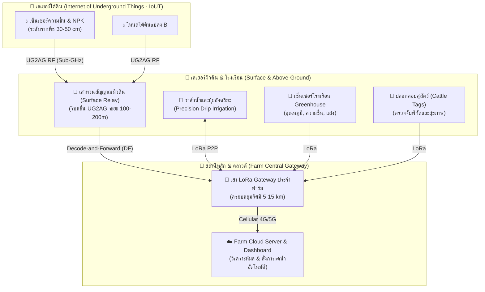

# 📄 สรุปเอกสาร: LoRa Communication for Agriculture 4.0: Opportunities, Challenges, and Future Directions

* **ไฟล์ต้นฉบับ:** [`LoRa Communication for Agriculture.pdf`](file:///e:/file/ProjectLoRa/LoRa%20Communication%20for%20Agriculture.pdf)
* **ตีพิมพ์ใน:** IEEE Internet of Things Journal (Vol. 12, No. 2, มกราคม 2025)
* **กลุ่มผู้วิจัย:** Lameya Aldhaheri, Ruhul Amin Khalil, Nasir Saeed (UAEU), Mohamed-Slim Alouini (KAUST) et al.

---

## 🖼️ ภาพรวมสถาปัตยกรรมระบบ (System Architecture Overview)


---

## 1. ภาพรวมและขอบเขตของบทความวิจัย (Survey Overview)
บทความนี้เป็น **Systematic Survey ระดับเรือธง (Flagship Review)** ที่สำรวจเทคโนโลยี LoRa และ LoRaWAN ในบริบทของการเกษตรอัจฉริยะ (Agriculture 4.0) โดยเจาะลึกตั้งแต่คุณสมบัติคลื่นแม่เหล็กไฟฟ้าระดับ Physical Layer (PHY), โมเดลช่องสัญญาณดิน (Underground Channel), โปรโตคอลการหาเส้นทางและการทวนสัญญาณ (Relaying & Routing), ไปจนถึงการบูรณาการปัญญาประดิษฐ์ (AI/ML) และเทคโนโลยีแห่งอนาคต

---

## 2. เจาะลึกเลเยอร์เครือข่ายและการทวนสัญญาณ (Networking & Relaying)



### 2.1 สถาปัตยกรรมการสื่อสารแบบ Multi-hop และ Relaying

* **ปัญหา:** แปลงเกษตรขนาดใหญ่มีสิ่งกีดขวางทางธรรมชาติ (ทรงพุ่มต้นไม้, ร่องเขา, โครงสร้างโรงเรือน) ทำให้สัญญาณแบบ Single-hop เข้าไม่ถึง
* **รูปแบบการทวนสัญญาณ (Relaying Schemes):**
  1. **Decode-and-Forward (DF):** โหนด Relay จะถอดรหัส (Decode) ข้อมูลออกมาก่อน ตรวจสอบความถูกต้อง แล้วจึงเข้ารหัสส่งต่อใหม่
     * *ข้อดี:* ตัดสัญญาณรบกวน (Noise) ทิ้งไป ไม่ขยายสัญญาณกวน เหมาะอย่างยิ่งสำหรับเครือข่ายเซ็นเซอร์ดินและ Multi-hop
  2. **Amplify-and-Forward (AF):** ทำหน้าที่เสมือนตัวขยายคลื่น (Repeater) ขยายสัญญาณแล้วส่งต่อทันทีโดยไม่ถอดรหัส
     * *ข้อเสีย:* ขยายทั้งสัญญาณและ Noise ทำให้เกิดข้อผิดพลาดสะสมในระยะทางไกล
* **สมการความน่าจะเป็นของความผิดพลาด (End-to-End BER):**
  งานวิจัยระบุว่าสำหรับระบบทวนสัญญาณแบบ DF จำนวน $M+1$ Hops:
  $$P_{M+1} = \frac{1}{2} \left[1 - (1 - 2P)^{M+1}\right]$$
  *(เมื่อ $P$ คือค่า Bit Error Rate ของการส่ง Hop เดี่ยว)* — การเพิ่มจุด Relay ช่วยลดระยะห่าง $d/(M+1)$ ทำให้ SNR แต่ละช่วงสูงขึ้น ส่งผลให้ BER รวมดีกว่าการยิงตรงระยะไกล

### 2.2 นวัตกรรมระดับ MAC Layer
* **LMAC:** ใช้คุณสมบัติ Channel Activity Detection (CAD) แทน ALOHA ดั้งเดิม ช่วยตรวจสอบว่าช่องว่างจริงก่อนส่ง ลดการชนกันของสัญญาณ
* **X-MAC:** ตัวจัดตารางเวลาการส่ง (Scheduler) ที่คำนึงถึงความไม่สมบูรณ์ของความมุมฉาก (Imperfect Orthogonality) ระหว่างแต่ละ SF เพื่อจัดคิวส่งแบบ Dynamic
* **RALoRa (Rateless LoRa):** ใช้ Rateless Coding เพื่อปรับตัวตามคุณภาพลิงก์ที่แปรปรวนในแปลงเกษตร

---

## 3. โมเดลการแพร่กระจายสัญญาณใต้ดิน (Soil & Underground Channel Modeling)
หนึ่งในจุดเด่นสำคัญที่สุดของเปเปอร์นี้คือการวิเคราะห์ **IoUT (Internet of Underground Things)**:

```
[โหนดเซ็นเซอร์ใต้ดิน (UG)] ──(ดินสู่ดิน: 4–20 m)──> [โหนดทวนสัญญาณใต้ดิน]
                                                           │
                                                           ▼ (ดินสู่บนดิน: 100–200 m)
                                                   [โหนดรับบนผิวดิน (AG)]
```

* **ปัจจัยหลักที่มีผลต่อการลดทอนสัญญาณในดิน (Peplinski Model):**
  * **ความชื้นในดิน (Volumetric Water Content - VWC):** เป็นตัวแปรที่ทำให้สัญญาณดรอปมากที่สุด เมื่อความชื้นเพิ่มจาก 10% เป็น 50% Path Loss จะพุ่งขึ้นมหาศาล
  * **องค์ประกอบดิน:** ดินทราย (Sand) สัญญาณทะลุผ่านได้ดีที่สุด ให้ค่า RSSI สูงกว่าดินลูกรังหรือหินกรวด (Gravel) ถึง 10 dBm
* **ระยะทำการจริงของ LoRa ใต้ดิน:**
  * ใต้ดินสู่ใต้ดิน (UG2UG): ทำระยะได้เพียง **4 ถึง 20 เมตร**
  * ใต้ดินสู่บนดิน (UG2AG): ทำระยะได้ **100 ถึง 200 เมตร** (ที่ความถี่ 433 / 868 MHz)

---

## 4. การสื่อสารข้ามเทคโนโลยี (Cross-Technology Communication: CTC)
เปเปอร์นำเสนอเทคนิค **Hardware-free CTC** ที่ทำให้อุปกรณ์ต่างมาตรฐานคุยกันได้โดยไม่ต้องมี Gateway แปลงสัญญาณ:
* **WiLo (Wi-Fi to LoRa):** ทำให้อุปกรณ์ Wi-Fi 2.4 GHz สามารถส่งแพ็กเก็ตพิเศษที่ชิป LoRa 2.4 GHz ตรวจจับและถอดรหัสได้โดยตรง
* **LoRaBee (LoRa to ZigBee):** ทำให้อุปกรณ์ LoRa ส่งสัญญาณที่โหนด ZigBee สามารถอ่านข้อมูลผ่านค่า RSSI Sampling
* **SymBee (ZigBee to Wi-Fi):** แปลงสัญลักษณ์ของ ZigBee ส่งตรงเข้า Wi-Fi ได้ความเร็วสูงสุด 31.25 kbps

---

## 5. ตารางเปรียบเทียบเทคโนโลยีไร้สายในงานเกษตรอัจฉริยะ

| เทคโนโลยี | ย่านความถี่ | ระยะทำการ | อัตราส่งข้อมูล | การกินไฟ | ความเหมาะสมในงานเกษตร |
| :--- | :--- | :--- | :--- | :--- | :--- |
| **LoRa** | Sub-GHz (433/868/915/923 MHz) | **5–15 km** (บนดิน) / 100 m (ใต้ดิน) | 0.3–27 kbps | **ต่ำมาก** (ใช้แบตได้หลายปี) | เซ็นเซอร์ระยะไกล, วาล์วน้ำ, สภาพดิน |
| **WiFi** | 2.4 GHz / 5 GHz | 20–100 m (แบบปกติ) / 3 km (WiLD) | 11–100+ Mbps | สูง | ส่งภาพกล้องวงจรปิด, โดรนสำรวจ |
| **ZigBee** | 2.4 GHz ISM | 10–100 m (สูงสุด 1.2 km LOS) | 250 kbps | ต่ำ | โรงเรือนปิด (Greenhouse), ระยะประชิด |
| **Cellular (4G/5G)**| ลิขสิทธิ์เฉพาะค่ายมือถือ | กว้างไกลตามเสาสัญญาณ | 10–1000+ Mbps | สูง (มีค่าบริการรายเดือน) | สถานีสภาพอากาศหลัก, แพลตฟอร์ม Cloud |
| **BLE** | 2.4 GHz | 10–100 m (BLE 5 ทำได้ 400 m) | 1–2 Mbps | ต่ำมาก | ตั้งค่าอุปกรณ์เฉพาะหน้างาน, ติดตามปศุสัตว์ |

---

## 6. ทิศทางการวิจัยในอนาคต (Future Research Directions)
เปเปอร์ระบุ 10 ประเด็นวิจัยที่เปิดกว้างสำหรับนักวิจัย:
1. **LoRa-based ISAC (Integrated Sensing and Communication):** ใช้คลื่น Chirp ของ LoRa ตรวจวัดความชื้นในดินหรือสภาพพืชไปพร้อมกับการส่งข้อมูล (Communication-free Sensing)
2. **On-Device AI / TinyML:** ฝังโมเดล Machine Learning ขนาดเล็กบนโหนดเซ็นเซอร์เพื่อคัดกรองข้อมูลก่อนส่ง ประหยัด Airtime
3. **Multi-Agent Reinforcement Learning (MARL):** ใช้ AI ช่วยเลือกช่องสัญญาณและ SF ในเครือข่าย Multi-hop ขนาดใหญ่
4. **Energy Harvesting & Wake-up Radio:** นำพลังงานจากแสงอาทิตย์ แรงสั่นสะเทือนเครื่องจักรกลการเกษตร และการปลุกโหนดผ่านคลื่นเหนี่ยวนำแม่เหล็ก (Magnetic Induction)
5. **GPS-Free Localization:** หาพิกัดเซ็นเซอร์และสัตว์เลี้ยงโดยใช้เทคนิค TDoA (Time Difference of Arrival) และ ToF บน LoRa แทนการติดชิป GPS ที่กินไฟสูง
