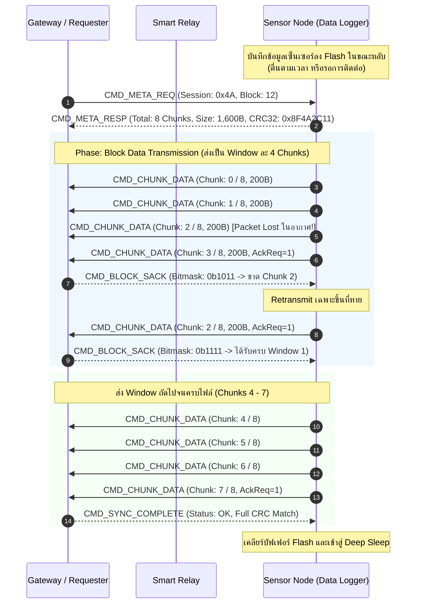

# 📦 เอกสารข้อกำหนดทางวิศวกรรม: สถาปัตยกรรมการส่งข้อมูลสะสมก้อนใหญ่ (Bulk Sensor Data Protocol แบบ AlLoRa)

* **รหัสเอกสาร:** `SPEC-05-BULK-DATA`
* **สถานะ:** Engineering Specification & Architecture Blueprint
* **เทคโนโลยีอ้างอิง:** AlLoRa (Arratia et al., Elsevier 2024), Stop-and-Wait ARQ with Block Selective-ACK
* **เป้าหมาย:** สื่อสารข้อมูลประวัติการวัด (Data Logger) ขนาดใหญ่ (1 KB – 64 KB) ข้ามโครงข่าย LoRa ในสภาวะปกติอย่างเสถียร ประหยัดพลังงาน และปลอดการชนกัน

---

## 🖼️ ภาพรวมสถาปัตยกรรมระบบ (System Architecture Overview)


---

## 1. ที่มาและความจำเป็นทางวิศวกรรม (Problem & Motivation)

```mermaid
flowchart LR
    subgraph EdgeNode["โหนดตรวจวัดภาคสนาม (Solar Data-Logger)"]
        SENS["🌡️ เซ็นเซอร์วัดค่าต่อเนื่อง<br/>(Temp, VWC, Soil NPK, Gas)"] -->|"จัดเก็บ Log"| FLASH["💾 ชิป SPI Flash / EEPROM<br/>(1 KB - 64 KB Buffer)"]
        FLASH -->|"ดึงข้อมูลเมื่อถึงรอบส่ง"| CHUNK["✂️ Dynamic Chunking Engine<br/>(ตัดแบ่งก้อนละ 200 ไบต์)"]
        CHUNK -->|"คำนวณ CRC32"| RF["📡 วิทยุ LoRa (SX1262)<br/>(ยิง Burst Window ละ 4 Chunks)"]
    end

    subgraph Channel["📶 โครงข่าย LoRa Mesh"]
        RF -->|"Chunk 0, 1, 2, 3"| MESH["🌐 LoRa Mesh Relay Nodes"]
    end

    subgraph BaseStation["🏢 สถานีฐานและเกตเวย์ (Gateway Receiver)"]
        MESH -->|"รับข้อมูลเข้าบัฟเฟอร์"| GW_BUF["📥 Reassembly Buffer"]
        GW_BUF -->|"ตรวจสอบชิ้นส่วนที่ขาด"| SACK["📋 Block Selective-ACK Generator<br/>(สร้าง Bitmask ยืนยันผล)"]
        SACK -->|"ส่ง SACK กลับ"| RF
    end
```



ในระบบตรวจวัดสิ่งแวดล้อม การเกษตรแม่นยำ และการเฝ้าระวังไฟป่า เซ็นเซอร์ส่วนใหญ่ (เช่น อุณหภูมิ, ความชื้นในดินหลายระดับความลึก, ก๊าซ CO/CO2, และภาพถ่ายความละเอียดต่ำ) ทำงานในลักษณะ **Periodic Data Logging**:
1. **ข้อจำกัดของการส่งแบบ Real-time ทุก 1 นาที:**
   * การเปิดภาครับ/ภาคส่งของวิทยุ LoRa บ่อยครั้งทำให้สูญเสียพลังงานในเฟส Warm-up และ Preamble ซ้ำซ้อน
   * กฎหมาย กสทช. ย่าน **AS923 (920–925 MHz)** ในประเทศไทยและข้อจำกัด Duty Cycle (1%) ไม่อนุญาตให้ยิงคลื่นบรอดแคสต์ต่อเนื่องตลอดเวลา
2. **แนวทางแก้ปัญหาด้วย Bulk Sensor Data (สไตล์ AlLoRa):**
   * โหนดปลายทาง (End Node) ทำการอ่านค่าเซ็นเซอร์และจัดเก็บลงในหน่วยความจำสำรอง (SPI Flash / FRAM / EEPROM) ในขณะที่ MCU เข้าสู่โหมด **Deep Sleep** (กินกระแสไฟเพียง $10–15\ \mu\text{A}$)
   * เมื่อถึงรอบเวลาเก็บเกี่ยวข้อมูล (Data Harvesting Cycle เช่น ทุก 1 หรือ 4 ชั่วโมง) หรือเมื่อสถานีฐาน (Base Station / Gateway) ร้องขอ ข้อมูลประวัติสะสมทั้งหมดจะถูกแบ่งชิ้นส่วน (Fragmentation) และส่งขึ้นมาในคราวเดียวแบบเป็นระบบ
   * มีกลไกตรวจสอบความถูกต้องระดับบล็อก (CRC-32 / Checksum) ทำให้มั่นใจได้ว่าข้อมูลย้อนหลังไม่สูญหายแม้แต่ไบต์เดียว

---


## 2. โครงสร้างแพ็กเก็ตและไบนารีเฟรม (Packet Framing Architecture)

เพื่อประสิทธิภาพสูงสุดในการใช้ Time-on-Air (ToA) เฟรมข้อมูลถูกออกแบบให้กะทัดรัด (Bit-level Header Optimization) รองรับ Payload สูงสุดของ LoRa คือ 255 ไบต์:

```
+---------------+---------------+---------------+---------------+
| Source ID(2B) |  Dest ID(2B)  | Control Byte  |  Session(1B)  |
+---------------+---------------+---------------+---------------+
|  Block ID(2B) | Chunk Idx(2B) | Total Chk(2B) | Payload Len(1)|
+---------------+---------------+---------------+---------------+
|                 Payload Data (16 - 220 Bytes)                 |
+---------------+---------------+---------------+---------------+
|                       CRC-32 / Hash (4B)                      |
+---------------+---------------+---------------+---------------+
```

### 2.1 รายละเอียดส่วนหัว (Header Field Definitions - รวม 15 ไบต์)

| ฟิลด์ข้อมูล | ขนาด | หน้าที่และรายละเอียดทางเทคนิค |
| :--- | :---: | :--- |
| `Source ID` | 2 Bytes | รหัสประจำตัวโหนดต้นทาง ($0x0001 - 0xFFFE$) |
| `Destination ID` | 2 Bytes | รหัสประจำตัวโหนดปลายทาง / Gateway ($0x0000$ คือ Base Station) |
| `Control Byte` | 1 Byte | บิตควบคุมคำสั่งและการทำงาน (ดูตารางบิตย่อยด้านล่าง) |
| `Session ID` | 1 Byte | รหัสรอบการสื่อสาร (Session Nonce) ป้องกันการตอบรับข้ามรอบ |
| `Block ID` | 2 Bytes | หมายเลขบล็อกไฟล์หรือรอบการเก็บข้อมูลสะสม |
| `Chunk Index` | 2 Bytes | ลำดับที่ของชิ้นส่วนย่อยปัจจุบัน ($0, 1, 2, ... N-1$) |
| `Total Chunks` | 2 Bytes | จำนวนชิ้นส่วนย่อยทั้งหมดในบล็อก ($N$) |
| `Payload Len` | 1 Byte | ขนาดข้อมูลจริงใน Payload ปัจจุบัน (ปกติ $128$ หรือ $200$ ไบต์) |
| `Payload Data` | แปรผัน | ข้อมูลเซ็นเซอร์ดิบที่ถูกบีบอัด (Compressed Sensor Log / CBOR / JSON) |
| `Checksum` | 4 Bytes | ค่า **CRC-32** คำนวณครอบคลุมตั้งแต่ Header จนถึง Payload |

### 2.2 โครงสร้างบิตย่อยใน `Control Byte` (8 Bits)

```
  Bit 7      Bit 6      Bit 5      Bit 4      Bit 3      Bit 2      Bit 1      Bit 0
+----------+----------+----------+----------+----------+----------+----------+----------+
| Priority | MeshMode | Reserved | AckReq   |       Command Sub-Type (4 Bits)        |
+----------+----------+----------+----------+----------+----------+----------+----------+
```

* **Bit 7 (`Priority`):** `0` = ทราฟฟิกข้อมูลปกติ (Bulk / Sensor Log), `1` = ทราฟฟิกฉุกเฉินระดับสูง (SOS Preemptive)
* **Bit 6 (`MeshMode`):** `0` = ส่งตรงแบบ Point-to-Point, `1` = ร้องขอการส่งต่อผ่าน Relay Node
* **Bit 5 (`Reserved`):** สำรองสำหรับขยายระบบ
* **Bit 4 (`AckReq`):** `1` = ต้องการแพ็กเก็ต ACK ยืนยัน, `0` = ไม่ต้องตอบ ACK (Unreliable Streaming)
* **Bit 3–0 (`Command Sub-Type`):**
  * `0x0` = `CMD_PING` (ทักทายตรวจสอบสถานะลิงก์)
  * `0x1` = `CMD_META_REQ` (ขอทราบขนาดข้อมูลและจำนวน Chunk ทั้งหมด)
  * `0x2` = `CMD_META_RESP` (ตอบกลับขนาดไฟล์, CRC รวม, ขนาดต่อ Chunk)
  * `0x3` = `CMD_CHUNK_DATA` (ส่งข้อมูลชิ้นส่วนย่อย)
  * `0x4` = `CMD_BLOCK_SACK` (Selective ACK แจ้งรายชื่อชิ้นที่ตกหล่น)
  * `0x5` = `CMD_SYNC_COMPLETE` (ปิดรอบการโอนย้ายข้อมูลสำเร็จ)

---

## 3. ขั้นตอนการทำงานและโปรโตคอลการแลกเปลี่ยนข้อมูล (Protocol Exchange Flow)

การส่งข้อมูลสะสมก้อนใหญ่ใช้กระบวนการ **Stop-and-Wait with Block Selective-ACK (SACK)** เพื่อป้องกันการติดขัดในอากาศ (Over-the-Air Congestion):



### คำอธิบายขั้นตอนการทำงาน:
1. **การเจรจาเมทาดาทา (Metadata Handshake):** Gateway สอบถามโหนดเซ็นเซอร์ โหนดจะคำนวณขนาดและตอบกลับด้วยจำนวน Chunk ทั้งหมดและค่าแฮช CRC32 ของไฟล์รวม
2. **การส่งแบบหน้าต่างบล็อก (Windowed Burst Transmission):** แทนที่จะส่ง 1 ชิ้นแล้วรอ ACK 1 ครั้งแบบ Half-duplex แบบเดิม ซึ่งช้ามาก ระบบจะส่งรวดเดียวเป็นกลุ่ม (Window Size = 4 Chunks) แล้วจึงร้องขอ SACK หนึ่งครั้ง
3. **Selective Repeat (SACK):** Gateway ตอบกลับด้วย Bitmap ข้อมูลชิ้นที่ได้รับ หากมีชิ้นที่ตกหล่น โหนดจะส่งซ่อมแซมเฉพาะ Chunk นั้น โดยไม่ต้องส่งชิ้นที่ผ่านแล้วซ้ำ
4. **ความสมบูรณ์ระดับไฟล์ (End-to-End Verification):** เมื่อได้รับ Chunk ครบ Gateway จะทำการตรวจเทียบค่า CRC32 รวมของข้อมูลทั้งหมดกับค่าใน Metadata หากตรงกันจึงส่ง `CMD_SYNC_COMPLETE` สั่งให้โหนดเข้าสู่ Deep Sleep

---

## 4. การปรับขนาดชิ้นส่วนอัตโนมัติตามคุณภาพลิงก์ (Dynamic Chunk Sizing via ADR)

ความยาวของ Payload ต่อแพ็กเก็ตจะถูกปรับแบบไดนามิกให้สอดคล้องกับค่า **Spreading Factor (SF)** เพื่อควบคุมให้ Time-on-Air (ToA) ต่อแพ็กเก็ตไม่ยาวเกินไปจนเสี่ยงต่อการถูกรบกวน:

| Spreading Factor (SF) | แบนด์วิดท์ (BW) | Payload ต่อนัด (Bytes) | Time-on-Air (ms) | คำแนะนำการใช้งาน |
| :---: | :---: | :---: | :---: | :--- |
| **SF7** | 125 kHz | **200 Bytes** | ~370 ms | คุณภาพลิงก์ดีเยี่ยม ($\text{SNR} > +5\ \text{dB}$) Throughput สูงสุด |
| **SF8** | 125 kHz | **160 Bytes** | ~535 ms | คุณภาพลิงก์ปานกลาง ($0\ \text{dB} \le \text{SNR} \le +5\ \text{dB}$) |
| **SF9** | 125 kHz | **100 Bytes** | ~615 ms | สัญญาณเริ่มอ่อน ($-5\ \text{dB} \le \text{SNR} < 0\ \text{dB}$) |
| **SF10** | 125 kHz | **48 Bytes** | ~575 ms | ระยะไกลมาก ($\text{SNR} < -5\ \text{dB}$) ป้องกัน Packet Error Rate พุ่งสูง |

---

## 5. ตัวอย่างโครงสร้างซอร์สโค้ดเฟิร์มแวร์ (ESP32 + RadioLib Implementation)

ตัวอย่างโค้ดลอจิกการแบ่งชิ้นส่วนข้อมูลและสร้างเฟรมแพ็กเก็ต (Packet Fragmentation Engine) บนไมโครคอนโทรลเลอร์ ESP32:

```cpp
#include <Arduino.h>
#include <RadioLib.h>

// โครงสร้าง Header ของโปรโตคอล Bulk Data (15 ไบต์)
struct __attribute__((packed)) BulkHeader {
    uint16_t srcId;
    uint16_t dstId;
    uint8_t  ctrlByte;
    uint8_t  sessionId;
    uint16_t blockId;
    uint16_t chunkIdx;
    uint16_t totalChunks;
    uint8_t  payloadLen;
};

// ฟังก์ชันส่ง Chunk ข้อมูลเดี่ยว
bool sendBulkChunk(SX1262 &radio, uint16_t dst, uint8_t session, uint16_t block, 
                   uint16_t chunkIdx, uint16_t total, const uint8_t *data, uint8_t len, bool requestAck) {
    uint8_t txBuffer[255];
    BulkHeader *hdr = (BulkHeader*)txBuffer;
    
    hdr->srcId = 0x1001; // ID ของโหนดเซ็นเซอร์
    hdr->dstId = dst;
    hdr->ctrlByte = 0x03; // CMD_CHUNK_DATA
    if (requestAck) hdr->ctrlByte |= (1 << 4); // Set AckReq bit
    hdr->sessionId = session;
    hdr->blockId = block;
    hdr->chunkIdx = chunkIdx;
    hdr->totalChunks = total;
    hdr->payloadLen = len;

    // คัดลอกข้อมูล Payload
    memcpy(txBuffer + sizeof(BulkHeader), data, len);

    // คำนวณ CRC-32 ท้ายแพ็กเก็ต
    uint32_t crc = calculateCRC32(txBuffer, sizeof(BulkHeader) + len);
    memcpy(txBuffer + sizeof(BulkHeader) + len, &crc, sizeof(uint32_t));

    size_t totalPacketSize = sizeof(BulkHeader) + len + sizeof(uint32_t);

    // ส่งออกอากาศผ่าน RadioLib
    int state = radio.transmit(txBuffer, totalPacketSize);
    return (state == RADIOLIB_ERR_NONE);
}
```

---

## 6. การวิเคราะห์ประสิทธิภาพและการประหยัดพลังงาน (Energy & Throughput Metrics)

* **ปริมาณงานส่ง (Throughput):**
  * ที่ **SF7 / BW 125 kHz:** ความเร็วสุทธิของการส่งไฟล์อยู่ที่ **~3.2 kbps** (รวม Header และช่วงหน่วงเวลา SACK)
  * ข้อมูลประวัติเซ็นเซอร์ 1 วัน (ขนาดประมาณ 4 KB หรือเก็บบันทึก 120 จุดวัด) ใช้เวลาส่งเพียง **~12 วินาที**
* **การใช้พลังงาน (Energy Consumption):**
  * โหมด Deep Sleep (23 ชั่วโมง 59 นาที): $15\ \mu\text{A} \times 3.3\ \text{V} \approx 0.05\ \text{mW}$
  * โหมดส่งคลื่น LoRa Tx (+14 dBm ที่ 45 mA): $45\ \text{mA} \times 3.3\ \text{V} \times 12\ \text{s} \approx 1.78\ \text{Joules}$ ต่อวัน
  * แบตเตอรี่ Li-ion 18650 (3,000 mAh = ~39,960 Joules) สามารถรองรับการทำงานได้ **มากกว่า 10 ปี** ในทางทฤษฎี (จำกัดจริงด้วย Self-discharge ของแบตเตอรี่ที่ 3–5 ปี)
