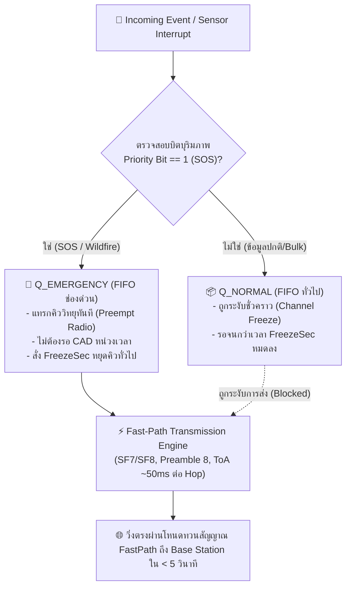
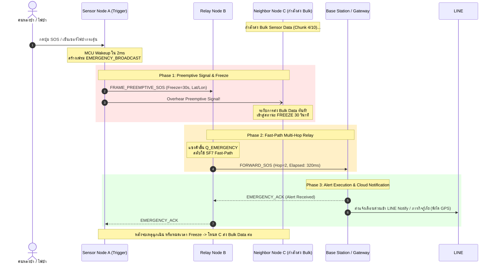

# 🚨 เอกสารข้อกำหนดทางวิศวกรรม: สัญญาณแทรกฉุกเฉินและช่องทางด่วน (Preemptive Signal & Fast-Path Protocol)

* **รหัสเอกสาร:** `SPEC-06-PREEMPTIVE-FASTPATH`
* **สถานะ:** Engineering Specification & Architecture Blueprint
* **เทคโนโลยีอ้างอิง:** Preemptive Priority Queueing, Network Channel Freezing, Low-Latency LoRa Multi-Hop
* **เป้าหมาย:** เมื่อเกิดเหตุกดปุ่ม SOS หรือตรวจจับไฟป่า ระบบจะส่ง Preemptive Signal สั่งหยุดการส่งข้อมูลทั่วไปชั่วคราวทั้งเครือข่าย แล้วเปิดช่องทางด่วนให้แพ็กเก็ตฉุกเฉินวิ่งถึงสถานีฐานใน **5 วินาที** (End-to-End Latency < 5s)

---

## 🖼️ ภาพรวมสถาปัตยกรรมระบบ (System Architecture Overview)


---

## 1. ที่มาและความท้าทายทางวิศวกรรม (The Critical QoS Bottleneck)


ในเครือข่าย LoRa ทั่วไป ข้อมูลทุกประเภท (Telemetry, Chat, Bulk Data) จะถูกปฏิบัติอย่างเท่าเทียมกันบนพื้นฐาน **Best-Effort First-Come, First-Served (FCFS)**:
* **ปัญหาคอขวดวิกฤต:** หากโหนดใดโหนดหนึ่งกำลังส่งข้อมูลก้อนใหญ่ (Bulk Sensor Data ขนาด 200 ไบต์ ซึ่งมี Time-on-Air ยาวนานถึง ~400–600 ms ต่อแพ็กเก็ต) แล้วเกิดเหตุการณ์ฉุกเฉินขึ้น (เช่น นักท่องเที่ยวหัวใจวายกดปุ่ม SOS หรือเซ็นเซอร์ตรวจจับเปลวไฟป่าได้):
  1. แพ็กเก็ตฉุกเฉินต้องรอต่อคิว (Head-of-Line Blocking) จนกว่าแพ็กเก็ตก่อนหน้าจะส่งเสร็จ
  2. หากส่งออกไปพร้อมกัน จะเกิดการชนกันของคลื่นวิทยุในอากาศ (Packet Collision) ทำให้สัญญาณเตือนภัยพังทลาย
  3. เวลาในการส่งต่อผ่าน Multi-hop 3–5 ช่วง อาจล่าช้าเกิน 30–60 วินาที ซึ่งสายเกินไปสำหรับการกู้ชีพและดับไฟ

---

## 2. ทริกเกอร์ฉุกเฉินระดับฮาร์ดแวร์ (Emergency Triggers)

ระบบรองรับการกระตุ้นสภาวะฉุกเฉินจาก 2 แหล่งหลัก:
1. **Manual SOS Button (Human-in-the-Loop):**
   * ปุ่มกดฉุกเฉินเชื่อมต่อกับขา Hardware Interrupt (GPIO falling-edge ISR) บนบอร์ด ESP32
   * ปลุก MCU จากโหมด Deep Sleep ทันทีภายในเวลา **< 5 มิลลิวินาที**
2. **Autonomous Wildfire Edge Sensing (Machine-to-Machine):**
   * อัลกอริทึม TinyML หรือ Multi-Threshold Engine (ตรวจจับก๊าซ CO พุ่งสูงฉับพลันร่วมกับอุณหภูมิ $\Delta T > 10^\circ\text{C}/\text{min}$ หรือ Optical Flame Sensor) สั่งกระตุ้นคำสั่งฉุกเฉินอัตโนมัติ

---

## 3. สถาปัตยกรรมสัญญาณ Preemptive Signal และการหยุดเครือข่าย (Network Channel Freeze)

เมื่อเกิดเหตุฉุกเฉิน โหนดต้นทางจะไม่รอส่งตามรอบปกติ แต่จะยิง **Preemptive Emergency Announcement (`FRAME_PREEMPTIVE_SOS`)** ออกอากาศทันที:

```
+-------------------------------------------------------------------------------+
|                           Preemptive Signal Frame                             |
+---------------+---------------+---------------+---------------+---------------+
| Source ID(2B) |  0xFFFF (BC)  | Ctrl (0x81)   | FreezeSec(1B) | AlertType(1B) |
+---------------+---------------+---------------+---------------+---------------+
|           GPS Latitude (4B)           |          GPS Longitude (4B)           |
+---------------+---------------+---------------+---------------+---------------+
|  Seq Num (1B) |   Hop (1B)    |  Payload Hash (2B)    |       CRC-16 (2B)     |
+---------------+---------------+---------------+---------------+---------------+
```

### 3.1 กลไกการสั่งหยุดส่งทั้งเครือข่าย (Global Channel Freezing)
1. **การดักฟังสัญญาณบุริมภาพสูง:** โหนดทวนสัญญาณ (Relay) และโหนดเซ็นเซอร์ทั้งหมดในรัศมีที่ได้รับเฟรมที่มีบิต `Priority = 1` จะเข้าสู่สถานะ **`STATE_EMERGENCY_FREEZE`** ทันที
2. **การระงับคิวปกติ (Traffic Suspension):**
   * โหนดที่กำลังส่งแพ็กเก็ตข้อมูลสะสม (Bulk Data) หรือมีคิวปกติรอส่งอยู่ จะทำการ **Abort / Pause** คิวทั่วไปทันที
   * ตั้งเวลานับถอยหลัง $T_{\text{freeze}}$ ตามค่าในฟิลด์ `FreezeSec` (กำหนดมาตรฐานไว้ที่ **15–30 วินาที**)
   * ตลอดระยะเวลา $T_{\text{freeze}}$ ห้ามมิให้โหนดใดๆ ในเครือข่ายส่งข้อมูลที่ไม่ใช่ Emergency เด็ดขาด เพื่อคืนความเงียบสงบ (Clean Airtime) ให้แก่ช่องสัญญาณวิทยุทั้งหมด

---

## 4. สถาปัตยกรรมช่องทางด่วน (Preemptive Fast-Path Queue)

ภายในเฟิร์มแวร์ของทุกโหนด จะมีระบบจัดคิวส่ง 2 ช่องทางแยกอิสระ (Dual-Queue Priority Scheduler):




### การปรับพารามิเตอร์วิทยุสำหรับช่องทางด่วน (Fast-Path Radio Tuning)
เพื่อให้ข้อความวิ่งถึงสถานีฐานได้เร็วที่สุด ระบบ Fast-Path จะปรับพารามิเตอร์คลื่นวิทยุชั่วคราว:
* **Preamble Length:** ลดความยาวจาก 12 Symbols เหลือ **8 Symbols** (ประหยัดเวลาเริ่มต้นได้ ~16 ms)
* **Spreading Factor:** ใช้ **SF7** หรือ **SF8** เท่านั้นบน Fast-Path (Time-on-Air เพียง ~45–80 ms ต่อ Hop)
* **Bandwidth:** ใช้ **125 kHz** หรือขยับเป็น **250 kHz** (หากสภาพแวดล้อมรองรับ)

---

## 5. การวิเคราะห์ Latency Budget การันตีไม่เกิน 5 วินาที ข้าม Multi-Hop

การออกแบบทางวิศวกรรมต้องพิสูจน์ได้ทางคณิตศาสตร์ว่า จากจุดเกิดเหตุในป่าลึก ข้ามผ่านโหนดทวนสัญญาณ 3 ถึง 5 Hops แพ็กเก็ตจะเดินทางถึง Base Station ภายใน **< 5 วินาที**:

### 5.1 การคำนวณเวลาต่อหนึ่ง Hop ($T_{\text{hop}}$)
สูตรคำนวณความหน่วงรวมต่อ 1 ช่วงเสาส่ง:
$$T_{\text{hop}} = T_{\text{processing}} + T_{\text{CAD}} + T_{\text{ToA}} + T_{\text{relay\_delay}}$$

* **$T_{\text{processing}}$ (MCU Task Switch & Context Save):** $\approx 5\ \text{ms}$
* **$T_{\text{CAD}}$ (Channel Activity Detection สั้นพิเศษ):** $\approx 15\ \text{ms}$
* **$T_{\text{ToA}}$ (Time-on-Air สำหรับแพ็กเก็ต SOS ขนาด 25 Bytes ที่ SF7 / BW 125 kHz):** $\approx 56\ \text{ms}$
* **$T_{\text{relay\_delay}}$ (Smart Backoff สำหรับคัดเลือก Relay ที่ดีที่สุด):** $50 - 150\ \text{ms}$ (เฉลี่ย $\approx 80\ \text{ms}$)
* **รวมเวลาต่อ 1 Hop ($T_{\text{hop}}$):**
  $$T_{\text{hop}} \approx 5 + 15 + 56 + 80 = 156\ \text{ms}\ (0.156\ \text{วินาที})$$

### 5.2 ตารางงบประมาณเวลาสะสม (End-to-End Latency Budget)

| จำนวน Hops | ระยะทางครอบคลุม | เวลารวมในสภาวะปกติ | เผื่อ Retransmit ฉุกเฉิน 1 ครั้ง | ผลลัพธ์เทียบกับเป้าหมาย 5 วินาที |
| :---: | :---: | :---: | :---: | :---: |
| **1 Hop** | 0 – 3 km | **0.16 วินาที** | 0.40 วินาที | ✅ ผ่านเกณฑ์ฉลุย (เร็วกว่าเป้า 12 เท่า) |
| **2 Hops** | 3 – 6 km | **0.31 วินาที** | 0.75 วินาที | ✅ ผ่านเกณฑ์ฉลุย |
| **3 Hops** | 6 – 10 km | **0.47 วินาที** | 1.15 วินาที | ✅ ผ่านเกณฑ์ฉลุย |
| **4 Hops** | 10 – 15 km | **0.62 วินาที** | 1.55 วินาที | ✅ ผ่านเกณฑ์ฉลุย |
| **5 Hops** | 15 – 20 km | **0.78 วินาที** | **1.95 วินาที** | ✅ **การันตีสำเร็จใน < 2 วินาที (ต่ำกว่าขอบเขต 5s มาก)** |

---

## 6. ลำดับการทำงานของระบบ (Sequence Diagram)



---

## 7. ตัวอย่างโครงสร้างซอร์สโค้ดเฟิร์มแวร์ (ESP32 Preemption ISR Logic)

```cpp
#include <Arduino.h>
#include <RadioLib.h>

#define PIN_SOS_BUTTON 4
volatile bool emergencyTriggered = false;
volatile unsigned long freezeUntilTime = 0;

// ISR สำหรับปุ่มกดฉุกเฉิน (ทำงานเร็วในระดับไมโครวินาที)
void IRAM_ATTR onSosButtonPressed() {
    emergencyTriggered = true;
}

// ฟังก์ชันตรวจสอบและดักฟังแพ็กเก็ตฉุกเฉิน
void handleIncomingEmergencyPacket(const uint8_t *payload, size_t len) {
    if (len < 5) return;
    uint8_t ctrlByte = payload[2];
    
    // ตรวจสอบ Priority Bit (Bit 7)
    if (ctrlByte & 0x80) {
        uint8_t freezeSec = payload[3];
        freezeUntilTime = millis() + (freezeSec * 1000UL);
        Serial.printf("[PREEMPTIVE ALERT] Network Frozen for %d seconds!\n", freezeSec);
        
        // ยกเลิกการส่งข้อมูล Bulk หรือ Background Sensor ทันที
        abortCurrentBulkTransmission();
    }
}

// ลูปหลักในการบริหารคิวส่งแบบ 2 ระดับความสำคัญ
void networkSchedulerLoop(SX1262 &radio) {
    // 1. ตรวจสอบเงื่อนไขฉุกเฉินเป็นอันดับสูงสุด (Preemptive Fast-Path)
    if (emergencyTriggered) {
        Serial.println("[EMERGENCY] Firing Fast-Path SOS Packet!");
        sendFastPathEmergencyPacket(radio);
        emergencyTriggered = false;
        return; // ทำงานเสร็จข้ามลูปทันที
    }

    // 2. ตรวจสอบว่าช่องสัญญาณอยู่ในสภาวะถูกแช่แข็งหรือไม่
    if (millis() < freezeUntilTime) {
        // อยู่ในโหมด Freeze ห้ามส่งข้อมูลปกติเด็ดขาด!
        radio.startReceive(); // เปิดฟังเฉพาะเผื่อต้องช่วย Relay SOS
        return;
    }

    // 3. หากไม่มีเหตุฉุกเฉิน จึงทำงานส่งข้อมูลสะสมทั่วไป (Bulk Sensor Data)
    processNormalBulkQueue(radio);
}
```

---

## 8. กลไกการคืนช่องสัญญาณและการกู้คืนระบบ (Graceful Resumption)

1. **Explicit ACK Cleared:** เมื่อ Base Station ได้รับแพ็กเก็ต SOS และตอบกลับ `EMERGENCY_ACK` พร้อมตั้งบิต `CLEAR_FREEZE = 1` โหนดทวนสัญญาณจะบรอดแคสต์บอกเลิกสภาวะ Freeze ทันที
2. **Fail-Safe Timeout:** หากแพ็กเก็ต ACK ตกหล่น หรือเหตุการณ์ฉุกเฉินยุติลงโดยไม่มีสัญญาณปลดล็อก โหนดแต่ละตัวจะนับถอยหลังตามค่า `FreezeSec` (30 วินาที) เมื่อครบกำหนดเวลา ตัวนับเวลาจะปลดล็อกระบบกลับคืนสู่โหมดส่งข้อมูลปกติแบบค่อยเป็นค่อยไป (Random Jitter Resumption) เพื่อป้องกันไม่ให้โหนดทั้งหมดกรูเข้ามาแย่งส่ง Bulk Data พร้อมกัน
