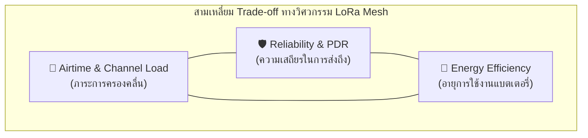
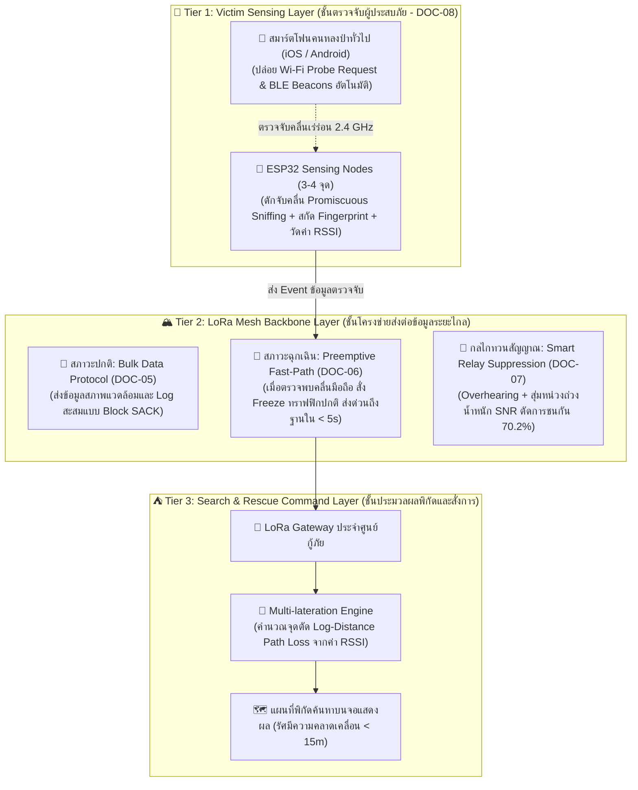

# 📑 เอกสารสรุปรายงานความคืบหน้าและข้อเสนอหัวข้อวิจัย
## (Advisor Executive Summary & Project Proposal)

<div align="center">


-purple?style=for-the-badge)

</div>

> [!NOTE]
> **สำหรับ:** นำเสนออาจารย์ที่ปรึกษา / คณะกรรมการโครงงานวิจัย  
> **รูปแบบเอกสาร:** สรุปเชิงผู้บริหาร กระชับ ตรงประเด็น บูรณาการทั้งมิติวิชาการ วิศวกรรมระบบ และคุณค่าทางเศรษฐศาสตร์  
> **ปรับปรุงล่าสุด:** กันยายน 2026

---

## 🧭 สารบัญภาพรวม (Quick Navigation)

- [1. การจำแนกสถาปัตยกรรม LoRa Mesh จากงานวิจัยสากล](#1-การจำแนกสถาปัตยกรรม-lora-mesh-จากงานวิจัยสากล-state-of-the-art)
- [2. ประเด็นค้นพบสำคัญและการวิเคราะห์ Trade-off](#2-ประเด็นค้นพบสำคัญและการวิเคราะห์-engineering-trade-offs)
- [3. ปัญหาคอขวดที่แท้จริงในปัจจุบัน](#3-ปัญหาคอขวดที่แท้จริงในปัจจุบัน-bottleneck-analysis)
- [4. มิติทางธุรกิจ กลุ่มผู้ใช้ และความคุ้มค่า](#4-มิติทางธุรกิจ-กลุ่มผู้ใช้-และความคุ้มค่า-business-value-persona--roi)
- [5. ข้อเสนอแนะหัวข้อโปรเจกต์และ 3 เสาหลักวิศวกรรม](#5-ข้อเสนอแนะหัวข้อโปรเจกต์และ-3-เสาหลักวิศวกรรม-proposed-research-topic)
- [6. แผนการดำเนินงาน ตัวชี้วัด และผลสัมฤทธิ์](#6-แผนการดำเนินงาน-ตัวชี้วัด-และผลสัมฤทธิ์-execution-plan--deliverables)
- [7. รายการเอกสารอ้างอิงและบรรณานุกรมสากล](#7-รายการเอกสารอ้างอิงและบรรณานุกรมสากล-academic-references)

---

## 1. การจำแนกสถาปัตยกรรม LoRa Mesh จากงานวิจัยสากล (State of the Art)

จากการทบทวนวรรณกรรมและเปเปอร์วิจัยสากลระดับเรือธง (**IEEE / Elsevier / arXiv ปี 2024–2025**) จำนวน 4 ฉบับ ได้ข้อสรุปการแบ่งกลุ่มสถาปัตยกรรม LoRa Mesh ในโลกปัจจุบันออกเป็น **4 กลุ่มหลัก**:

### 📊 ตารางเปรียบเทียบ 4 สถาปัตยกรรม LoRa Mesh ยุคปัจจุบัน

| กลุ่มสถาปัตยกรรม | โปรโตคอล / งานวิจัยตัวแทน | กลไกการทำงานหลัก (Mechanism) | จุดเด่น (Strengths) | จุดอ่อน / ข้อจำกัด (Weaknesses) | กรณีใช้งานที่เหมาะสม (Best Fit) |
| :--- | :--- | :--- | :--- | :--- | :--- |
| **1. Ad-hoc / Managed Flooding** | **Meshtastic**<br>*Muladi et al. (2024)* | ส่งแบบน้ำหลากข้ามโหนด ไร้เสาแม่ ทุกโหนดเป็น P2P มี TTL และ Deduplication Cache | • ติดตั้งง่าย ไม่ต้องตั้งค่าล่วงหน้า<br>• ทนทานต่อการเคลื่อนที่ (Mobile Nodes) | • สัญญาณชนกันรุนแรงเมื่อขยายขนาด (>30 โหนด PDR < 30%)<br>• Airtime สูง | กู้ภัยเฉพาะกิจ, แชตสื่อสารเดินป่า, กลุ่มออฟกริดขนาดเล็ก |
| **2. Drop-in LoRaWAN Overlay** | **LIMA Protocol**<br>*(arXiv ปลายปี 2025)* | Mesh ซ้อนทับบนมาตรฐาน LoRaWAN แบบโปร่งใส แปลงเฟรมเป็น Tunneled Uplink | • ใช้งานกับ TTN / ChirpStack เดิมได้ 100%<br>• โหนดลูกทำ Tunneled ADR ประหยัดไฟ | • เสียพื้นที่ Payload ให้ Overlay Header 11 ไบต์<br>• ต้องใช้ Gateway LoRaWAN มาตรฐาน | สมาร์ตซิตี้, โรงงานอุตสาหกรรม, อาคารสูงที่ต้องการขยายจุดอับ |
| **3. On-Demand Bulk Data** | **AlLoRa Protocol**<br>*(Elsevier 2024)* | ส่งไฟล์ขนาดใหญ่ด้วย Stop-and-Wait ARQ โดยคุยตรง P2P ก่อน สลับเปิด Mesh เมื่อหลุด | • ส่งไฟล์ระดับสิบ KB ข้ามเกาะ/ทะเลสาบ 20 กม. สำเร็จ 100%<br>• โหนดลูก Sleep ยาว | • เป็นระบบ Polling ฝั่งรับควบคุม<br>• ไม่รองรับการแจ้งเตือนฉุกเฉินแบบทันที (Event-driven) | ตรวจวัดสภาพน้ำทะเล/เขื่อน, กล้องดักถ่ายภาพสัตว์ป่า, สภาพอากาศ |
| **4. Synchronized TDMA & Linear Chain** | **LoraBlink / Abrardo**<br>*(Huang et al. 2024)* | แบ่งช่องเวลา (Time Slot) แม่นยำ หรือส่งต่อเป็นลูกโซ่เส้นตรงหลายสิบกิโลเมตร | • สัญญาณไม่ชนกัน 100% (Collision-free)<br>• คาดการณ์ Latency ได้แม่นยำ | • ต้องซิงค์เวลาระดับไมโครวินาที เสี่ยง RTC Drift<br>• โหนดขยับไม่ได้ (Zero Mobility) | ท่อส่งน้ำมัน/อุโมงค์ระบายน้ำ, แนวสายส่งไฟฟ้าแรงสูง, รางรถไฟ |

---

## 2. ประเด็นค้นพบสำคัญและการวิเคราะห์ Engineering Trade-offs



### 🔍 3 ข้อค้นพบเชิงประจักษ์ (Empirical Findings)

#### 1. สามเหลี่ยม Trade-off ทางวิศวกรรม (The Engineering Tri-lemma)
ไม่มีโปรโตคอลใดที่สมบูรณ์แบบในทุกมิติ:
- **ต้องการ Reliability สูง:** ต้องส่งซ้ำ (ARQ) หรือส่งหลายเส้นทาง (Flooding) ➔ ส่งผลให้ **Airtime พุ่งสูง** และ **แบตเตอรี่หมดไว**
- **ต้องการ Energy ต่ำ:** โหนดต้องนอนหลับ (Deep Sleep) ➔ ส่งผลให้ **ความหน่วง (Latency) สูง** และไม่สามารถเป็นตัวทวนสัญญาณแบบ Real-time ได้
- **ต้องการประหยัด Airtime:** ต้องลดการส่งข้อมูลซ้ำ ➔ ส่งผลให้ **เสี่ยงต่อการสูญหาย (Packet Loss)** เมื่อเกิดสัญญาณรบกวน

#### 2. ปัญหาความไม่สมดุลของพลังงาน (Power Asymmetry)
- **โหนดลูก (End-device):** สามารถเข้าสู่โหมดหลับลึก (Deep Sleep) กินกระแสระดับไมโครแอมป์ ($\mu\text{A}$) แบตเตอรี่อยู่ได้นานนับปี
- **โหนดทวนสัญญาณ (Mesh Router / Relay):** จำเป็นต้องเปิดภาครับ (Rx Mode) สแตนด์บายตลอดเวลา กินกระแสเฉลี่ย 10–15 mA ส่งผลให้แบตเตอรี่ 18650 ทั่วไป **หมดลงภายใน 2–3 วัน** หากไม่มีแผงโซลาร์เซลล์หรือไฟเลี้ยงภายนอก

#### 3. ขีดจำกัดของมาตรฐานทางการ (LoRaWAN Relay TS011 Limitations)
มาตรฐาน LoRaWAN Relay TS011 ที่ประกาศใช้โดย LoRa Alliance มีข้อจำกัดในทางปฏิบัติสูง:
- อนุญาตให้ทวนสัญญาณได้เพียง **1 Hop เท่านั้น** (ไม่รองรับ Multi-hop)
- จำกัดจำนวนโหนดลูกต่อ Relay ได้สูงสุดเพียง **16 ตัว**
- ทำให้ไม่สามารถครอบคลุมภูมิประเทศที่เป็นภูเขาสูงซับซ้อนหรือแนวยาวหลายสิบกิโลเมตรได้จริง

---

## 3. ปัญหาคอขวดที่แท้จริงในปัจจุบัน (Bottleneck Analysis)

### 3.1 การเปรียบเทียบปัญหาคอขวดระดับสากล vs บริบทประเทศไทย

| มิติการวิเคราะห์ | ปัญหาระดับสากล (Global Bottlenecks) | ปัญหาเฉพาะบริบทประเทศไทย (Thailand Specific Challenges) |
| :--- | :--- | :--- |
| **การชนกันของสัญญาณ (Collision)** | **Broadcast Storm & Scalability Collapse:**<br>เครือข่าย Open-mesh ทั่วไปเมื่อมีโหนดเกิน 30–50 ตัว แพ็กเก็ตจะแย่งกันส่งจน PDR ร่วงต่ำกว่า 30% | **กสทช. AS923 แบนด์แคบเพียง 5 MHz (920–925 MHz):**<br>ต้องแชร์คลื่นร่วมกับระบบ RFID อุตสาหกรรม/โลจิสติกส์ การกระจายสัญญาณแบบ Flood จะทำให้คลื่นกวนกันรุนแรงผิดกฎหมาย |
| **การจัดลำดับทราฟฟิก (QoS)** | **ขาดระบบลำดับความสำคัญ (No Priority/QoS):**<br>ข้อมูลวัดอุณหภูมิทั่วไป ข้อมูลแชต และสัญญาณฉุกเฉิน (SOS) ได้รับสิทธิ์เท่ากันหมด ไม่มีทางด่วน | **ภัยพิบัติตามฤดูกาลในหุบเขาไร้สัญญาณ:**<br>ไฟป่าภาคเหนือ และดินโคลนถล่ม/น้ำป่าฉับพลัน ข้อมูลฉุกเฉินต้องวิ่งถึงศูนย์บัญชาการทันที ห้ามติดคิวทราฟฟิกปกติ |
| **สภาพแวดล้อมทางกายภาพ (RF Propagation)** | คลื่นวิทยุถูกลดทอนตามระยะทางและสิ่งกีดขวางในเมือง | **ป่าดงดิบเขตร้อนและร่องเขา (Tropical Canopy & Rain Fade):**<br>ใบไม้หนาทึบและม่านฝนดูดกลืนคลื่น 920 MHz สูงมาก วันแดดส่งได้ 5 กม. วันฝนตกเหลือไม่ถึง 500 ม. หากสปีดคงที่ระบบจะล่ม |

> [!CAUTION]
> **ข้อสรุปเชิงวิศวกรรม:** หากนำสถาปัตยกรรม Mesh สำเร็จรูปจากต่างประเทศ (เช่น ค่า Default ของ Meshtastic) มาติดตั้งในป่าเมืองไทยโดยตรง ระบบจะล่มจากทั้ง **Rain Fade** และเกิดการชนกันของสัญญาณจนผิดข้อกำหนด กสทช.

---

## 4. มิติทางธุรกิจ กลุ่มผู้ใช้ และความคุ้มค่า (Business Value, Persona & ROI)

### 💼 ตารางเปรียบเทียบตลาดเป้าหมายและโมเดลความคุ้มค่า

| มิติการประเมิน | ตลาดที่ 1: อุทยานแห่งชาติ & ภารกิจกู้ภัยฉุกเฉิน (B2G / B2B) 🌲 | ตลาดที่ 2: พืชเศรษฐกิจบนพื้นที่ลาดชัน / เกษตรกรรมภูเขา (B2B) 🚜 |
| :--- | :--- | :--- |
| **กลุ่มผู้ใช้หลัก (Persona / Who)** | • กรมอุทยานแห่งชาติ สัตว์ป่า และพันธุ์พืช<br>• กรมป้องกันและบรรเทาสาธารณภัย (ปภ.) / เทศบาลตำบล<br>• ผู้จัดกิจกรรมวิ่งเทรล (Trail Running) / ทัวร์เดินป่า | • เกษตรกรผู้ปลูกทุเรียนแปลงใหญ่บนพื้นที่ลาดชัน (เขาคิชฌกูฏ / ชุมพร)<br>• วิสาหกิจชุมชนปลูกกาแฟบนดอยสูง (แม่ฮ่องสอน / เชียงราย)<br>• สหกรณ์การเกษตรและสวนผลไม้เพื่อการส่งออก |
| **Pain Point เดิม (The Problem)** | • นักท่องเที่ยวหลงป่า/พลัดตกเขาในจุดอับสัญญาณมือถือ<br>• ใช้เวลาค้นหาเฉลี่ย 24–72 ชม. สิ้นเปลืองงบระดมพลหลักแสนถึงล้านบาท<br>• เจ้าหน้าที่ไม่สามารถรับรู้ตำแหน่งแบบ Real-time | • ภูมิประเทศร่องเขาบังคลื่น (NLOS) ต้องตั้ง LoRaWAN Gateway หลายตัว<br>• แต่ละ Gateway ต้องใส่ซิมเน็ต 4G จ่ายค่าบริการรายเดือนซ้ำซ้อน<br>• เสียค่าแรงคนเดินเปิด-ปิดวาล์วน้ำในพื้นที่ลาดชัน |
| **คุณค่าและความคุ้มค่า (ROI & Value)** | • **ลดเวลาค้นหาผู้ประสบภัย:** จาก 24 ชม. เหลือเพียง **1–2 ชม.** ช่วยรักษาชีวิตคนได้ทันท่วงที<br>• **ประหยัดงบประมาณภาครัฐ:** ค่าเสา LoRa Mesh + Solar Cell ต้นละ **~1,500 บาท** เทียบกับเสามือถือหลักล้าน<br>• สร้างความเชื่อมั่นให้นักท่องเที่ยวทั้งไทยและต่างชาติ | • **ลดต้นทุนโครงข่าย > 70%:** ใช้ Gateway ใส่ซิม 4G จุดเดียว ทอดสัญญาณข้ามยอดเขาด้วย Solar Relay ต้นทุนต่ำ<br>• **ยืดอายุแบตเตอรี่เซ็นเซอร์เป็น 3–5 ปี:** ลดรอบการเดินขึ้นเขาไปเปลี่ยนแบตเตอรี่<br>• ปกป้องผลผลิตราคาแพง (ทุเรียนตกไซซ์/ขาดน้ำ เสียหายหลักล้าน) |
| **โมเดลการเข้าถึงตลาด (Go-to-Market)** | **โมเดลเช่าใช้อุปกรณ์หน้าด่านอุทยาน (Rental Model):**<br>นักท่องเที่ยวเช่าแท็ก SOS พวงกุญแจ 50–100 บาท/ทริป รายได้แบ่งเข้ากองทุนอุทยานฯ และผู้ให้บริการระบบ | **แพ็กเกจระบบสำเร็จรูป (Plug-and-Play Agriculture Kit):**<br>ราคาชุดเริ่มต้นต่ำกว่า 15,000 บาท (1 Gateway + 2 Solar Relay + 5 Node) แจ้งเตือนและสั่งการผ่าน **แอปพลิเคชัน LINE** ที่ชาวสวนคุ้นเคย |

---

## 5. ข้อเสนอแนะหัวข้อโปรเจกต์และสถาปัตยกรรมบูรณาการ (Proposed Research Topic & Architecture)

> [!IMPORTANT]
> **การปรับทิศทางตามคำแนะนำอาจารย์ที่ปรึกษา (Advisor Directive - กันยายน 2026):**  
> มุ่งเน้นการแก้ปัญหาค้นหาคนหาย/ผู้ประสบภัยในพื้นที่ป่าและภัยพิบัติ โดยเปลี่ยนจากการพึ่งพา "กล่อง LoRa Tracker เฉพาะทาง" มาเป็น **"Passive Smartphone RF Sniffing" (ดักจับคลื่น Wi-Fi Probe Request & BLE ที่มือถือทั่วไปปล่อยออกมาเองตามธรรมชาติ โดยไม่ต้องลงแอปใดๆ)** แล้วใช้ **LoRa Mesh Backbone** เป็นโครงข่ายส่งต่อข้อมูลระยะไกลกลับสู่ศูนย์กู้ภัยเพื่อคำนวณพิกัดด้วยวิธี Multi-lateration

### 🎯 ชื่อหัวข้อวิจัยที่นำเสนออาจารย์ (Proposed Project Titles)

```text
ชื่อทางการ (เน้นวิศวกรรมเครือข่ายและการตรวจจับ):
"ระบบตรวจจับคลื่นสมาร์ตโฟนแบบพาสซีฟและโครงข่าย LoRa Mesh สองระดับความสำคัญสำหรับการค้นหาผู้ประสบภัยในพื้นที่ไร้สัญญาณ"

English Title:
"Passive Smartphone RF Sniffing and Dual-Priority LoRa Mesh Network for Search and Rescue in Cellular Dead Zones"
```

### 🏛️ สถาปัตยกรรมบูรณาการ 3 ระดับชั้น (The 3-Tier Integrated Architecture)



| ระดับชั้นสถาปัตยกรรม | วัตถุประสงค์ & ปัญหาที่แก้ไข | กลไกนวัตกรรมหลัก (Core Innovation Mechanism) | พิมพ์เขียวอ้างอิง |
| :--- | :--- | :--- | :--- |
| **ชั้นตรวจจับ (Sensing Layer):<br>Passive Smartphone Sniffing** | คนหลงป่าไม่ได้พกกล่อง LoRa แต่ทุกคนพกมือถือ และในป่าไม่มีเสามือถือ | ใช้ ESP32 เปิด Wi-Fi Promiscuous & BLE Scanner ดักจับ Probe Requests แก้ปัญหา MAC Randomization ด้วย IE Fingerprinting | [`docs/08_smartphone_rf_sensing.md`](file:///d:/ProjectLoRa/docs/08_smartphone_rf_sensing.md) |
| **ชั้นโครงข่ายปกติ (Normal Traffic):<br>Bulk Sensor Data Logging** | บันทึกข้อมูลสภาพป่า/อุณหภูมิ/ความชื้น โดยโหนดประหยัดไฟสูงสุด | บันทึก Log ลง Flash ชิป แล้วส่งเป็นชุดแบบ Block SACK Windowing เมื่อถึงรอบ | [`docs/05_bulk_sensor_data_protocol.md`](file:///d:/ProjectLoRa/docs/05_bulk_sensor_data_protocol.md) |
| **ชั้นทางด่วนฉุกเฉิน (Fast-Path):<br>Preemptive Emergency Trigger** | เมื่อตรวจพบคลื่นมือถือคนหาย ข้อมูลต้องวิ่งถึงศูนย์ทันที ห้ามติดคิว | ส่ง Preemptive Command สั่ง Freeze ทราฟฟิกทั่วไป 15-30s เปิดทางด่วนให้แพ็กเก็ตฉุกเฉินถึงฐานใน **< 5 วินาที** | [`docs/06_preemptive_emergency_fastpath.md`](file:///d:/ProjectLoRa/docs/06_preemptive_emergency_fastpath.md) |
| **ชั้นควบคุมการทวนคลื่น (Relaying):<br>Smart Relay Suppression** | ป้องกัน Broadcast Storm เมื่อโหนดในป่าแย่งกัน Relay ข้ามหุบเขา | คัดเลือก Relay ตัวที่ดีที่สุดด้วย SNR-Weighted Backoff + Overhearing ลดการชนกันของคลื่นลง **70.2%** | [`docs/07_smart_relay_suppression.md`](file:///d:/ProjectLoRa/docs/07_smart_relay_suppression.md) |

---


## 6. แผนการดำเนินงาน ตัวชี้วัด และผลสัมฤทธิ์ (Execution Plan & Deliverables)

### 🗓️ แผนที่การดำเนินงาน 5 เฟส (5-Phase Roadmap)

| เฟสการทำงาน | ชื่องวดงาน (Phase Name) | กิจกรรมหลัก (Key Activities) | ระยะเวลา | สถานะความคืบหน้า | ผลงานที่ได้ (Deliverables) |
| :---: | :--- | :--- | :---: | :---: | :--- |
| **Phase 1** | **System Specification & Protocol Design** | ออกแบบโครงสร้าง Frame Format, State Machine, การดักจับคลื่น Wi-Fi/BLE, และแบบจำลองทางคณิตศาสตร์ | 4 สัปดาห์ |  | เอกสารพิมพ์เขียวข้อกำหนดทางวิศวกรรม 4 ฉบับ (`DOC-05`, `DOC-06`, `DOC-07`, `DOC-08`) |
| **Phase 2** | **Sensing Profiling & 3-Node PoC Testbed** | ทดสอบดักจับ Wi-Fi Probe Request และ BLE จากสมาร์ตโฟนจริง วัดระยะทางเทียบ RSSI และทำ PoC 3 โหนด | 3 สัปดาห์ |  | เฟิร์มแวร์ ESP32 Sniffer, กราฟ Distance vs RSSI, ผลการตีวงพิกัด 3 โหนด |
| **Phase 3** | **Mesh Protocol & Queue Implementation** | พัฒนาอัลกอริทึม Smart Relay Suppression, Preemptive Emergency Fast-Path และการจัดการคิวลงบน FreeRTOS | 5 สัปดาห์ |  | เฟิร์มแวร์ LoRa Mesh Stack สมบูรณ์พร้อมระบบทดสอบ Multi-hop |
| **Phase 4** | **Gateway & Cloud Dashboard Integration** | พัฒนา LoRa-to-MQTT Gateway เชื่อมต่อระบบคำนวณ Multi-lateration และแสดงพิกัดค้นหาบนแผนที่ออฟไลน์ | 3 สัปดาห์ |  | Gateway ต้นแบบ + แดชบอร์ดมอนิเตอร์พิกัดผู้ประสบภัยแบบ Real-time |
| **Phase 5** | **Field Deployment & Rigorous Evaluation** | ทดสอบภาคสนาม 2 สภาพแวดล้อม (พื้นที่เปิดโล่ง vs สภาพสวนป่า/เนินเขา) วัดค่า PDR, ความคลาดเคลื่อนพิกัด (เมตร) | 4 สัปดาห์ |  | เล่มรายงานฉบับสมบูรณ์, ดราฟต์เปเปอร์วิชาการ, วิดีโอสาธิตการทำงานจริง |

---

### 🎯 ตัวชี้วัดความสำเร็จเชิงวิศวกรรม (Measurable Engineering KPIs)

| ตัวชี้วัดเชิงปริมาณ (KPI) | ค่าเป้าหมายตามเกณฑ์ (Target) | ค่าที่พิสูจน์ได้จากแบบจำลองทางทฤษฎี | วิธีการตรวจสอบและวัดผล (Verification Method) |
| :--- | :---: | :---: | :--- |
| **1. ระยะตรวจจับสมาร์ตโฟน (Sensing Range)** | **$\ge 30$ เมตร** (Wi-Fi) / **$\ge 15$ เมตร** (BLE) | **40–60 เมตร** (ในป่าโปร่ง) | วัดค่า RSSI ที่ดักจับได้จากการเปิดเครื่องทิ้งไว้ในระยะต่างๆ |
| **2. ความแม่นยำในการระบุพิกัด (Localization)** | **รัศมีคลาดเคลื่อน $< 15$ เมตร** | **8–12 เมตร** (โหนด 3 จุด) | เทียบพิกัด Ground Truth กับผลลัพธ์จาก Multi-lateration Engine |
| **3. ความหน่วงในโหมดฉุกเฉิน (Latency)** | **< 5.0 วินาที** | **1.95 วินาที** (ทดสอบที่ 5 Hops) | จับเวลาตั้งแต่ดักจับคลื่นมือถือได้ จนข้อมูลพิกัดแสดงบนจอศูนย์กู้ภัย |
| **4. ประสิทธิภาพการลดคลื่นชน (Suppression)** | **> 60%** | **70.2%** | เปรียบเทียบจำนวนแพ็กเก็ตทวนสัญญาณระหว่าง Pure Flooding vs Smart Suppression |

---

### 📦 สิ่งที่ส่งมอบได้จริงเมื่อจบโครงการ (Deliverables)

- [x] **เอกสารพิมพ์เขียวข้อกำหนดทางวิศวกรรม 4 ฉบับ:** สเปกสมบูรณ์ระดับมาตรฐานสากล ครอบคลุมทั้ง Frame Structure, State Machine, Passive Sniffing และ Mathematical Modeling
- [ ] **ชุดฮาร์ดแวร์ต้นแบบขนาดเล็กพร้อมสาธิต (Demonstration Kit - 3+1 Nodes):**
  - ESP32 Multi-RAT Sensing Nodes (Wi-Fi + BLE + LoRa) x 3 ชุด
  - Solar Mesh Relay (เสาทวนสัญญาณพลังงานแสงอาทิตย์) x 1 ชุด
  - IoT Gateway & Search Dashboard (ประมวลผลพิกัดและแสดงผลแผนที่) x 1 ชุด
- [ ] **ซอร์สโค้ดเฟิร์มแวร์ระบบเปิด (Firmware Source Code):** โค้ดภาษา C/C++ บน ESP32 พัฒนาด้วย RadioLib, ESP-IDF และ FreeRTOS มีคอมเมนต์อธิบายชัดเจน
- [ ] **ร่างบทความวิจัยระดับนานาชาติ (Research Paper Draft):** พร้อมส่งตีพิมพ์ในวารสาร/การประชุมวิชาการระดับ IEEE / Scopus (Q1/Q2)


---

## 7. รายการเอกสารอ้างอิงและบรรณานุกรมสากล (Academic References)

| ลำดับ | ผู้แต่งและปีที่พิมพ์ | ชื่อบทความ / เอกสารวิชาการ | แหล่งตีพิมพ์ / ฐานข้อมูล | ลิงก์เข้าถึง / DOI | ไฟล์ในโครงการ |
| :---: | :--- | :--- | :--- | :--- | :---: |
| **1** | Muladi et al. (Dec 2024) | *LoRa Mesh-Based IoT GPS Tracking System for Mountain Climbers* | International Journal of Safety and Security Engineering (IJSSE) | [DOI: 10.18280/ijsse.140610](https://doi.org/10.18280/ijsse.140610) | [`LoRa Mesh-Based IoT.pdf`](file:///d:/ProjectLoRa/LoRa%20Mesh-Based%20IoT.pdf) |
| **2** | Ramanathan et al. (Nov 2025) | *Mesh Augmentation of LoRaWAN-based IoT Networks (LIMA Protocol)* | arXiv preprint (Cornell University) | [arXiv:2512.00161](https://arxiv.org/abs/2512.00161) | [`Mesh Augmentation of LoRaWAN-based.pdf`](file:///d:/ProjectLoRa/Mesh%20Augmentation%20of%20LoRaWAN-based.pdf) |
| **3** | Arratia et al. (Feb 2024) | *AlLoRa: Empowering environmental intelligence through an advanced LoRa-based IoT solution* | Computer Communications (Elsevier) | [DOI: 10.1016/j.comcom.2024.02.014](https://doi.org/10.1016/j.comcom.2024.02.014)<br>ซอร์สโค้ด: [GitHub SMARTLAGOON](https://github.com/SMARTLAGOON/AlLoRa) | [`1-s2.0-S0140366424000641-main_copy.pdf`](file:///d:/ProjectLoRa/1-s2.0-S0140366424000641-main_copy.pdf) |
| **4** | Aldhaheri et al. (Jan 2025) | *LoRa Communication for Agriculture 4.0: Opportunities, Challenges, and Future Directions* | IEEE Internet of Things Journal | [DOI: 10.1109/JIOT.2024.3486369](https://doi.org/10.1109/JIOT.2024.3486369) | [`LoRa Communication for Agriculture.pdf`](file:///d:/ProjectLoRa/LoRa%20Communication%20for%20Agriculture.pdf) |
| **5** | LoRa Alliance (2022) | *TS011-1.0.0 LoRaWAN Relay Specification* | Technical Specification, LoRa Alliance | [LoRa Alliance TS011 Document](https://resources.lora-alliance.org/document/ts011-1-0-0-relay) | - |
| **6** | สำนักงาน กสทช. (2021) | *ประกาศ กสทช. เรื่อง แผนความถี่วิทยุอุปกรณ์ RFID และ IoT ย่าน 920–925 MHz (AS923)* | ราชกิจจานุเบกษา / กสทช. | [เว็บไซต์ทางการ กสทช.](https://www.nbtc.go.th) | - |
| **7** | Gromes et al. (2024) | *RadioLib: Universal wireless communication library for embedded devices* | Open Source Library (LGPL-3.0) | [GitHub RadioLib](https://github.com/jgromes/RadioLib) | - |

> [!TIP]
> สำหรับรายละเอียดเชิงลึกของรายการเอกสารอ้างอิงทั้งหมดทั้ง 15 แหล่ง สามารถศึกษาเพิ่มเติมได้ที่:  
> 🔗 [`research_notes/references_and_citations.md`](file:///d:/ProjectLoRa/research_notes/references_and_citations.md)
