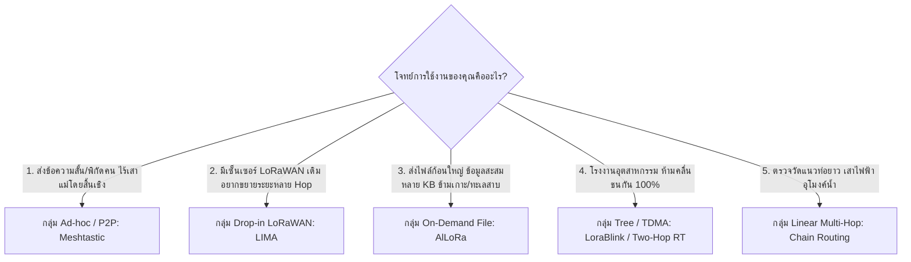

# 📊 ตารางเปรียบเทียบสถาปัตยกรรมและโปรโตคอล LoRa Mesh

เอกสารนี้รวบรวมการวิเคราะห์เปรียบเทียบเชิงลึก ทั้งจากโปรโตคอลระบบจริง (Meshtastic, LIMA, AlLoRa, LoRaWAN Relay) และการจัดกลุ่มทิศทางการออกแบบสถาปัตยกรรมในแวดวงวิชาการ (Academic Taxonomy) ทั้ง 4 กลุ่มหลัก

---

## 1. การจำแนกสถาปัตยกรรมในงานวิจัยวิชาการ (4 Academic Research Paradigms)

จากการสำรวจวรรณกรรมวิจัยในระดับสากล สถาปัตยกรรม LoRa Multi-hop สามารถจัดกลุ่มตามกลไกการส่งข้อมูลและการจัดการพลังงานได้ 4 รูปแบบหลัก:

### 1.1 กลุ่ม Tree-based & Synchronized TDMA (เน้นปลอดการชนกันของสัญญาณ)
* **แนวคิดหลัก:** จัดระเบียบเครือข่ายเป็นโครงสร้างต้นไม้ (Tree Topology) และแบ่งช่องเวลา (Time Slots / TDMA) เพื่อไม่ให้สัญญาณตีกัน เหมาะกับงานโรงงานอุตสาหกรรม โครงสร้างใต้ดิน หรือเหมืองแร่
* **งานวิจัยเด่น:**
  * **LoraBlink:** งานวิจัยบุกเบิกการส่ง Multi-hop บน LoRa PHY โดยใช้ระบบ Slotted Protocol ซิงค์เวลาแบบ Hop-by-Hop เพื่อส่งข้อมูลไปยัง Sink node แบบไร้การชน (Collision-free)
  * **MLoRa (Spanning Tree LoRa):** ใช้ Spanning Tree ค้นหาเส้นทาง Multi-hop เพื่อยืดอายุแบตเตอรี่ในเครือข่าย End-device ขนาดใหญ่
  * **Two-Hop Real-Time LoRa (Two-Hop RT-LoRa):** มุ่งเน้นเครือข่ายที่มีการเคลื่อนที่ (Dynamic/Mobile Nodes) โดยแชร์ Time Slot ในแต่ละชั้นของ Tree ทำให้รองรับการซ่อมแซมเส้นทางที่ขาดหายได้แบบ Real-time
* **Trade-off:** ต้องพึ่งพาระบบ Time Synchronization ที่แม่นยำระดับไมโครวินาที (เสี่ยงต่อ Clock Drift ของ RTC ในบอร์ดราคาประหยัด) และมีความยืดหยุ่นต่ำหากโหนดเคลื่อนที่

### 1.2 กลุ่ม Concurrent Transmission & Clustering (ใช้คุณสมบัติคลื่นวิทยุ)
* **แนวคิดหลัก:** แทนที่จะหลบเลี่ยงการชนกัน กลุ่มนี้กลับส่งสัญญาณพร้อมกัน โดยใช้ประโยชน์จากคุณสมบัติทางฟิสิกส์ของสัญญาณ LoRa เช่น **Capture Effect**
* **งานวิจัยเด่น:**
  * **CT-LoRa (Concurrent Transmission LoRa):** หากแพ็กเก็ตที่ส่งพร้อมกันมีเวลาต่างกันน้อยกว่าเกณฑ์ที่กำหนด ตัวรับจะสามารถถอดรหัสสัญญาณที่แรงกว่าได้ ทำให้ส่งต่อข้อมูลข้าม Hop ได้รวดเร็วโดยไม่ต้องเสีย Overhead จัดคิว
  * **Cluster-based SF Allocation:** แบ่งเครือข่ายออกเป็นกลุ่ม (Clusters) และกำหนด Spreading Factor (SF) ต่างกันในแต่ละชั้น (เช่น ชั้นนอกใช้ SF10 ส่งเข้าชั้นกลางที่ใช้ SF8 แล้วส่งต่อด้วย SF7) ทำให้แต่ละ Hop ไม่รบกวนกัน (Quasi-orthogonality)
* **Trade-off:** ความหน่วงต่ำมาก แต่ใช้พลังงานสูงในการส่งซ้ำ และการปรับแต่งระดับฮาร์ดแวร์มีความซับซ้อนสูง

### 1.3 กลุ่ม Peer-to-Peer & Gateway-Free (เครือข่ายอิสระไร้เสาแม่)
* **แนวคิดหลัก:** ออกแบบสำหรับกรณีตัดขาดจากโครงสร้างพื้นฐานโดยสิ้นเชิง ไม่มีเสา Gateway หรือการเชื่อมต่ออินเทอร์เน็ต
* **งานวิจัยเด่น:**
  * **Berto et al. (P2P Mesh):** ทุกโหนดเป็นทั้งตัวเซนเซอร์และตัวทวนสัญญาณในระดับเสมอกัน กระจายข้อมูลแบบ Peer-to-Peer อิสระ
  * **LoRa Mesh Library (Solé et al.):** ไลบรารีการสร้าง Distance-Vector Mesh บน ESP32/SX1276 ที่มีการแลกเปลี่ยน Neighbor Table เป็นระยะ เหมาะกับการพัฒนาระบบ Mesh อิสระ
* **Trade-off:** เหมาะกับงานกู้ภัย/ออฟกริด แต่จัดการส่งข้อมูลขึ้นคลาวด์แบบรวมศูนย์ได้ยาก และเสี่ยงต่อการเกิดปัญหาข้อมูลท่วมเครือข่าย

### 1.4 กลุ่ม Linear Multi-Hop (โครงสร้างแบบเส้นตรงตามแนวภูมิประเทศ)
* **แนวคิดหลัก:** ออกแบบเฉพาะสำหรับพื้นที่ทางยาว แคบ หรือจำกัดเส้นทาง ซึ่งสัญญาณไม่สามารถทะลุสิ่งกีดขวางตรงๆ ได้
* **งานวิจัยเด่น:**
  * **Underground Aqueducts Monitoring (Abrardo et al.):** ตรวจวัดอุโมงค์น้ำใต้ดินในอิตาลี ส่งต่อแบบทอดๆ เป็นเส้นตรง (Linear Chain) ไปออกที่ปากอุโมงค์
  * **Smart Grid Transmission Line (Huang et al.):** ดัดแปลง AODV ให้ส่งข้อมูลตามแนวสายส่งไฟฟ้าแรงสูงระยะทางหลายสิบกิโลเมตรผ่านโหนดบนเสาไฟ
* **Trade-off:** เส้นทางไม่มีทางเลือกสำรอง (Single Point of Failure สูง) หากโหนดใดโหนดหนึ่งดับ เครือข่ายส่วนปลายจะขาดการเชื่อมต่อทันที

---

## 2. ตารางเปรียบเทียบภาพรวมสถาปัตยกรรมในงานวิจัย (Academic Landscape)

| กลุ่มสถาปัตยกรรม | ตัวอย่างโปรโตคอล | จุดเด่น (Key Strengths) | ข้อจำกัด / Trade-off |
| :--- | :--- | :--- | :--- |
| **1. Tree / TDMA** | LoraBlink, MLoRa, Two-Hop RT-LoRa | สัญญาณไม่ชนกัน ประสิทธิภาพ PDR สูง | ต้องซิงค์เวลาระดับไมโครวินาที โหนดขยับยาก |
| **2. Concurrent TX** | CT-LoRa, Spreading Clustering | ความหน่วง (Latency) ต่ำมาก ส่งต่อได้ไว | ใช้พลังงานสูงในการส่งซ้ำ ฮาร์ดแวร์ซับซ้อน |
| **3. Drop-in LoRaWAN** | LIMA, LoRaWAN Relay (TS011) | ใช้งานร่วมกับอุปกรณ์และ Server มาตรฐานได้ทันที | เสียพื้นที่ Payload ให้กับ Header เพิ่มขึ้น |
| **4. Ad-hoc / Flood** | Meshtastic, AODV-based | ยืดหยุ่นสูง ติดตั้งง่าย รองรับโหนดเคลื่อนที่ | ทราฟฟิกหนาแน่นง่าย เกิด Broadcast Storm |
| **5. On-Demand / File**| AlLoRa, AQUAMesh | ส่งไฟล์ก้อนใหญ่ได้ชัวร์ ไม่เปลืองไฟถ้าไม่หลุด | ต้องเขียนเฟิร์มแวร์เฉพาะลงทุกอุปกรณ์ |

---

## 3. ตารางเปรียบเทียบเชิงเทคนิคระบบจริง (Detailed Technical Matrix)

| คุณสมบัติ | 🌐 **Meshtastic** | ⚡ **LIMA** | 📦 **AlLoRa** | 🏷️ **LoRaWAN Relay (TS011)** |
| :--- | :--- | :--- | :--- | :--- |
| **สถาปัตยกรรมหลัก** | Ad-hoc / Flooding | Drop-in LoRaWAN Overlay | On-Demand / File Transfer | Standard Single Relay |
| **โครงสร้างเครือข่าย** | Peer-to-Peer Mesh | Tree Mesh Overlay | Request-Reply / Hybrid | Single-hop Parent-Child |
| **อัลกอริทึม Routing** | Managed Flooding (TTL + Cache) | Reverse Path Forwarding (RPF) | On-demand Forwarding | Fixed Pairing Relay |
| **Metric การหาเส้นทาง**| ไม่มี (นับจำนวน Hop) | Cost = $-\text{RSSI}$ | ไม่มี (Relay ตามบิต Mesh) | ไม่มี |
| **การรองรับ LoRaWAN** | ❌ ไม่รองรับ | ✅ รองรับ 100% (TTN/ChirpStack) | ❌ ไม่รองรับ | ⚠️ ต้องใช้ FW ตาม TS011 |
| **การดัดแปลงเซ็นเซอร์**| ต้องลง FW Meshtastic | **ไม่ต้องดัดแปลงเลย** | ต้องลง FW AlLoRa | ต้องอัปเกรด FW |
| **ข้อจำกัดจำนวน Hop** | 3–7 Hops | ไม่จำกัด (ทดสอบ 8–16 Hops) | ตามสเต็ป (ทดสอบ 2–3 Hops) | **จำกัดแค่ 1 Hop** |
| **การปรับ SF อัตโนมัติ** | ❌ ใช้ SF คงที่ | ✅ **Tunneled ADR** | ✅ **Dynamic SF Negotiation** | ✅ มี ADR ปกติ |
| **กลไกป้องกันการชน** | Random Delay Backoff | Stagger Delay + Overhearing | Sleep bit (0.1–0.5s Backoff) | WOR Preamble Timing |
| **ขนาด Payload สุทธิ** | ~237 ไบต์ (Protobuf) | หักลบจากเดิม 11 ไบต์ | 233–235 ไบต์ (มี Chunking) | ตามมาตรฐาน LoRaWAN |
| **ความเหมาะสมของงาน** | แชตฉุกเฉิน, เดินป่า, P2P ไร้เน็ต | รวมเซ็นเซอร์เดิมขึ้น Cloud ขนาดใหญ่ | ดูดไฟล์ Log ทุ่นลอยน้ำ/ฟาร์ม | โรงงาน, ฟาร์มขนาดย่อม |

---

## 4. แผนผังช่วยตัดสินใจเลือกสถาปัตยกรรม (Architecture Decision Tree)

