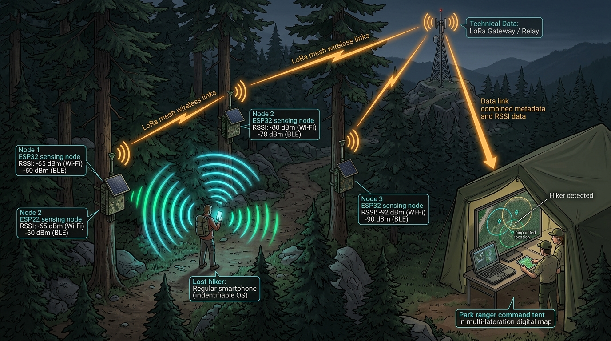
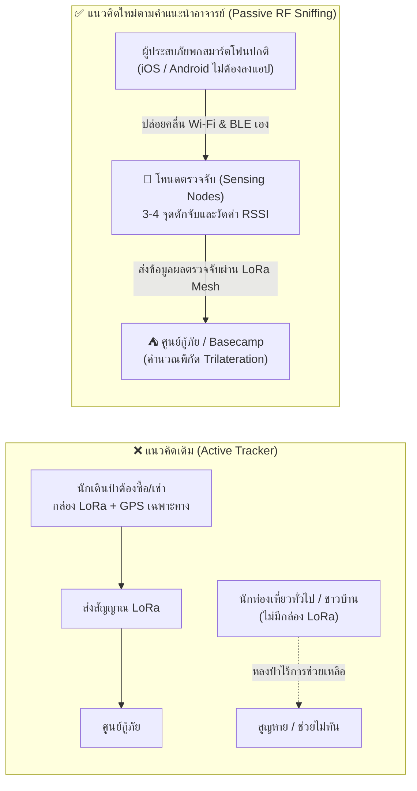
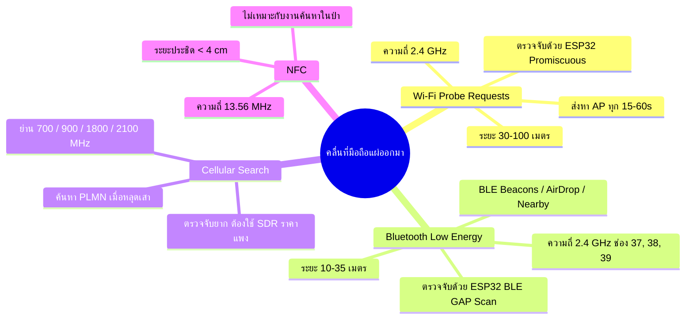
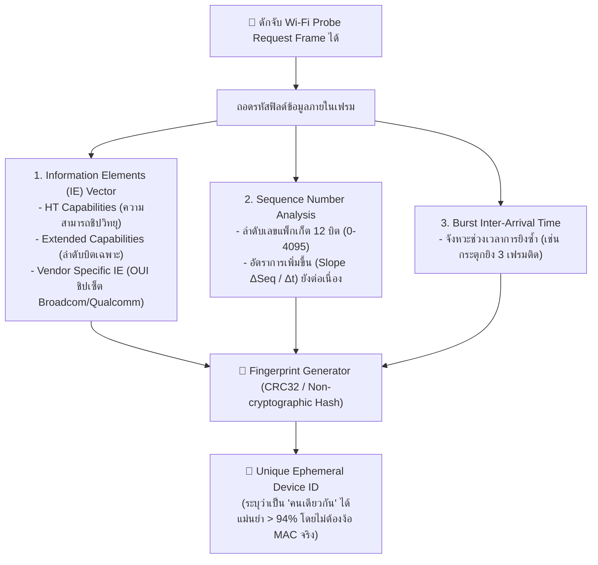
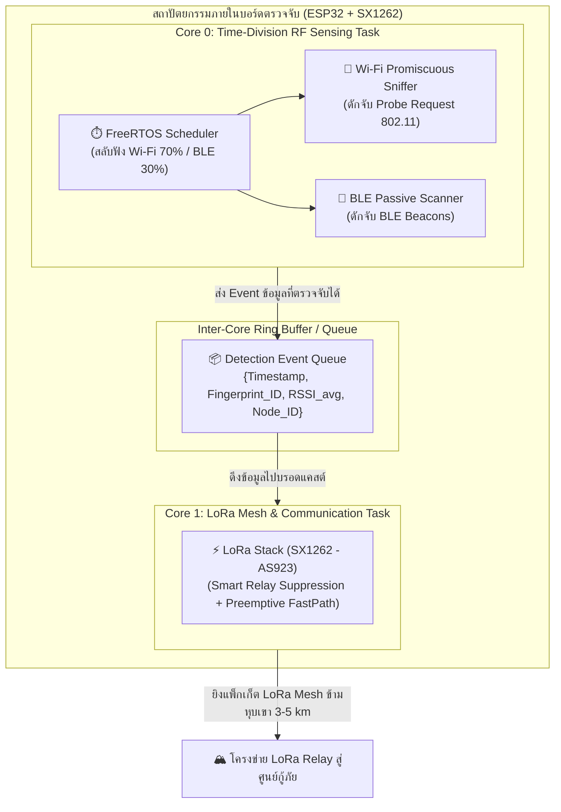
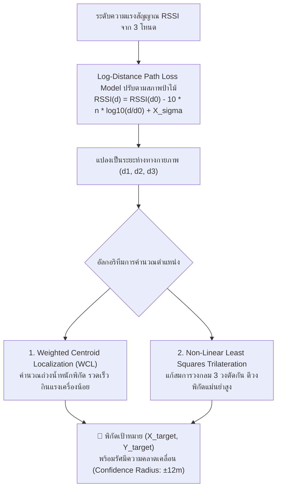

# 📱 เอกสารข้อกำหนดทางวิศวกรรม: ระบบตรวจจับคลื่นสมาร์ตโฟนเพื่อการกู้ภัย (Passive Smartphone RF Sniffing & LoRa Mesh Localization)

* **รหัสเอกสาร:** `SPEC-08-SMARTPHONE-SENSING`
* **สถานะ:** Core Research Directive (คำแนะนำอาจารย์ที่ปรึกษา - กันยายน 2026)
* **เทคโนโลยีอ้างอิง:** Wi-Fi 802.11 Promiscuous Mode, BLE Advertising Sniffing, Device Fingerprinting under MAC Randomization, Log-Distance Path Loss Trilateration, LoRa Mesh Backhaul
* **เป้าหมาย:** ค้นหาผู้ประสบภัยหรือคนหลงป่าโดยอาศัยคลื่นวิทยุที่สมาร์ตโฟนทั่วไป (iOS / Android) ปล่อยออกมาเองตามธรรมชาติ โดยผู้ประสบภัย **ไม่ต้องติดตั้งแอปพลิเคชันพิเศษใดๆ** และ **ไม่ต้องเชื่อมต่อสัญญาณอินเทอร์เน็ต** ตีวงพิกัดค้นหาได้แม่นยำในระยะ 10–20 เมตร แล้วส่งข้อมูลพิกัดผ่าน LoRa Mesh กลับสู่ศูนย์กู้ภัย

---

## 🖼️ ภาพรวมสถาปัตยกรรมระบบ (System Architecture Overview)



---

## 1. ที่มาและความสำคัญ (The Paradigm Shift: Active Tracker vs Passive Sniffing)

### 1.1 ปัญหาคอขวดของการกู้ภัยในอดีต
1. **ข้อจำกัดของ Dedicated LoRa Tracker:** ในงานวิจัยส่วนใหญ่ (เช่น Meshtastic Mountain Tracker) กำหนดให้นักท่องเที่ยวต้องพก "กล่องอุปกรณ์เฉพาะ" ที่มี LoRa และ GPS ติดตัว ซึ่งในชีวิตจริง **ไม่มีใครพกกล่องเหล่านี้เข้าไปทุกคน** หากคนหลงป่าเป็นชาวบ้านหาของป่า นักท่องเที่ยวทั่วไป หรือผู้ประสบภัยดินถล่มที่ไม่มีกล่องนี้ ระบบจะไม่สามารถช่วยเหลือได้เลย
2. **ปัญหา Cellular Dead Zone:** ในหุบเขาและป่าลึก ไม่มีสัญญาณเสามือถือ (4G/5G) ทำให้ผู้ประสบภัยไม่สามารถโทรออก ส่งพิกัด หรือแชร์ Live Location ได้
3. **พฤติกรรมจริงของมนุษย์ยุคปัจจุบัน:** สิ่งหนึ่งที่มนุษย์เกือบ 100% พกติดตัวตลอดเวลาคือ **"สมาร์ตโฟน"** แม้จะอยู่ในจุดที่ไม่มีสัญญาณโทรศัพท์ และแม้จะไม่ได้ต่อ Wi-Fi แต่ตราบใดที่แบตเตอรี่ยังไม่หมด **ชิปวิทยุภายในเครื่องจะยังคงแผ่คลื่นแม่เหล็กไฟฟ้าออกมาเป็นระยะๆ โดยอัตโนมัติ**



---

## 2. การวิเคราะห์คลื่นวิทยุ 4 ประเภทที่สมาร์ตโฟนแผ่ออกมา (RF Emission Analysis)

อาจารย์ที่ปรึกษาได้มอบหมายโจทย์สำคัญ: **"ต้องพิสูจน์ให้ชัดเจนว่า โทรศัพท์ที่วางไว้เฉยๆ แผ่คลื่นอะไรออกมาบ้าง เราตรวจจับได้อย่างไร และมีระยะเท่าไหร่"**



### 2.1 Wi-Fi Probe Request Frames (โอกาสสำเร็จสูงสุด ⭐⭐⭐⭐⭐)
* **พฤติกรรมตามมาตรฐาน 802.11:** เมื่อสมาร์ตโฟนเปิด Wi-Fi ทิ้งไว้ (ผู้ใช้ส่วนใหญ่ไม่เคยปิด Wi-Fi แม้จะเดินป่า) ระบบปฏิบัติการจะทำการค้นหา Access Point (AP) โดยส่งแพ็กเก็ตบรอดแคสต์ชนิด **Management Frame (Subtype: `0x0040` - Probe Request)** ออกไปในอากาศทุกๆ 15–60 วินาที
* **ข้อมูลที่แฝงมาในเฟรม:**
  * Transmitter Address (MAC Address เดิมหรือสุ่ม)
  * Supported Data Rates และ HT Capabilities
  * Extended Capabilities และ Vendor Specific Information Elements (IE)
  * Sequence Number (ลำดับแพ็กเก็ต 12 บิต)
* **วิธีการตรวจจับ:** ใช้ชิปราคาประหยัดอย่าง **ESP32** เปิดโหมด **`WIFI_PROMIS_FILTER_MASK_MGMT`** ใน Promiscuous Mode ดักฟังสัญญาณทุกแพ็กเก็ตที่ลอยอยู่ในอากาศได้ทันทีโดยไม่ต้องทำการ Connect หรือ Handshake
* **ระยะทำการตรวจจับ:** **30 – 100 เมตร** ในที่โล่ง (LOS) และ **15 – 40 เมตร** ในป่าทึบ (NLOS)

### 2.2 Bluetooth Low Energy (BLE Advertisements) (ประหยัดพลังงาน ⭐⭐⭐⭐)
* **พฤติกรรมของสมาร์ตโฟน:** สมาร์ตโฟนยุคใหม่เปิด Bluetooth ไว้ตลอดเวลาสำหรับนาฬิกา Smartwatch, หูฟังไร้สาย, ระบบสัมผัส COVID Tracking ในอดีต, และเซอร์วิสประจำเครื่อง เช่น Apple Continuity / AirDrop หรือ Android Nearby Share
* **ช่องสัญญาณที่แผ่ออกมา:** ยิงผ่าน 3 ช่องสัญญาณหลักคือ **Channel 37 (2402 MHz), Channel 38 (2426 MHz), และ Channel 39 (2480 MHz)**
* **ชนิดของแพ็กเก็ต:** `ADV_IND` (Connectable Undirected Advertising) และ `ADV_NONCONN_IND` (Non-connectable Advertising) ยิงทุกๆ 100 ms – 1,024 ms
* **วิธีการตรวจจับ:** ใช้ ESP32 BLE Controller ทำหน้าที่เป็น **Passive Observer** (`esp_ble_gap_start_scanning`)
* **ระยะทำการตรวจจับ:** **10 – 35 เมตร**

### 2.3 Cellular Network Search Signaling (4G LTE / 5G NR)
* **พฤติกรรมของสมาร์ตโฟน:** เมื่อหลุดจากเครือข่ายมือถือ (No Service) ชิปโมเด็มจะเข้าสู่สถานะ Cell Selection / PLMN Search และปล่อยสัญญาณ Uplink RRC Connection Request เป็นระยะๆ
* **ข้อจำกัดทางวิศวกรรม:** ย่านความถี่ Cellular (700 MHz, 900 MHz, 1800 MHz, 2100 MHz, 2600 MHz) มีความซับซ้อนสูง ต้องใช้อุปกรณ์ประเภท **Software Defined Radio (SDR)** เช่น HackRF หรือ USRP ซึ่งมีราคาสูง กินพลังงานสูง และผิดกฎหมายหากตั้งเป็น Fake Base Station (IMSI Catcher)
* **ข้อสรุปตามคำแนะนำอาจารย์:** ในการทดลองระดับปริญญาตรีและงานวิจัยเชิงวิศวกรรม **ให้มุ่งเน้นที่ Wi-Fi Probe Request และ BLE Sniffing บนชิป ESP32 เดียวกัน** เพราะทำได้ทันที ต้นทุนต่ำ และถูกต้องตามกฎหมาย

---

## 3. นวัตกรรมแก้ไขจุดตาย: การรับมือกับ MAC Address Randomization

หนึ่งในจุดท้าทายที่สุดระดับสากล และเป็น **"จุดขายทางวิชาการ (Academic Novelty)"** ที่ดีที่สุดของงานนี้ คือการแก้ปัญหาการสุ่ม MAC Address:

### 3.1 ปัญหาของ MAC Randomization
ตั้งแต่ iOS 14 และ Android 10 เป็นต้นมา เมื่อโทรศัพท์ส่ง Probe Request ในขณะที่ไม่ได้เชื่อมต่อ Wi-Fi เครื่องจะทำการ **สุ่ม MAC Address ขึ้นมาใหม่เรื่อยๆ** เพื่อป้องกันการถูกติดตาม (Privacy Protection) ส่งผลให้ MAC Address ที่ Sensing Node ดักจับได้เปลี่ยนไปตลอดเวลา

### 3.2 เทคนิคแก้ปัญหาด้วยการทำ Device Fingerprinting
แม้ MAC Address จะเปลี่ยนไป แต่ **ลักษณะทางกายภาพและโครงสร้างไบนารีของเฟรมยังคงเป็นเอกลักษณ์ (Signature)** ของเครื่องนั้นๆ:



---

## 4. สถาปัตยกรรมโหนดตรวจจับ (ESP32 Multi-RAT Sniffer & Relay Node)

โหนดภาคสนามถูกออกแบบให้ทำหน้าที่ 2 บทบาทพร้อมกัน:
1. **Sniffer Engine (Wi-Fi + BLE):** ตรวจจับคลื่นจากมือถือคนหลงป่า
2. **Mesh Communicator (LoRa SX1262):** ส่งผลการตรวจจับข้ามระยะทางไกล



### 4.1 ตัวอย่างซอร์สโค้ดต้นแบบ ESP32 Wi-Fi Promiscuous Sniffer (Arduino / ESP-IDF)
```cpp
#include <WiFi.h>
#include <esp_wifi.h>

// โครงสร้าง Header ของ 802.11 Management Frame
struct SnifferPacket {
    int rssi;
    uint8_t mac[6];
    uint16_t seq_num;
    uint32_t fingerprint_hash;
};

// Callback ฟังก์ชันทำงานเมื่อดักจับแพ็กเก็ตในอากาศได้
void IRAM_ATTR wifi_promiscuous_rx_cb(void* buf, wifi_promiscuous_pkt_type_t type) {
    if (type != WIFI_PKT_MGMT) return; // กรองเอาเฉพาะ Management Frame
    
    const wifi_promiscuous_pkt_t* pkt = (wifi_promiscuous_pkt_t*)buf;
    const uint8_t* payload = pkt->payload;
    int len = pkt->rx_ctrl.sig_len;
    
    // ตรวจสอบ Subtype ว่าเป็น Probe Request (0x0040) หรือไม่
    uint8_t frame_control = payload[0];
    if ((frame_control & 0xFC) == 0x40) {
        int rssi = pkt->rx_ctrl.rssi;
        uint16_t seq = (payload[22] | (payload[23] << 8)) >> 4;
        
        // สกัด MAC Address ต้นทาง (Transmitter Address: ไบต์ที่ 10 ถึง 15)
        char mac_str[18];
        snprintf(mac_str, sizeof(mac_str), "%02X:%02X:%02X:%02X:%02X:%02X",
                 payload[10], payload[11], payload[12], 
                 payload[13], payload[14], payload[15]);
                 
        // ส่งต่อเข้า FreeRTOS Queue เพื่อให้ Core 1 ส่งต่อทาง LoRa
        // ... (Push to LoRa Transmit Queue) ...
    }
}
```

---

## 5. อัลกอริทึมการประมาณพิกัดตำแหน่ง (Multi-lateration & Trilateration)

เมื่อ Sensing Nodes จำนวน 3 จุด (โหนด A, B, C) ในป่า ดักจับสัญญาณจากมือถือเครื่องเดียวกันได้ ณ เวลาใกล้เคียงกัน:

```
โหนด A (x1, y1) วัดได้ RSSI = -65 dBm ──> คำนวณระยะทาง d1 ≈ 18 เมตร
โหนด B (x2, y2) วัดได้ RSSI = -80 dBm ──> คำนวณระยะทาง d2 ≈ 38 เมตร
โหนด C (x3, y3) วัดได้ RSSI = -92 dBm ──> คำนวณระยะทาง d3 ≈ 65 เมตร
```



### 5.1 แบบจำลองการสูญเสียสัญญาณในป่าไม้ (Forest Path Loss Modeling)
ในป่าทึบ ดัชนีการลดทอนของคลื่น ($n$) จะสูงกว่าในอากาศเปิดปกติ ($n_{\text{free space}} = 2.0$):
* **ป่าโปร่ง / สวนผลไม้:** $n = 2.7 - 3.2$
* **ป่าเบญจพรรณ / ทรงพุ่มหนา:** $n = 3.5 - 4.2$
* ระบบบนแดชบอร์ดศูนย์กู้ภัยจะทำการปรับแต่งค่าพารามิเตอร์สิ่งแวดล้อม ($n$) ให้เหมาะสมกับสภาพภูมิประเทศ เพื่อให้ได้ระยะทาง $d_i$ ที่แม่นยำที่สุด

---

## 6. แผนการทดลอง Proof of Concept (PoC) สเกลเล็กตามคำแนะนำอาจารย์

อาจารย์ให้คำแนะนำสำคัญว่า **"อย่าเพิ่งทำระบบใหญ่ไปลุยในป่า ให้ทำ PoC ขนาดเล็กพิสูจน์ความแม่นยำก่อน"** ดังนั้นแผนทดสอบจึงถูกจัดเป็น 3 ก้าวหลัก:

| ลำดับการทดลอง | เป้าหมายการทดสอบ | การจัดวางอุปกรณ์และวิธีการวัด | ผลลัพธ์ที่ต้องพิสูจน์ (Success Criteria) |
| :---: | :--- | :--- | :--- |
| **ขั้นที่ 1:<br>RF Sniffing Profiling** | พิสูจน์ว่ามือถือแผ่คลื่นอะไรออกมาบ้างในแต่ละสถานะ | นำมือถือ 4 เครื่อง (iPhone 2 เครื่อง, Android 2 เครื่อง) วางไว้เฉยๆ แล้วใช้ ESP32 บันทึกอัตราการส่งเฟรม | • บันทึกอัตราการเกิด Wi-Fi Probe Request ต่อนาที<br>• ยืนยันว่าดักจับได้แม้หน้าจอปิดอยู่ (Standby) |
| **ขั้นที่ 2:<br>Distance vs RSSI Mapping** | วัดระยะทำการดักจับและความสัมพันธ์ของ RSSI | เดินถอยห่างจากโหนด ESP32 ในระยะ 5, 10, 20, 30, 50 เมตร ทั้งในอาคารและสวนต้นไม้ | • สร้างกราฟความสัมพันธ์ Distance vs RSSI<br>• พิสูจน์ระยะตรวจจับหวังผลได้ที่ $\ge 30\text{ m}$ |
| **ขั้นที่ 3:<br>3-Node Small-scale Trilateration** | วางโหนด 3 จุดในพื้นที่ 40x40 เมตร เพื่อหาพิกัด | วาง ESP32 3 ตัวเป็นรูปสามเหลี่ยม ให้คนพกมือถือเดินไปตามจุด แล้วส่งผลผ่าน LoRa เข้าคอมพิวเตอร์ | • โปรแกรมบนคอมพิวเตอร์คำนวณจุดตัดวงกลม<br>• ความคลาดเคลื่อนของตำแหน่ง **$< 10\text{ เมตร}$** |

---

## 7. บทสรุปและประโยชน์ต่อโครงการ
การผสาน **"Passive Smartphone RF Sniffing"** เข้ากับ **"LoRa Mesh Backbone"** ช่วยยกระดับโครงการนี้ขึ้นสู่ระดับแนวหน้า:
1. **แก้ปัญหาความจริง (Real-World Feasibility):** คนหลงป่าทุกคนได้รับการช่วยเหลือทันทีเพียงแค่มีมือถือติดตัว
2. **มีคุณค่าทางวิชาการ (Academic Novelty):** มีงานวิจัยด้าน Device Fingerprinting ภายใต้ MAC Randomization และ Multi-lateration ในสภาพแวดล้อมธรรมชาติ
3. **ขอบเขตงานชัดเจนตามอาจารย์ที่ปรึกษา:** เริ่มต้นจากบอร์ดจำลอง 3 ตัว พิสูจน์หลักการให้เสร็จสมบูรณ์ ก่อนขยายผลสู่พื้นที่จริง
