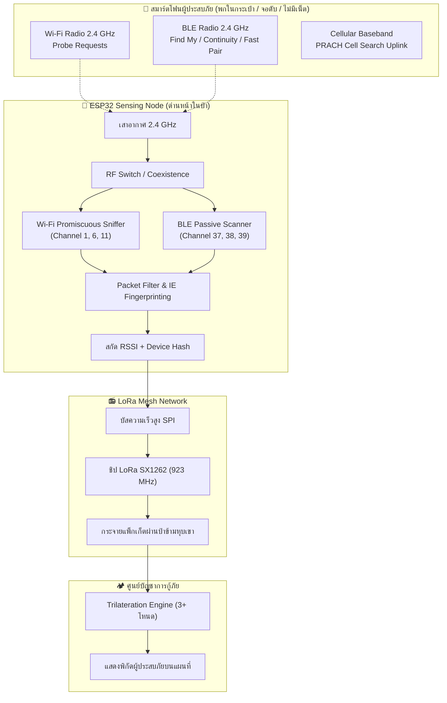
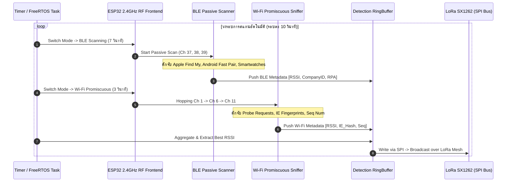

# 📡 SPEC-09: การวิเคราะห์คลื่นสัญญาณวิทยุที่สมาร์ตโฟนแผ่ออกมาและวิธีการตรวจจับ (Smartphone RF Emissions & Passive Detection Analysis)

> **สถานะเอกสาร:** ฉบับสมบูรณ์ (Active Core Engineering Specification)  
> **วันที่มีผลบังคับใช้:** 2026-09-13  
> **โครงการ:** โครงการวิจัยและพัฒนาสหกิจศึกษา (Project Co-op) - ระบบค้นหาและระบุตำแหน่งผู้ประสบภัยในพื้นที่อับสัญญาณด้วย Passive RF Sniffing & LoRa Mesh  
> **เอกสารอ้างอิงหลัก:** [`docs/08_smartphone_rf_sensing.md`](file:///d:/ProjectLoRa/docs/08_smartphone_rf_sensing.md)

---

## 1. บทนำและแรงจูงใจ (Introduction & Motivation)

ในการปฏิบัติการค้นหาและกู้ภัยในป่าลึกหรือพื้นที่ประสบภัยพิบัติ ข้อจำกัดร้ายแรงที่สุดของแนวคิดเดิม (Active Tracking) คือ **"ผู้ประสบภัยไม่มีอุปกรณ์สื่อสารเฉพาะทาง (เช่น กล่องวิทยุ LoRa Tracker)"** แต่ในความเป็นจริง **ผู้คนเกือบ 100% พกพาสมาร์ตโฟน (Smartphone) ติดตัวตลอดเวลา**

แม้ในพื้นที่ที่ **ไม่มีสัญญาณโทรศัพท์ (No Cellular Service)** และ **ไม่มีอินเทอร์เน็ต (No Internet / No Wi-Fi AP)** ชิปเซตไร้สายภายในสมาร์ตโฟนยังคงทำงานตลอดเวลาและแผ่คลื่นแม่เหล็กไฟฟ้า (Radio Frequency - RF Emissions) ออกสู่อากาศ เพื่อพยายามค้นหาเครือข่ายหรือเชื่อมต่อกับอุปกรณ์ข้างเคียง

เอกสารฉบับนี้ทำการวิเคราะห์เชิงลึกว่า **สมาร์ตโฟนปล่อยคลื่นอะไรออกมาบ้าง, เงื่อนไขและจังหวะเวลาในการปล่อย, ข้อมูลเมทาดาทาที่สามารถดักจับได้, และความเป็นไปได้ในการใช้อุปกรณ์ราคาประหยัดและกินไฟต่ำอย่าง ESP32 ร่วมกับ LoRa Mesh ในการตรวจจับเพื่อระบุตำแหน่ง**



---

## 2. การจำแนกประเภทคลื่นสัญญาณที่สมาร์ตโฟนแผ่ออกมา (Emitted RF Taxonomy)

จากการวิจัยเชิงวิศวกรรม คลื่นวิทยุที่สมาร์ตโฟนรุ่นปัจจุบัน (iOS และ Android) แผ่ออกมา สามารถแบ่งออกเป็น 5 มิติหลัก:

```
                          ┌─ 1. Wi-Fi (802.11 b/g/n) 2.4 GHz [Probe Requests]  ──> ⭐ ดักจับได้ยอดเยี่ยม (ESP32)
                          ├─ 2. BLE (Bluetooth Low Energy) 2.4 GHz [Adv Beacons]──> ⭐ ดักจับได้ยอดเยี่ยม (ESP32)
Smartphone RF Emissions ──┼─ 3. Wi-Fi (802.11 ac/ax) 5 GHz [High-band Probes]   ──> ต้องใช้ชิป Dual-band
                          ├─ 4. Cellular Uplink (4G LTE/5G NR) [PRACH Preambles]──> ต้องใช้ SDR (HackRF/RTL-SDR)
                          └─ 5. UWB (Ultra-Wideband) 6.5–8.0 GHz & NFC 13.56 MHz ──> ไม่เหมาะกับงานป่าระยะไกล
```

---

## 3. เจาะลึกสัญญาณแต่ละประเภท (Deep Dive by RF Technology)

### 3.1 สัญญาณ Wi-Fi (IEEE 802.11 b/g/n - ย่านความถี่ 2.4 GHz)

#### ก. กลไกการแผ่คลื่น (Transmission Mechanism)
เมื่อสมาร์ตโฟนเปิดการทำงาน Wi-Fi ไว้ (ซึ่งผู้ใช้ส่วนใหญ่เปิดทิ้งไว้เป็นปกติ) แต่ **ไม่ได้เชื่อมต่อกับเราเตอร์ใดๆ** (เช่น เดินอยู่ในป่า) ระบบปฏิบัติการจะสั่งให้ชิป Wi-Fi ส่งเฟรมบริหารจัดการประเภท **Probe Request (Subtype 0x0004)** ออกสู่อากาศทุกช่องสัญญาณ (Channel Hopping 1 ถึง 13) เพื่อถามว่า *"มี Access Point ที่ฉันรู้จักหรือเปิดกว้างอยู่แถวนี้ไหม?"*

Probe Requests แบ่งออกเป็น 2 ชนิด:
1. **Broadcast (Wildcard) Probe Request:** ความยาว SSID เป็น 0 (SSID Field ว่างเปล่า) เป็นการถามหา AP ทุกตัวในบริเวณ
2. **Directed Probe Request:** บรรจุชื่อ SSID ที่บันทึกไว้ในเครื่อง (เช่น `Home_Wi-Fi`, `Office_Guest`) ปัจจุบัน iOS และ Android รุ่นใหม่จะจำกัดการส่ง Directed Probes เพื่อความเป็นส่วนตัว ยกเว้นกรณีเครือข่าย Hidden SSID

#### ข. ข้อมูลที่สกัดได้จากแพ็กเก็ต (Sniffable Metadata)
1. **RSSI (Received Signal Strength Indicator):** วัดระดับความแรงสัญญาณเป็น dBm มีความสัมพันธ์กับระยะทางตามแบบจำลอง Log-Distance Path Loss
2. **Sequence Control Field (12-bit Counter: 0–4095):** ตัวนับลำดับเฟรมที่สร้างจากชิปเซตวิทยุ ค่านี้จะบวกเพิ่มทีละ 1 สำหรับเฟรมที่ส่งออกติดๆ กัน แม้สมาร์ตโฟนจะปลอมหรือเปลี่ยน MAC Address สลับไปมา แต่ตัวนับ Sequence Number ภายใน Burst เดียวกันจะเรียงลำดับต่อเนื่องกันเสมอ ทำให้ระบบสามารถจับกลุ่ม (Cluster) ได้ว่าเป็นเครื่องเดียวกัน
3. **Information Elements (IE Fingerprinting):** แพ็กเก็ต Probe Request มีก้อนข้อมูลคุณสมบัติฮาร์ดแวร์แนบมาด้วยเสมอ เช่น:
   * **Supported Rates (Tag 1) & Extended Supported Rates (Tag 50):** อัตราความเร็วที่ชิปเซตมือถือรองรับ
   * **HT Capabilities (Tag 45 - 802.11n):** ข้อมูลความกว้างแถบคลื่น, Modulation Coding Scheme (MCS)
   * **Extended Capabilities (Tag 127):** คุณลักษณะความปลอดภัยและโปรโตคอลประหยัดพลังงาน
   * **Vendor Specific Element (Tag 221):** ลายเซ็นเฉพาะของผู้ผลิตชิป (เช่น Broadcom, Qualcomm, Apple, MediaTek)
   > **จุดเด่นทางวิศวกรรม:** ค่า Information Elements เหล่านี้เกิดจากโครงสร้างทางกายภาพของฮาร์ดแวร์ชิป จึง **ไม่เปลี่ยนแปลงเลยแม้จะมีการสุ่ม MAC Address (MAC Randomization)**

#### ค. จังหวะเวลาและพฤติกรรมการส่ง (Interval Dynamics & Battery States)
* **สถานะเปิดหน้าจอ (Screen ON):** ส่งแพ็กเก็ตถี่มาก ทุกๆ **3 – 10 วินาที**
* **สถานะพักหน้าจอ / อยู่ในกระเป๋า (Screen OFF / Deep Sleep):**
  * **Android (Doze Mode):** เมื่อวางเครื่องนิ่ง ระบบจะหน่วงระยะห่างการสแกนแบบทวีคูณ (15s $\rightarrow$ 30s $\rightarrow$ 60s $\rightarrow$ 120s $\rightarrow$ สูงสุด 5–15 นาที) แต่หากเครื่องมีการสั่นไหว (เช่น ผู้ประสบภัยก้าวเดิน หรือสลบแต่ถูกเขย่า) เซนเซอร์ Accelerometer จะปลุกระบบมาส่งสแกนรอบใหม่
  * **iOS:** ส่งเป็นช่วงสั้นๆ (Burst 3–5 เฟรม) ทุกๆ **60 วินาที ถึง 3 นาที** เมื่อจอดับ และใช้ชิปประมวลผลการเคลื่อนไหว (CoreMotion) ช่วยตรวจจับการเคลื่อนไหวเพื่อสั่งสแกน

---

### 3.2 สัญญาณ Bluetooth Low Energy (BLE - ย่านความถี่ 2.4 GHz)

> **หัวใจสำคัญของการค้นหา:** สัญญาณ BLE มีอัตราการยิงที่ **สม่ำเสมอและถี่กว่า Wi-Fi ในขณะที่หน้าจอดับ** อย่างมีนัยสำคัญ เนื่องจากระบบปฏิบัติการยุคใหม่พึ่งพา BLE ในการทำงานของ Eco-system ตลอดเวลา

#### ก. สัญญาณ BLE จากระบบปฏิบัติการ (Background OS Beacons)
1. **Apple Ecosystem & Continuity Protocols (Company ID: `0x004C`):**
   * **Apple Find My Network (Offline Finding Beacon):** เป็นฟีเจอร์ที่สำคัญที่สุดในงานกู้ภัย iPhone ทุกเครื่องที่เปิดฟังก์ชัน Find My จะแผ่คลื่น BLE Advertisement แบบไม่เชื่อมต่อ (Non-connectable) ออกมาเรื่อยๆ เพื่อให้โครงข่ายรับรู้ตำแหน่ง แม้ไม่มีเน็ตหรือหน้าจอดับ
   * **Power Reserve Finding (iPhone 11 ขึ้นไป):** แม้แบตเตอรี่โทรศัพท์จะหมดจนดับสนิท ชิป Apple A-Series และชิป Ultra-low power Bluetooth จะยังคงใช้พลังงานสำรองก้อนสุดท้ายยิงคลื่น Find My BLE ออกมาได้นานต่อเนื่องสูงสุดถึง **24 ชั่วโมง**
   * **Nearby Discovery / Proximity:** ยิงค้นหา Apple Watch, AirPods, หรือ iPad ที่อยู่ใกล้เคียงทุกๆ **1 – 3 วินาที**
2. **Google Fast Pair & Nearby Share (Company ID: `0x00E0` หรือ `0x01AA`):**
   * มือถือ Android เกือบทุกรุ่นจะส่ง Advertising Packets ในช่องสัญญาณ Advertising (Channels 37, 38, 39) เพื่อค้นหาหูฟังบลูทูธและอุปกรณ์ IoT รอบข้าง
   * **Android Find My Device Network (เปิดตัวปี 2024+):** สมาร์ตโฟน Android สากลจะแผ่คลื่น BLE Beacon เข้ารหัสออกมาสม่ำเสมอเช่นเดียวกับ Apple
3. **อุปกรณ์สวมใส่และอุปกรณ์เสริม (Wearables & Accessories):**
   * นักเดินป่าจำนวนมากสวมใส่ **Smartwatch** (Apple Watch, Garmin, Galaxy Watch, Mi Band) หรือพกพา **หูฟังไร้สาย TWS** (AirPods, Galaxy Buds) ในกระเป๋า
   * อุปกรณ์เหล่านี้จะส่ง BLE Advertising และ Connection Maintenance ออกมาแทบจะทุกๆ **500 ms ถึง 2 วินาที** อย่างต่อเนื่อง

#### ข. ข้อได้เปรียบของช่องสัญญาณ BLE Advertising (Channels 37, 38, 39)
* ความถี่ของช่อง 37 (2402 MHz), 38 (2426 MHz), และ 39 (2480 MHz) ถูกออกแบบมาเป็นพิเศษให้อยู่ตรงช่องว่างระหว่าง Wi-Fi Channel 1, 6, 11
* ทำให้สัญญาณ BLE ไม่ถูกสัญญาณ Wi-Fi กวนโดยตรง และ ESP32 สามารถเปิดโหมด Passive Scan ดักฟังได้พร้อมกันอย่างมีประสิทธิภาพสูงมาก

---

### 3.3 สัญญาณเซลลูลาร์ (Cellular Uplink: 4G LTE / 5G NR / 2G GSM)

#### ก. พฤติกรรมเมื่อตกอยู่ในจุดอับสัญญาณ (Out of Coverage / No Service)
เมื่อเดินเข้าป่าลึกจนขาดการติดต่อจากเสาส่ง โทรศัพท์จะไม่หยุดทำงาน แต่จะเข้าสู่กระบวนการ **Cell Search & Selection Procedure**:
1. โทรศัพท์จะกวาดรับสัญญาณ Downlink ในทุกย่านความถี่ (เช่น 700 MHz, 850 MHz, 900 MHz, 1800 MHz, 2100 MHz)
2. หากจับสัญญาณเสาสัญญาณอ่อนๆ ที่ปลายขอบการครอบคลุมได้ โทรศัพท์จะส่งแพ็กเก็ต **PRACH Preamble (Physical Random Access Channel)** ขึ้นไปทาง Uplink เพื่อขอเชื่อมต่อ (RRC Connection Request)
3. กำลังส่ง (Tx Power) ของคลื่นเซลลูลาร์ในช่วงนี้จะถูกบูสต์ขึ้นสู่ระดับสูงสุดของเครื่อง คือ **+23 dBm (ประมาณ 200 mW)** ซึ่งแรงกว่า Wi-Fi (+15 dBm) และ BLE (+0 ถึง +4 dBm) หลายเท่าตัว

#### ข. การวิเคราะห์ความเป็นไปได้ในการนำมาใช้
* **ระยะสัญญาณ:** สัญญาณเซลลูลาร์ความถี่ต่ำ (เช่น Band 28: 700 MHz หรือ Band 8: 900 MHz) มีความยาวคลื่นยาว ทะลุต้นไม้ใบหญ้าในป่าได้ไกลเป็นกิโลเมตร
* **ข้อจำกัดทางเทคนิค:**
  * ชิป **ESP32 ไม่สามารถรับสัญญาณเซลลูลาร์ได้** เนื่องจากไม่มีภาครับ RF ย่าน Sub-GHz / Multiband ของโทรศัพท์มือถือ
  * การดักจับสัญญาณเซลลูลาร์ต้องใช้บอร์ด **SDR (Software Defined Radio)** เช่น HackRF One, LimeSDR หรือ USRP ร่วมกับคอมพิวเตอร์ Single Board Computer (เช่น Raspberry Pi) ซึ่งกินไฟสูงมาก (5–15W เทียบกับ ESP32 ที่กินเพียง 0.3–0.8W) และราคาแพงหลักหมื่นบาท
  * มีข้อจำกัดทางกฎหมายด้านความมั่นคงและโทรคมนาคม (NBTC / กสทช.)
* **บทสรุปเชิงวิศวกรรม:** ให้บันทึกเรื่อง Cellular Uplink ไว้ในเชิงทฤษฎีเปรียบเทียบในรายงานวิจัย แต่ในการสร้างฮาร์ดแวร์ Sensing Node ภาคสนาม ให้มุ่งเน้นที่ **Wi-Fi 2.4 GHz + BLE** เพราะสร้างได้จริง กินไฟต่ำ ต้นทุนหลักร้อยบาท และถูกกฎหมายคลื่นสาธารณะ (ISM Band)

---

### 3.4 สัญญาณ Ultra-Wideband (UWB - 6.5 GHz / 8.0 GHz) และ NFC (13.56 MHz)

1. **UWB (IEEE 802.15.4z):**
   * แม้จะมีในสมาร์ตโฟนระดับเรือธง (iPhone 11+, Samsung Galaxy Ultra) แต่วงจร UWB จะไม่ยิงคลื่นออกมาเองโดยพลการ จะทำงานเฉพาะเมื่อมีการสื่อสารสองทาง (Two-Way Ranging) กับแท็กหรือกุญแจดิจิทัลเท่านั้น
   * คลื่นความถี่ 6.5–8.0 GHz ถูกดูดกลืนด้วยความชื้นและใบไม้ในป่าอย่างรุนแรง จึงไม่เหมาะกับการค้นหาบุคคลระยะไกล
2. **NFC (Near Field Communication - 13.56 MHz):**
   * ทำงานด้วยการเหนี่ยวนำแม่เหล็กไฟฟ้าระยะสั้นมาก (ไม่เกิน 4–10 เซนติเมตร) ไม่สามารถนำมาใช้ในการตรวจจับระยะไกลในป่าได้

---

## 4. ตารางเปรียบเทียบคลื่นสัญญาณแม่เหล็กไฟฟ้าจากสมาร์ตโฟน (RF Characteristics Matrix)

| สัญญาณ (RF Technology) | ย่านความถี่ (Band) | รูปแบบแพ็กเก็ตที่แผ่ออกมา | สถานการณ์ที่เครื่องยิงคลื่น | กำลังส่ง (Tx Power) | ระยะหวังผลในป่า (Range) | ความถี่การส่ง (Interval) | ความเป็นไปได้กับ ESP32 Node |
| :--- | :---: | :--- | :--- | :---: | :---: | :---: | :---: |
| **Wi-Fi 2.4 GHz** | 2.412–2.472 GHz (Ch 1–13) | Probe Requests (Management 0x0004) | เปิด Wi-Fi ไว้แต่ไม่ได้ต่อ AP | +14 ถึง +20 dBm (25–100 mW) | 30 – 60 ม. (โปร่ง)<br>15 – 30 ม. (ป่าทึบ) | จอเปิด: 3–10s<br>จอดับ: 1–5 min | **ทำได้ 100%**<br>(Promiscuous Mode) |
| **BLE (Bluetooth LE)** | 2.402, 2.426, 2.480 GHz (Ch 37–39) | Advertising Packets (Find My, Continuity, Fast Pair) | เซอร์วิสเบื้องหลัง, หูฟัง, นาฬิกา Smartwatch | 0 ถึง +4 dBm (1–2.5 mW) | 20 – 40 ม. (โปร่ง)<br>10 – 20 ม. (ป่าทึบ) | **ยิงต่อเนื่องสม่ำเสมอ**<br>(ทุกๆ 1 – 3s แม้จอดับ) | **ทำได้ 100%**<br>(Passive GAP Scan) |
| **Wi-Fi 5 GHz** | 5.180–5.825 GHz | Probe Requests 802.11ac/ax | สแกนหาเราเตอร์ 5 GHz | +14 ถึง +20 dBm | 10 – 20 ม. (ลดทอนสูง) | พร้อมๆ กับ 2.4 GHz | ต้องใช้ชิปเสริม Dual-band |
| **Cellular Uplink** | 700 / 900 / 1800 / 2100 MHz | PRACH Preamble / Search | โทรศัพท์ตกอยู่ในจุดอับสัญญาณ | **+23 dBm (200 mW)** | 100 – 500+ ม. | เป็นรอบตาม Baseband Timer | ❌ ไม่รองรับ (ต้องใช้ SDR) |
| **UWB** | 6.5 GHz / 8.0 GHz (Ch 5, 9) | Impulse Radio Packets | เฉพาะเมื่อสื่อสารกับ AirTag/กุญแจ | ต่ำมาก (Pulse) | < 10 ม. (ลดทอนสูงมาก) | ไม่ยิงถ้าไม่มีอุปกรณ์ปลุก | ❌ ไม่รองรับ (ต้องใช้ DW3000) |
| **NFC** | 13.56 MHz | Inductive Coupling | เมื่อแตะจ่ายเงินหรือสแกนบัตร | ต่ำมาก | < 0.05 เมตร | ไม่ยิงถ้าไม่มีเครื่องทาบ | ❌ ไม่รองรับ |

---

## 5. สถาปัตยกรรมตัวดักจับสัญญาณ 2 ระบบร่วมกัน (Dual-RAT Sniffing Engine บน ESP32)

เพื่อแก้ปัญหาจุดอ่อนของทั้งสองสัญญาณ (Wi-Fi จอดับยิงช้า / BLE สัญญาณสั้นกว่า Wi-Fi เล็กน้อย) สถาปัตยกรรมโหนดตรวจจับของเราจะใช้เทคนิค **Time-Division Coexistence บน ESP32**:



### สัดส่วนการแบ่งเวลา (Time Allocation):
1. **70% ของเวลา (7 วินาที): สแกน BLE Passive Scanning**  
   * เพื่อดักจับ Apple Continuity / Find My และ Android Fast Pair ที่ยิงออกมาสม่ำเสมอทุกๆ 1–3 วินาที
2. **30% ของเวลา (3 วินาที): สแกน Wi-Fi Promiscuous Mode**  
   * หมุนสลับช่องสัญญาณหลัก 1, 6, 11 ช่องละ 1 วินาที เพื่อดักจับ Probe Request เมื่อมีเฟรมยิงออกมา

---

## 6. โครงสร้างข้อมูลแพ็กเก็ต LoRa ที่ส่งกลับศูนย์กู้ภัย (Sniffed LoRa Payload Spec)

เมื่อโหนด ESP32 ดักจับคลื่นได้ จะทำการบีบอัดข้อมูลให้เล็กที่สุด (Compact Binary Payload) เพื่อส่งผ่านบัส SPI เข้าชิป LoRa SX1262 ดังนี้:

| ไบต์ที่ (Offset) | ฟิลด์ข้อมูล (Field Name) | ชนิดข้อมูล (Data Type) | ขนาด (Bytes) | คำอธิบายรายละเอียด |
| :---: | :--- | :---: | :---: | :--- |
| `0x00` | `NodeType` | `uint8_t` | 1 Byte | ชนิดของโหนด (`0x81` = RF Sniffer Node) |
| `0x01` | `NodeID` | `uint8_t` | 1 Byte | รหัสประจำตัวโหนดที่ตรวจพบ (เช่น Node 01, 02, 03) |
| `0x02` | `TargetRAT` | `uint8_t` | 1 Byte | ประเภทคลื่น (`0x01` = Wi-Fi, `0x02` = Apple BLE, `0x03` = Android BLE, `0x04` = Generic BLE) |
| `0x03 - 0x06` | `DeviceFingerprint` | `uint32_t` | 4 Bytes | ค่า Hash ย่อของ IE Fingerprint หรือ Manufacturer Specific Payload |
| `0x07` | `RSSI_Value` | `int8_t` | 1 Byte | ค่าความแรงสัญญาณที่ตรวจวัดได้จริง (เช่น `-68` dBm) |
| `0x08 - 0x09` | `FrameSequence` | `uint16_t` | 2 Bytes | ลำดับแพ็กเก็ต (Wi-Fi Sequence Number หรือ BLE Packet Counter) |
| `0x0A - 0x0D` | `TimestampDelta` | `uint32_t` | 4 Bytes | เวลาที่ตรวจพบ นับเทียบกับเวลาเริ่มต้นของระบบ (ms) |
| `0x0E` | `BatteryStatus` | `uint8_t` | 1 Byte | เปอร์เซ็นต์แบตเตอรี่ของโหนดตรวจจับ (0–100%) |
| **รวม** | **Total Payload Size** | | **15 Bytes** | **มีขนาดกะทัดรัดมาก ส่งผ่าน LoRa SF9/SF10 ได้ในเวลา < 60ms** |

---

## 7. สรุปผลและขั้นตอนการดำเนินงานถัดไป (Next Steps)

1. ✅ **เคลียร์พื้นที่และแยกงานวิจัยเดิม:** ย้ายงานเก่าทั้งหมด (Docs 01–07, เอกสาร PDF, โน้ตเดิม) เข้าสู่ [`archive_initial_research`](file:///d:/ProjectLoRa/archive_initial_research) เป็นที่เรียบร้อย
2. ✅ **เปลี่ยนชื่อโปรเจกต์:** สร้างโฟลเดอร์ Junction [`d:\ProjectCo-op`](file:///d:/ProjectCo-op) เชื่อมโยงกับโปรเจกต์จริง
3. ✅ **จัดทำบทวิเคราะห์สัญญาณคลื่นสมาร์ตโฟนอย่างสมบูรณ์:** บันทึกลงในเอกสารฉบับนี้ ([`docs/09_smartphone_rf_signals_analysis.md`](file:///d:/ProjectLoRa/docs/09_smartphone_rf_signals_analysis.md))
4. 🎯 **งานลำดับถัดไป (Milestone Phase 1 - Sensing Firmware):**
   * พัฒนาโค้ดต้นแบบเฟิร์มแวร์ ESP32 (Arduino / ESP-IDF) สำหรับทดสอบการเปิด **Wi-Fi Promiscuous Mode** ดักจับ Probe Request และ **BLE Passive Scan** ดักจับ Apple/Android Beacons
   * ทำการทดสอบวัดค่า RSSI จริงเทียบกับระยะห่าง (5m, 10m, 20m, 30m) เพื่อคำนวณหาค่า Path Loss Exponent ($n$)
