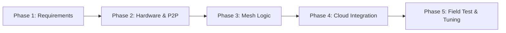

# 🛠️ แผนการดำเนินงานวิจัยและพัฒนาระบบ LoRa Mesh (5-Phase Engineering Roadmap)

เอกสารนี้กำหนดกรอบการดำเนินงาน (Roadmap) สำหรับการวิจัยและพัฒนาระบบเครือข่ายเซนเซอร์ไร้สายด้วย **LoRa Mesh / Multi-hop** ครอบคลุม 5 ระยะหลัก ตั้งแต่การวิเคราะห์ข้อกำหนด ไปจนถึงการทดสอบและปรับจูนประสิทธิภาพในสภาพแวดล้อมจริง

---

## 🧭 ตารางสรุปภาพรวมแผนการดำเนินงาน 5 ระยะ (Summary Roadmap)

| ระยะ (Phase) | เป้าหมายหลัก | กิจกรรมสำคัญ | ผลลัพธ์ที่ได้ (Deliverables) |
| :--- | :--- | :--- | :--- |
| **Phase 1: ข้อกำหนดและการเลือกแนวทาง** | เลือกสถาปัตยกรรมโปรโตคอลให้ตรงกับโจทย์ | • กำหนดขนาด Payload และความถี่ในการส่ง (เช่น 10–50 Bytes ทุก 5–15 นาที) • เลือกสถาปัตยกรรม: AlLoRa (คัสตอม/ส่งไฟล์), LIMA (เสริม LoRaWAN เดิม), Meshtastic (P2P ไร้เน็ต), หรือ TDMA (ปลอดการชน) | 📄 **เอกสาร System Architecture & Protocol Specification** |
| **Phase 2: จัดเตรียมฮาร์ดแวร์ & พัฒนา Firmware ขั้นต้น** | เชื่อมต่อวงจรและทดสอบรับส่ง Point-to-Point | • ประกอบบอร์ด ESP32 + โมดูล LoRa (SX1262/SX1276) ผ่าน SPI • เชื่อมต่อเซนเซอร์วัดค่าสภาพแวดล้อม/ดิน/การเกษตร • พัฒนาเฟิร์มแวร์สื่อสารพื้นฐาน (P2P) วัดค่า RSSI, SNR, Packet Loss | 📦 **ต้นแบบ Node และ Gateway อย่างละ 1 ชุด** ที่สื่อสารทางตรงได้สมบูรณ์ |
| **Phase 3: พัฒนาและทดสอบลอจิก Mesh & Routing** | สร้างกลไกการส่งต่อข้อมูลแบบหลายช่วง (Multi-hop) | • เขียนลอจิก Forwarding และกำหนดโครงสร้าง Header • ใส่ระบบ Duplicate Detection ป้องกันลูป/ส่งซ้ำ • พัฒนาระบบยืนยันข้อมูล (ARQ) หรือจูนค่า SF อัตโนมัติ (ADR) • จัดการวงจรประหยัดพลังงาน (Deep Sleep) ของโหนด | 💻 **เฟิร์มแวร์ Mesh Protocol** ที่รองรับ Multi-hop อย่างน้อย 2–3 Hops |
| **Phase 4: การรวมระบบและส่วนติดต่อผู้ใช้ (Integration)** | เชื่อมต่อ Gateway เข้ากับระบบจัดการข้อมูล | • พัฒนา Gateway ส่งข้อมูลออกสู่ Cloud ผ่าน Wi-Fi/4G ด้วย MQTT หรือ HTTP • ติดตั้ง Database (InfluxDB/PostgreSQL) และ Backend Service • สร้าง Dashboard (Grafana/Node-RED) แสดงค่าเซนเซอร์, สถานะโหนด และ Topology Map | 🖥️ **ระบบปลายทาง (End-to-End System)** แสดงผลข้อมูลและเส้นทาง Routing ได้เรียลไทม์ |
| **Phase 5: ทดสอบในสภาพแวดล้อมจริงและปรับจูน** | วัดประสิทธิภาพและแก้ไขจุดอับสัญญาณ | • ติดตั้งทดสอบในพื้นที่จริง (แปลงเกษตร, แนวเขา, อาคารบัง) • เก็บสถิติ Packet Delivery Ratio (PDR), Latency และอัตรากินพลังงาน • ปรับตำแหน่ง Relay Node และจูนค่า SF/BW เพื่อขจัดจุดอับสัญญาณ | 📊 **รายงานสรุปผลการทดสอบประสิทธิภาพเครือข่ายจริง (Performance Report)** |

---

## 🔍 รายละเอียดการปฏิบัติงานในแต่ละระยะ (Detailed Action Items)

### 📍 Phase 1: ข้อกำหนดและการเลือกแนวทาง (Requirements & Architecture)
* **1.1 วิเคราะห์พฤติกรรมข้อมูล (Traffic Profiling):**
  * ข้อมูลสั้นแบบ Sensor Telemetry (10–50 Bytes ทุก 5–15 นาที) หรือข้อมูลสะสมแบบ Bulk Data / Files (> 1 KB)?
  * ต้องการส่งทิศทางเดียว (Uplink Only) หรือสองทิศทาง (Bi-directional ควบคุมวาล์ว/คำสั่ง)?
* **1.2 เลือกกลุ่มสถาปัตยกรรม (ดูเอกสาร [`comparison_matrix.md`](file:///e:/file/ProjectLoRa/research_notes/comparison_matrix.md)):**
  * *กลุ่ม Drop-in LoRaWAN (แนวคิด LIMA):* หากต้องการใช้เซ็นเซอร์ LoRaWAN ในตลาดเดิมและส่งเข้า Cloud (TTN / ChirpStack)
  * *กลุ่ม On-Demand File Mesh (แนวคิด AlLoRa):* หากต้องส่งไฟล์ก้อนใหญ่หรือบันทึกประวัติเซ็นเซอร์ข้ามระยะไกล
  * *กลุ่ม Ad-hoc / P2P (แนวคิด Meshtastic):* หากเป็นงานกู้ภัย ฉุกเฉิน ไม่พึ่งพาคลาวด์
  * *กลุ่ม TDMA / Tree:* หากเป็นงานโรงงานที่ห้ามมีคลื่นรบกวนกันโดยเด็ดขาด
* **1.3 กำหนดมาตรฐานความถี่:**
  * กำหนดใช้ย่านความถี่ตามกฎหมาย กสทช. ของประเทศไทย **920–925 MHz** กำลังส่งไม่เกินที่กฎหมายกำหนด

---

### 📍 Phase 2: จัดเตรียมฮาร์ดแวร์ & พัฒนา Firmware ขั้นต้น (Hardware & P2P)
* **2.1 การเตรียมชุดอุปกรณ์:**
  * **MCU + LoRa:** แนะนำโมดูลตระกูล **ESP32 + Semtech SX1262** (มีวงจร CAD ที่แม่นยำและกินไฟต่ำกว่า SX1276)
  * **เซ็นเซอร์:** เซ็นเซอร์วัดอุณหภูมิ/ความชื้น (SHT31 / BME280), เซ็นเซอร์ความชื้นในดิน (Capacitive Soil Moisture), หรือ GPS (Neo-6M / Neo-8M)
  * **ระบบจ่ายพลังงาน:** แบตเตอรี่ Li-ion 18650 / LiFePO4 พร้อมวงจรโซลาร์เซลล์ TP4056 หรือ CN3791
* **2.2 พัฒนาเฟิร์มแวร์รับส่งทางตรง (Point-to-Point):**
  * ใช้เฟรมเวิร์ก PlatformIO บน Visual Studio Code ร่วมกับไลบรารี **RadioLib**
  * เขียนโปรแกรมทดสอบ Ping-Pong วัดความแรงสัญญาณ (RSSI), ค่าคุณภาพสัญญาณ (SNR), และอัตราการสูญเสียแพ็กเก็ต
  * คำนวณค่า **Time on Air (ToA)** ของแต่ละ Spreading Factor (SF7 ถึง SF12)

---

### 📍 Phase 3: พัฒนาและทดสอบลอจิก Mesh & Routing (Mesh & Routing Logic)
* **3.1 การออกแบบโครงสร้าง Frame & Header:**
  * กำหนด Packet Header: `Source ID` (2B), `Destination ID` (2B), `Sender ID` (2B), `Sequence Number` (1B), `Hop Count / TTL` (1B), `Flags` (1B)
* **3.2 กลไกการส่งต่อและการป้องกันลูป (Forwarding & De-duplication):**
  * แต่ละโหนดทำแคชจดจำ `(Source ID, Sequence Number)` ล่าสุด หากเจอแพ็กเก็ตที่เคยส่งแล้วจะทิ้งทันที
  * มีการลดค่า TTL ทีละ 1 ทุกครั้งที่ส่งต่อ หาก TTL = 0 ให้ยกเลิกการส่ง
* **3.3 การป้องกันคลื่นชนกันระดับ MAC (Collision Avoidance):**
  * ใช้ **Channel Activity Detection (CAD)** เพื่อดักฟัง Preamble บนอากาศก่อนส่ง
  * ใส่กลไก **Random Backoff Delay** (เช่น หน่วงเวลาสุ่ม 100–500 ms) ก่อนทำการ Relay
* **3.4 การจัดการพลังงาน (Energy Management):**
  * โหนดเซ็นเซอร์ปลายทาง (Leaf Node): ทำงานแบบ **Deep Sleep** ตื่นมาอ่านค่าเซ็นเซอร์ ส่งข้อมูล แล้วหลับต่อทันที
  * โหนดทวนสัญญาณ (Relay Node): บริหารเวลารับ-ส่ง หรือทำงานร่วมกับระบบโซลาร์เซลล์เพื่อเปิดภาครับอย่างต่อเนื่อง

---

### 📍 Phase 4: การรวมระบบและส่วนติดต่อผู้ใช้ (System Integration & Cloud Dashboard)
* **4.1 การพัฒนา Gateway:**
  * ใช้ ESP32 หรือ Raspberry Pi ต่อโมดูล LoRa ทำหน้าที่รับข้อมูลจากโครงข่าย Mesh
  * แปลงแพ็กเก็ต LoRa ให้อยู่ในรูป JSON และส่งต่อออกสู่อินเทอร์เน็ตผ่าน **Wi-Fi, 4G LTE หรือ Ethernet**
  * รองรับโปรโตคอลมาตรฐาน **MQTT (Message Queuing Telemetry Transport)** หรือ HTTP Webhooks
* **4.2 ระบบ Backend & ฐานข้อมูล:**
  * ติดตั้ง MQTT Broker (Eclipse Mosquitto หรือ EMQX)
  * จัดเก็บข้อมูลอนุกรมเวลาลงใน **InfluxDB** หรือ **PostgreSQL (TimescaleDB)**
* **4.3 การสร้างหน้าจอ Dashboard:**
  * ใช้ **Grafana** หรือ **Node-RED Dashboard** ในการแสดงผลค่าเซ็นเซอร์แบบเรียลไทม์
  * แสดงแผนที่พิกัดสถานะของโหนดแต่ละตัว (Node Status / Health Monitoring)
  * วาดเส้นทาง Routing Topology แสดงว่าข้อมูลวิ่งผ่าน Relay โหนดใดบ้าง พร้อมค่า RSSI/SNR ของแต่ละช่วง

---

### 📍 Phase 5: ทดสอบในสภาพแวดล้อมจริงและปรับจูน (Field Testing & Tuning)
* **5.1 แผนการทดสอบภาคสนามจริง:**
  * **Scenario 1 (Line-of-Sight: LOS):** ทดสอบในพื้นที่เปิดโล่งเพื่อหาขีดจำกัดระยะทางสูงสุดต่อ Hop
  * **Scenario 2 (Non-Line-of-Sight: NLOS):** ทดสอบในพื้นที่อับสัญญาณ เช่น แปลงสวนผลไม้ที่มีทรงพุ่มไม้หนาทึบ หรือหลังอาคาร
  * **Scenario 3 (Relay Assisted):** วางโหนด Relay บนจุดยุทธศาสตร์ที่สูง (เช่น เนินเขา หรือหลังคาอาคาร) เพื่อกู้คืนสัญญาณระหว่าง 2 จุดที่คุยกันไม่ถึง
* **5.2 การประเมินตัวชี้วัดประสิทธิภาพ (Key Performance Indicators):**
  * **Packet Delivery Ratio (PDR %):** อัตราแพ็กเก็ตที่ส่งถึงปลายทางเทียบกับแพ็กเก็ตทั้งหมด (เป้าหมาย > 90%)
  * **End-to-End Latency:** ระยะเวลาที่ข้อมูลเดินทางจากโหนดต้นทางข้ามหลาย Hop ไปถึงหน้าจอ Dashboard
  * **Energy Consumption:** อัตราการใช้กระแสไฟในสภาวะ Sleep vs. Active Transmit/Receive
* **5.3 การปรับจูนขั้นสุดท้าย (Optimization):**
  * ปรับแต่งค่า Spreading Factor (SF), Bandwidth (BW) และค่าหน่วงเวลา Backoff เพื่อขจัดปัญหาคอขวด
  * จัดทำสรุปรายงานผลการทดสอบ (Performance Evaluation Report)

---

## 🎯 ตารางเปรียบเทียบเครื่องมือและชุดพัฒนาที่แนะนำ (Recommended Tools)

| หมวด | ตัวเลือกอันดับ 1 | ตัวเลือกสำรอง | เหตุผลที่แนะนำ |
| :--- | :--- | :--- | :--- |
| **MCU + LoRa** | **LilyGO T-Beam (ESP32 + SX1262)** | Heltec WiFi LoRa 32 V3 | มีวงจรชาร์จ 18650, ชิป SX1262 รุ่นใหม่, มี GPS ในตัว |
| **Low-Power Node** | **RAKwireless WisBlock (nRF52840)** | Seeed Studio XIAO ESP32S3 | กินไฟต่ำระดับไมโครแอมป์ เหมาะกับเซ็นเซอร์ทิ้งไว้ในแปลง |
| **LoRa Library** | **RadioLib** | LMIC / Sandeep Mistry | ยืดหยุ่นสูงสุด รองรับทั้ง SX1262/1276 และเขียนโปรโตคอลคัสตอมได้ |
| **Network Simulator**| **ns-3 (โมดูล ns3-lorawan)** | OMNeT++ (FLoRa) | รองรับการจำลองหลายร้อยโหนดพร้อมกันอย่างแม่นยำ |
| **Dashboard** | **Grafana + InfluxDB** | Node-RED Dashboard | สวยงาม แสดงผลกราฟ Time-series และแผนที่ Geolocation ได้ดี |
