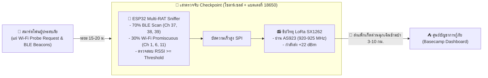

# 📅 บันทึกการวิจัยประจำวัน: 2026-09-18 (Smartphone RF Emissions, Checkpoint Architecture & LoRa SX1262)

## 📌 สรุปประเด็นการวิจัยประจำวัน (Key Research Focus)
1. **การจำแนกประเภทคลื่นวิทยุที่สมาร์ตโฟนแผ่ออกมาและระยะหวังผล:**
   * วิเคราะห์คุณลักษณะคลื่นแม่เหล็กไฟฟ้า 5 ประเภทที่สมาร์ตโฟน (iOS/Android) ปล่อยออกมาในสภาวะไม่มีเน็ต/ไม่มีสัญญาณมือถือ/จอดับในกระเป๋า
   * เจาะลึกพฤติกรรมของ BLE Beacons ยามจอดับ (Apple Find My, Google Fast Pair, Smartwatch) และ Wi-Fi Probe Requests (Doze Mode vs Motion Detection)
2. **การศึกษาฮาร์ดแวร์ตรวจจับและระบุตำแหน่ง:**
   * วิเคราะห์เปรียบเทียบ ESP32/ESP32-S3, Nordic nRF52833 (BLE 5.1 AoA Direction Finding), Raspberry Pi Monitor Mode, และ SDR (HackRF)
3. **การออกแบบสถาปัตยกรรมเสา Checkpoint เฝ้าระวังโซน (Virtual Perimeter / Geofencing Checkpoint):**
   * กำหนดกลไกการตรวจจับอุปกรณ์ที่ก้าวเข้ามาในวงรัศมีด้วยการกรองค่าความแรงสัญญาณ RSSI Threshold ร่วมกับ Log-Distance Path Loss Model
4. **บทบาททางวิศวกรรมของ Semtech LoRa SX1262:**
   * สรุปการแบ่งหน้าที่: ESP32 เป็น "สมอง + เรดาร์ดักจับคลื่นระยะใกล้ 15–30 ม." และ SX1262 เป็น "โทรโข่งวิทยุระยะไกล 3–10+ กม." ส่งผ่านบัส SPI ย่าน AS923 (920–925 MHz) กลับสู่ศูนย์กู้ภัย
5. **การรวบรวมงานวิจัยสากลอ้างอิง (Literature Review):**
   * รวบรวม 5 บทความวิจัยสากลระดับ ACM/IEEE/MDPI ครอบคลุมด้าน Search & Rescue, Checkpoint/Virtual Fencing, และการแก้ปัญหา MAC Address Randomization

---

## 📊 ตารางเปรียบเทียบและบทวิเคราะห์เชิงวิศวกรรม

### ตารางที่ 1: การจำแนกคลื่นวิทยุสมาร์ตโฟนและระยะหวังผล (Smartphone RF Emissions)
| ประเภทคลื่นสัญญาณ | รูปแบบแพ็กเก็ตที่แผ่ออกมา | ระยะปล่อยในที่โล่ง (LOS) | ระยะปล่อยในป่า/สิ่งกีดขวาง (NLOS) | จังหวะเวลาในการยิง (Interval) | พฤติกรรมเมื่อจอดับ / แบตเตอรี่ |
| :--- | :--- | :---: | :---: | :---: | :--- |
| **1. BLE (Bluetooth LE) 2.4 GHz (Ch 37, 38, 39)** | **Advertising Beacons** (Apple Find My, Fast Pair, หูฟัง, Smartwatch) | **20 – 50 เมตร** | **10 – 25 เมตร** | **ถี่และสม่ำเสมอมาก** (ทุกๆ 1 – 3 วินาที) | **ดีที่สุดยามจอดับ:** iPhone 11+ มีระบบ *Power Reserve* ยิงได้ต่อเนื่อง 24 ชม. แม้แบตเตอรี่จะหมดจนดับ |
| **2. Wi-Fi 2.4 GHz (802.11 b/g/n)** | **Probe Request Frames** (ถามหา AP: Subtype `0x0040`) | **50 – 100 เมตร** | **15 – 35 เมตร** | จอเปิด: 3 – 10 วินาที จอดับ: 1 – 5 นาที | ถ้าเครื่องอยู่นิ่งๆ เข้าสู่ Doze Mode แต่ถ้าคนเดิน/ขยับตัว เซนเซอร์ Accelerometer จะปลุกให้ยิงเฟรม |
| **3. Cellular Uplink (4G LTE / 5G / GSM)** | **PRACH Preambles** (พยายามขอเกาะเสาสัญญาณ) | **หลายร้อยเมตร – 1 กม.+** | **100 – 300 เมตร** | ยิงเป็นรอบตามวงรอบโมเด็ม | กำลังส่งสูงสุด **+23 dBm (200 mW)** แรงกว่า Wi-Fi/BLE หลายเท่า ทะลุทะลวงต้นไม้ดีมาก |
| **4. Wi-Fi 5 GHz / 6 GHz (802.11 ac/ax)** | Probe Request ย่านความถี่สูง | 20 – 40 เมตร | 5 – 15 เมตร | ยิงพร้อมๆ กับ 2.4 GHz | คลื่นความถี่สูงถูกดูดกลืนด้วยความชื้นและใบไม้ในป่าอย่างรุนแรง ระยะจึงสั้น |
| **5. UWB & NFC** | Two-way Ranging / Inductive | < 10 ม. (UWB) < 4 ซม. (NFC) | แทบไม่ทะลุ | ไม่ยิงถ้าไม่มีอุปกรณ์ปลุก | ไม่เหมาะกับการทำ Checkpoint ระยะไกล |

---

### ตารางที่ 2: การเปรียบเทียบอุปกรณ์ดักจับและหาตำแหน่ง (Hardware Comparison)
| อุปกรณ์ฮาร์ดแวร์ | ความสามารถในการดักจับ | การระบุพิกัดตำแหน่ง | ข้อดี | ข้อจำกัด | ความเหมาะสมในระบบ |
| :--- | :--- | :--- | :--- | :--- | :---: |
| **ESP32 / ESP32-S3** | Wi-Fi Promiscuous (Ch 1–13) + BLE Passive Scan | วัดระดับความแรงสัญญาณ (RSSI) เพื่อกำหนดระยะรัศมี | ราคาประหยัด (100–200 บ.), กินไฟต่ำ (0.5–0.8W), มีพอร์ต SPI ต่อ LoRa ได้โดยตรง | บอกเฉพาะระยะห่าง (Radius) แต่ไม่รู้มุม 360 องศา | **เหมาะสมสูงสุด ⭐⭐⭐⭐⭐** |
| **Nordic nRF52833 / nRF5340** | BLE Passive Scan (BLE 5.1) | วัดมุมตกกระทบ Angle of Arrival (AoA) ด้วย Antenna Array | อุปกรณ์ตัวเดียวสามารถรู้ได้ทั้ง "ระยะทาง" และ "มุมองศา" พล็อตพิกัด X, Y ได้จากเสาเดียว | วงจรสายอากาศ Array ซับซ้อน ไม่รองรับ Wi-Fi | เหมาะสำหรับเฟสต่อยอด ⭐⭐⭐⭐ |
| **Raspberry Pi + Wi-Fi Dongle** | Wi-Fi Monitor Mode 2.4/5 GHz | วัด RSSI และจับเวลา TDoA | พลังประมวลผลสูง รัน Aircrack/Kismet ได้ | กินไฟสูง (3–7W) ราคาสูง ไม่เหมาะกับการทิ้งไว้ในป่า | เหมาะเป็นตัวประมวลผลที่ฐาน ⭐⭐⭐ |
| **SDR (HackRF / RTL-SDR)** | ดักจับ Cellular, Wi-Fi, วิทยุสื่อสาร | วิเคราะห์ความถี่สเปกตรัม | ดักคลื่น 4G/5G PRACH ระยะไกลได้ | ราคาแพง กินไฟมหาศาล มีข้อจำกัดทางกฎหมาย | ใช้ในเชิงวิเคราะห์ทฤษฎี ⭐⭐ |

---

### ตารางที่ 3: สรุปงานวิจัยสากลที่เกี่ยวข้อง (Literature Review)
| ลำดับ | รายการบทความวิจัยและผู้แต่ง | แหล่งตีพิมพ์ / ฐานข้อมูล | สาระสำคัญที่นำมาประยุกต์ใช้ในโครงงาน |
| :---: | :--- | :--- | :--- |
| **1** | Wang et al. (2013) *Feasibility study of mobile phone WiFi detection in aerial search and rescue operations* | ACM ApSys (Asia-Pacific Workshop on Systems) | พิสูจน์ว่า Wi-Fi Probe Request จากมือถือที่ไม่ได้ต่อเน็ต สามารถใช้เป็น "SOS Beacon" ในการค้นหาผู้ประสบภัย |
| **2** | Pérez-Hernández et al. (2022) *BLE and Wi-Fi Passive Sniffing for Emergency Evacuation and Presence Tracking in Critical Infrastructure* | MDPI Sensors Journal | การใช้ไมโครคอนโทรลเลอร์ตรวจจับทั้ง Wi-Fi และ BLE พร้อมกัน เพื่อระบุตำแหน่งและการมีอยู่ของบุคคลในจุดฉุกเฉิน |
| **3** | Di Luzio et al. (2020) *Mind the Gap: Passive Wi-Fi Sniffing for Virtual Fencing and Perimeter Intrusion Detection* | IEEE Sensors Journal | การสร้าง "แนวกำแพงเสมือน (Virtual Fence / Checkpoint)" ดักจับอุปกรณ์ที่ก้าวข้ามแนวเส้นโดยไม่ต้องลงแอป |
| **4** | Ciftler et al. (2016) *Indoor occupancy tracking in smart buildings using passive sniffing of probe requests* | IEEE ICCW (International Conference on Communications) | การตรวจจับและนับจำนวนอุปกรณ์ที่ผ่านเข้า-ออกจุดตรวจ (Checkpoint/Gate) จากระดับความแรงสัญญาณ RSSI |
| **5** | Robyns et al. (2017) *Physical-layer and Information Element Fingerprinting of Wi-Fi Devices under MAC Address Randomization* | IEEE S&P / ESORICS | การแก้ปัญหา MAC Randomization โดยใช้ Information Elements (IEs) ระบุตัวตนอุปกรณ์ได้อย่างแม่นยำ |

---

## 🎯 แนวทางการพัฒนาเสา Checkpoint (Implementation Blueprint)

1. **เฟิร์มแวร์ ESP32 Sniffer:** สลับโหมด Time-Division Coexistence (BLE 70% / Wi-Fi 30%) ดักจับแพ็กเก็ตในอากาศ
2. **การตัดสินใจ Checkpoint:** หากค่า $\text{RSSI} \ge -75\text{ dBm}$ ให้ถือว่าอุปกรณ์ก้าวเข้ามาในวงรัศมีตรวจจับ
3. **LoRa Backhaul:** ดันข้อมูลไบนารีจิ๋ว 15 ไบต์ ผ่านบัส SPI เข้าชิป SX1262 ยิงคลื่น LoRa AS923 กลับศูนย์กู้ภัยทันที
