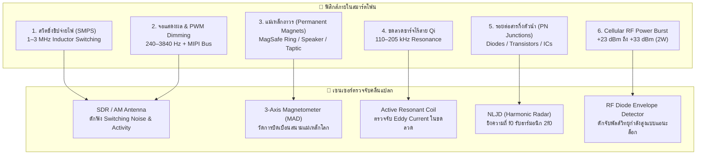

# 📡 การวิเคราะห์คลื่นสัญญาณสมาร์ตโฟนเชิงลึก: โปรโตคอล คลื่นแม่เหล็กไฟฟ้า และการแผ่รังสีผิดปกติ (Smartphone Signals & Unconventional Emissions Deep Dive)

> **ประเภทเอกสาร:** งานวิจัยเชิงวิศวกรรมและฟิสิกส์คลื่น (Engineering & Physics Research Blueprint)  
> **หมวดหมู่:** Research / สรุปความรู้เชิงลึก  
> **โฟลเดอร์จัดเก็บ:** `share_friend/Research/สรุป/02_Smartphone_Signals_and_Unconventional_Emissions.md`  
> **เป้าหมาย:** วิเคราะห์กลไกการส่ง โปรโตคอล ความถี่ และการแผ่คลื่น "ทุกมิติ" ที่ออกจากสมาร์ตโฟน ทั้งคลื่นวิทยุมาตรฐาน (Standard RF) และคลื่นผิดปกติ/คลื่นรั่วไหลตามปรากฏการณ์ฟิสิกส์ (Unconventional & Side-Channel Emissions) สำหรับนำไปใช้ออกแบบตัวดักจับ (Sensing)

---

## 🧭 แผนผังภาพรวม: สิ่งที่แผ่ออกมาจากสมาร์ตโฟน 1 เครื่อง

สมาร์ตโฟนในมือผู้ใช้ไม่ได้เป็นเพียงเครื่องส่งวิทยุธรรมดา แต่คือ **"แหล่งกำเนิดสนามแม่เหล็กไฟฟ้าที่มีความซับซ้อนสูง (Complex EM Emitter)"** ซึ่งแผ่พลังงานออกมา 2 รูปแบบใหญ่:

```
                                  ┌── 1. Wi-Fi (802.11 b/g/n/ac/ax/be) [2.4 / 5 / 6 GHz]
                                  ├── 2. Bluetooth Low Energy (BLE) [2.4 GHz - Ch 37, 38, 39]
        ┌─ [A] คลื่นวิทยุตั้งใจส่ง ──┼── 3. Cellular Uplink (2G/3G/4G/5G) [PRACH Preambles & TAU]
        │   (Intentional RF)      ├── 4. NFC (Near Field Communication) [13.56 MHz Inductive Loop]
        │                         └── 5. Ultra-Wideband (UWB) [6.5 – 8.0 GHz Nanosecond Pulses]
คลื่นจากมือถือ ─┤
        │                         ┌── 1. Magnetic Anomaly (MAD): สนามแม่เหล็กถาวร (MagSafe, ลำโพง, Haptic)
        │                         ├── 2. SMPS Switching EMI: สวิตชิ่งชิปจ่ายไฟ (1 MHz – 3.2 MHz)
        └─ [B] คลื่นแปลก/รั่วไหล ──┼── 3. Display PWM & Refresh Leakage: รังสีจากจอ OLED/สาย MIPI
            (Unintentional / EMI) ├── 4. Audio Amp Class-D Leakage: สวิตชิ่งขับลำโพง (300 kHz – 1.2 MHz)
                                  ├── 5. Wireless Charging Resonance: ขดลวดเหนี่ยวนำ Qi (110–205 kHz)
                                  └── 6. Non-Linear Junction Response: ฮาร์มอนิกสารกึ่งตัวนำ (NLJD)
```

---

## ภาคที่ 1: คลื่นวิทยุตั้งใจส่ง (Intentional RF Protocols & Transmission Principles)

### 1.1 Wi-Fi (IEEE 802.11) — การส่ง Probe Requests
* **ความถี่:** 
  * 2.4 GHz ISM Band (2.412 – 2.472 GHz: Channel 1–13)
  * 5 GHz U-NII Bands (5.180 – 5.825 GHz)
* **การผสมสัญญาณ (Modulation):** DSSS, CCK, OFDM (BPSK, QPSK, 16-QAM, 64-QAM, 256-QAM)
* **กลไกการส่ง (Transmission Mechanism):**
  * เมื่อโทรศัพท์ **เปิด Wi-Fi แต่ไม่ได้เชื่อมต่อ AP** เครื่องจะใช้โปรโตคอล **Active Scanning** โดยส่งเฟรมบริหารจัดการ **Probe Request (Type `0x00`, Subtype `0x04`)** กระจายออกไปทุกช่องสัญญาณ
  * **Wildcard Probe Request:** ฟิลด์ SSID มีความยาวเป็น 0 เพื่อถาม AP ทั้งหมดว่ามีใครเปิดรับบ้าง
  * **Directed Probe Request:** บรรจุชื่อ Wi-Fi ที่เคยต่อ เพื่อเร่งเวลาเชื่อมต่อกับเครือข่ายเดิม
* **โครงสร้างภายในเฟรม (Packet Internals):**
  * **Sequence Control (12-bit Counter):** สร้างจากระดับฮาร์ดแวร์ จะนับเพิ่มขึ้นเรื่อยๆ (+1) ต่อ 1 แพ็กเก็ต ทำให้ติดตามเครื่องได้แม้ MAC Address จะเปลี่ยน
  * **Information Elements (IEs):** ก้อนพารามิเตอร์ฮาร์ดแวร์ เช่น Supported Rates (Tag 1), HT Capabilities (Tag 45), Extended Capabilities (Tag 127) และ Vendor Specific (Tag 221) ซึ่งเปรียบเสมือน **"ลายนิ้วมือทางกายภาพ (Fingerprint)"** ประจำรุ่นชิปเซต
* **จังหวะการยิง (Transmission Timing):**
  * **หน้าจอเปิด (Screen ON):** ยิงสแกนถี่ทุกๆ **3 – 10 วินาที**
  * **หน้าจอดับ (Screen OFF / Doze Mode):** ยิงหน่วงลงแบบ Exponential Backoff (15s $\rightarrow$ 30s $\rightarrow$ 60s $\rightarrow$ 3–5 นาที) เว้นแต่เซนเซอร์วัดการเคลื่อนไหว (Accelerometer) จะถูกเขย่า

---

### 1.2 Bluetooth Low Energy (BLE) — การบรอดแคสต์อย่างต่อเนื่อง
* **ความถี่:** 2.402 GHz ถึง 2.480 GHz (แบ่งออกเป็น 40 ช่อง ช่องละ 2 MHz)
* **ช่องสัญญาณสำคัญ (Primary Advertising Channels):**
  * **Channel 37 (2402 MHz), Channel 38 (2426 MHz), Channel 39 (2480 MHz)**
  * *ข้อค้นพบทางฟิสิกส์:* ความถี่ทั้ง 3 ช่องนี้ถูกเลือกวางไว้ **ในช่องว่างระหว่าง Wi-Fi Channel 1, 6, 11** พอดี เพื่อหลบหลีกการชนกันของสัญญาณ
* **การผสมสัญญาณ (Modulation):** GFSK (Gaussian Frequency Shift Keying) แบนด์วิดท์ 1 MHz หรือ 2 MHz
* **โปรโตคอลและเซอร์วิสเบื้องหลัง:**
  * **Apple Find My Network (Company ID `0x004C`):** โทรศัพท์ iPhone จะส่งแพ็กเก็ต BLE Advertisement แบบ `ADV_NONCONN_IND` ทุกๆ **1 – 3 วินาที สม่ำเสมอแม้จอดับสนิท** และเมื่อแบตหมด (Power Reserve Mode) ชิปประหยัดพลังงานจะยังคงยิงคลื่น Find My ต่อได้สูงสุดถึง 24 ชั่วโมง
  * **Google Fast Pair / Find My Device (Company ID `0x00E0` หรือ `0x01AA`):** มือถือ Android ปล่อยคลื่นค้นหาหูฟัง อุปกรณ์ IoT และเครือข่ายค้นหาเครื่องหายของ Google
  * **Smartwatches & Wearables:** หูฟังไร้สาย (TWS) หรือนาฬิกาสมาร์ตวอทช์จะบรอดแคสต์สัญญาณต่อเนื่องทุกๆ 500 ms – 1 วินาที

---

### 1.3 Cellular Uplink (2G GSM / 3G / 4G LTE / 5G NR) — การยิงพลังงานสูงสุด (Power Bursts)
* **ความถี่:** 700 MHz, 850 MHz, 900 MHz, 1800 MHz, 2100 MHz, 2600 MHz
* **หลักการส่ง Uplink:**
  * โทรศัพท์มือถือใช้การมอดูเลตแบบ **SC-FDMA (Single-Carrier FDMA)** ใน 4G LTE หรือ **DFT-s-OFDM** ใน 5G NR เพื่อรักษาค่า Peak-to-Average Power Ratio (PAPR) ให้ต่ำ
* **พฤติกรรมเมื่ออยู่ในจุดอับสัญญาณ (Out of Coverage / Seeking Base Station):**
  * เมื่อโทรศัพท์หลุดจากเสาสัญญาณ มันจะกวาดรับคลื่น Downlink เพื่อหา System Information Block (SIB)
  * เมื่อเริ่มตรวจพบสัญญาณอ่อนๆ จากขอบสัญญาณ โทรศัพท์จะส่ง **PRACH (Physical Random Access Channel) Preamble** ขึ้นไปหาเสา เพื่อขอช่องสัญญาณ (RRC Connection Request)
* **จุดเด่นด้านพลังงาน (Transmit Power Spikes):**
  * **4G LTE / 5G NR:** บูสต์กำลังส่งขึ้นสู่ขีดจำกัดเครื่องที่ **+23 dBm (200 mW)**
  * **2G GSM (Legacy):** ยิงกระชากด้วยกำลังส่งสูงสุดถึง **+33 dBm (2,000 mW หรือ 2 Watts Peak!)**
  * กำลังส่งระดับนี้แรงกว่า Wi-Fi (+15 dBm / 30 mW) และ BLE (+0 dBm / 1 mW) อย่างมหาศาล ทำให้เกิดปรากฏการณ์เหนี่ยวนำวงจรรอบข้างได้ชัดเจน

---

### 1.4 NFC (Near Field Communication) — สนามแม่เหล็กความถี่ 13.56 MHz
* **ความถี่:** 13.56 MHz (ย่าน High Frequency - HF)
* **หลักการส่ง:** **Magnetic Inductive Coupling (การเหนี่ยวนำสนามแม่เหล็กระยะประชิด)**
  * ไม่ได้ส่งคลื่นวิทยุกระจายไปในอากาศแบบ Far-field แต่สร้างสนามแม่เหล็ก Near-field ผ่านขดลวดแบน (Planar Loop Antenna) หลังเครื่อง
  * โทรศัพท์ทำงานตามมาตรฐาน ISO/IEC 14443 Type A/B และ ISO 18092
* **พฤติกรรมแปลก:** แม้จะล็อกหน้าจอ สมาร์ตโฟนหลายรุ่นจะปล่อย **NFC Polling Loop** สั้นๆ (Carrier Bursts นานไม่กี่มิลลิวินาที) ทุกๆ 300–500 ms เพื่อตรวจจับว่ามีบัตรโดยสาร บัตรเครดิต หรือแท็ก RFID เข้ามาทาบหรือไม่

---

### 1.5 Ultra-Wideband (UWB) — พัลส์ระดับนาโนวินาที
* **ความถี่:** 6.5 GHz (Channel 5) และ 8.0 GHz (Channel 9) ตามมาตรฐาน IEEE 802.15.4z
* **หลักการส่ง:** **Impulse Radio UWB (IR-UWB)**
  * ส่งพัลส์วิทยุความกว้างเพียง **1 – 2 นาโนวินาที** กระจายพลังงานครอบคลุมแบนด์วิดท์กว้างกว่า **500 MHz**
  * ชิป Apple U1/U2 และ NXP UWB ในสมาร์ตโฟนระดับเรือธงใช้หาทิศทางและระยะทางระดับเซนติเมตรผ่าน Two-Way Ranging (TWR)

---

## ภาคที่ 2: คลื่นแปลกและการแผ่รังสีรั่วไหล (Unconventional Emissions & Physical Side-Channels)

นี่คือสิ่งที่น่าตื่นเต้นที่สุดในเชิงวิจัย เพราะเป็น **"การแผ่คลื่นแม่เหล็กไฟฟ้าและคุณสมบัติทางฟิสิกส์ที่ไม่ได้ตั้งใจปล่อย (Unintentional Radiations / EM Leakage)"** ซึ่งมีงานวิจัยระดับโลกและวงการความมั่นคงค้นพบ:



---

### 2.1 Magnetic Anomaly Detection (MAD) — การบิดเบือนสนามแม่เหล็กโลกจากชิ้นส่วนแม่เหล็กถาวร
* **ปรากฏการณ์ฟิสิกส์:**
  สมาร์ตโฟนยุคใหม่มี **แม่เหล็กถาวรนีโอไดเมียม (NdFeB Permanent Magnets)** ฝังอยู่ภายในเครื่องหลายจุด:
  1. **MagSafe Ring (iPhone 12 ถึง iPhone 16):** มีแม่เหล็กพลังสูงเรียงกันเป็นวงกลม **18 ถึง 36 ชิ้น** + แม่เหล็กกำหนดตำแหน่ง (Alignment Magnet) ด้านล่าง
  2. **ลำโพงและหูฟัง (Speaker & Earpiece Voice Coils):** ใช้แม่เหล็กความเข้มสูงขับไดอะแฟรมเสียง
  3. **มอเตอร์สั่นแบบแท่ง (Taptic Engine / Linear Resonant Actuator):** มีก้อนแม่เหล็กเคลื่อนที่ไปมา
  4. **ชุดกันสั่นกล้อง (OIS - Optical Image Stabilization):** ใช้ Voice Coil Motors (VCM) แขวนเลนส์กล้อง
* **ผลกระทบต่อสนามแม่เหล็ก:**
  * ปกติสนามแม่เหล็กโลก ณ พื้นผิวโลกจะราบเรียบสม่ำเสมอ (ความเข้มประมาณ **30 ถึง 60 ไมโครเทสลา: $\mu\text{T}$**)
  * เมื่อมีสมาร์ตโฟนเข้ามาในพื้นที่ ชิ้นส่วนแม่เหล็กเหล่านี้จะทำตัวเป็น **Magnetic Dipole** ทำให้เกิด **การบิดเบือนสนามแม่เหล็กโลกเฉพาะที่ (Local Magnetic Anomaly: $\Delta B$)**
* **วิธีตรวจจับ:**
  * ใช้เซนเซอร์วัดสนามแม่เหล็ก 3 แกนความไวสูง เช่น **PNI RM3100 (Geomagnetic Sensor)** หรือ **Fluxgate Magnetometer** หรือชิปยอดนิยมอย่าง **HMC5883L / QMC5883L**
  * เมื่อมีคนพกมือถือเดินผ่าน เซนเซอร์จะเห็นค่าสนามแม่เหล็กแกน $X, Y, Z$ แกว่งตัวขึ้นลงอย่างชัดเจนในระยะ **0.5 ถึง 2.0 เมตร**
* **จุดเด่น:** **ตรวจจับได้แม้โทรศัพท์จะปิดเครื่องสนิท (Power OFF) หรือแบตเตอรี่หมดเกลี้ยง!**  
  *(เป็นหลักการเดียวกับเสาตรวจจับมือถือแอบพกเข้าเรือนจำ เช่น ระบบ Metrasens Cellsense)*

---

### 2.2 Switched-Mode Power Supply (SMPS) EMI — คลื่นกวนจากการสลับความถี่ชิปจ่ายไฟ (1 MHz – 3.2 MHz)
* **ปรากฏการณ์ฟิสิกส์:**
  * แบตเตอรี่มือถือจ่ายไฟ 3.7V – 4.2V แต่ชิปประมวลผล (CPU Cores / GPU / RAM) ต้องการแรงดันต่ำมากเพียง 0.75V – 1.8V พร้อมกระแสหลายแอมแปร์
  * ชิปควบคุมพลังงาน (PMIC) ใช้ **Buck Converter** สลับเปิด-ปิดตัวเหนี่ยวนำ (Inductor) ด้วยความถี่สวิตชิ่งสูงถึง **1 MHz – 3.2 MHz**
  * ลายวงจรบนแผ่น PCB และตัวเหนี่ยวนำทำหน้าที่เป็น **เสาอากาศวงรอบเล็ก (Magnetic Loop Antenna)** แผ่คลื่นแม่เหล็กไฟฟ้าความถี่ 1–3 MHz และฮาร์มอนิกของมัน (Harmonics สูงถึง 30–100 MHz) รั่วไหลออกมาสู่อากาศ
* **พฤติกรรมทางสัญญาณ:**
  * เมื่อ CPU มีโหลด (เช่น หน้าจอสว่าง มีการคำนวณ หรือแอปพื้นหลังตื่นขึ้นมาทำงาน) กระแสกระชากจะทำให้ความเข้มของคลื่นสวิตชิ่งกระตุกวูบวาบตามจังหวะประมวลผล
* **วิธีตรวจจับ:**
  * ใช้ขดลวดรับคลื่นย่าน HF (Ferrite Rod Antenna หรือ Small Tuned Loop) ต่อเข้ากับภาครับวิทยุ AM หรือบอร์ด **SDR (Software Defined Radio เช่น RTL-SDR / HackRF)** ดักฟังสัญญาณย่าน 1–3 MHz ในระยะประชิด (0.3 – 1 เมตร)

---

### 2.3 Display Refresh & OLED PWM Dimming Harmonics (TEMPEST Side-Channel)
* **ปรากฏการณ์ฟิสิกส์:**
  1. **OLED PWM Dimming:** หน้าจอ OLED ควบคุมความสว่างด้วยการตัดต่อไฟกระพริบเร็ว (Pulse Width Modulation) ที่ความถี่ **240 Hz, 480 Hz, หรือ 1920–3840 Hz (High-frequency PWM)**
  2. **MIPI DSI Data Bus:** สายสัญญาณภาพความเร็วสูงจาก GPU ส่งข้อมูลภาพไปยังจอด้วยความเร็ว 500 MHz – 1.5 Gbps พร้อมอัตราการรีเฟรชหน้าจอ 60 Hz หรือ 120 Hz
* **ข้อค้นพบจากงานวิจัยความมั่นคง (TEMPEST Research):**
  * คลื่นแม่เหล็กไฟฟ้ารั่วไหลจากสายแพร์หน้าจอทำให้สามารถ "ดักจับภาพบนจอ" จากระยะไกลได้โดยไม่ต้องแตะเครื่อง
  * ในระดับเซนเซอร์อย่างง่าย เพียงแค่ดักจับฮาร์มอนิกความถี่สวิตชิ่งของหน้าจอ เราจะรู้ได้ทันทีว่า **"เป้าหมายกำลังเปิดหน้าจอโทรศัพท์อยู่หรือไม่"** เพราะสัญญาณ PWM จะกระเพื่อมขึ้นมาอย่างรวดเร็ว

---

### 2.4 CPU / RAM Electromagnetic Leakage (งานวิจัย Air-Gap Leakage)
* **งานวิจัยระดับโลกโดย Dr. Mordechai Guri (Ben-Gurion University):**
  * ผู้วิจัยได้พิสูจน์ผ่านเปเปอร์ชุด *Air-Gap Attack* (เช่น GSMem, MAGNETO, ODINI, RAMBO):
  * บัสของหน่วยความจำ (RAM Bus เช่น LPDDR4X / LPDDR5) ที่วิ่งด้วยความถี่หลักร้อย MHz สามารถปล่อยคลื่นวิทยุออกมารอบตัวเครื่องได้
  * แม้เครื่องจะตัดการเชื่อมต่อวิทยุทั้งหมด (เปิด Airplane Mode) ซีพียูและบัสแรมที่กำลังประมวลผลยังคงแผ่คลื่นวิทยุอ่อนๆ ออกมารอบเครื่อง

---

### 2.5 ปรากฏการณ์ RF Diode Demodulation: "เสียงตื๊ดๆ ของลำโพงแอนะล็อก" (Cellular RF Power Burst Detection)
* **ปรากฏการณ์ที่ทุกคนคุ้นเคย:**
  * เมื่อวางโทรศัพท์ไว้ใกล้ลำโพงคอมพิวเตอร์ เครื่องเสียงรถยนต์ หรือแอมป์กีตาร์ ก่อนจะมีสายเรียกเข้าหรือขณะมือถือส่งข้อมูล จะได้ยินเสียงดัง:  
    *🎵 "ติ๊ด... ติ๊ด-ติ๊ด-ติ๊ด... ติ๊ด-ติ๊ด-ติ๊ด... ซ่าาาาา" 🎵*
* **หลักการฟิสิกส์ที่เกิดขึ้น:**
  * คลื่นเซลลูลาร์ยิงออกมาด้วยกำลังส่งสูงมาก (+23 ถึง +33 dBm)
  * คลื่นแรงสูงนี้จะถูกเหนี่ยวนำเข้าไปในสายไฟลำโพงหรือลายวงจรแอมป์
  * รอยต่อ **PN Junction ของทรานซิสเตอร์หรือไดโอดในวงจรแอมป์จะทำหน้าที่เป็น "ไดโอดตรวจจับยอดคลื่น (Envelope Detector / Demodulator)" โดยไม่ได้ตั้งใจ!**
  * แปลงความถี่วิทยุระดับกิกะเฮิรตซ์ให้กลายเป็นพัลส์ความถี่เสียง (Audio Baseband Frequency) ส่งออกลำโพงให้ได้ยิน
* **การนำมาสร้างเป็นเซนเซอร์ (Analog RF Sniffer):**
  * เราไม่จำเป็นต้องถอดรหัสโปรโตคอล 4G/5G ด้วยเครื่องราคาเป็นแสน!
  * เพียงใช้ **ไดโอด RF ความเร็วสูง (Schottky Diode เช่น BAT15 หรือ SMS7630)** ต่อกับสายอากาศ Dipole สั้นๆ และวงจรขยาย Op-Amp / Comparator
  * หรือใช้ไอซีวัดพลังงานวิทยุ **AD8313 / AD8318 (Logarithmic RF Detector)**
  * เมื่อโทรศัพท์ยิงคลื่นเซลลูลาร์ออกมา วงจรจะสร้างแรงดันแอนะล็อกสั่ง Trigger ขาไมโครคอนโทรลเลอร์ได้ทันทีในราคาไม่กี่สิบบาท!

---

### 2.6 Non-Linear Junction Detection (NLJD) — เรดาร์ฮาร์มอนิกตรวจจับสารกึ่งตัวนำ
* **หลักการฟิสิกส์ (The Physics of Semiconductors):**
  * สารกึ่งตัวนำซิลิคอน (ไดโอด, ทรานซิสเตอร์, ชิป IC, ไดโอดป้องกันไฟกระชาก ESD บนเสาอากาศ) มีความสัมพันธ์ของกระแส-แรงดันแบบไม่เชิงเส้น (Non-linear I-V Characteristic Curve):
    $$I = I_s \left( e^{\frac{qV}{kT}} - 1 \right)$$
* **กลไกการตรวจจับ (Harmonic Radar Principle):**
  1. ตัวส่งสัญญาณเรดาร์จะยิงคลื่นวิทยุความถี่พื้นฐาน $f_0$ (เช่น **915 MHz** หรือ **2.4 GHz**) ส่องไปยังเป้าหมาย
  2. เมื่อคลื่นกระทบกับรอยต่อสารกึ่งตัวนำ คลื่นไซน์จะถูกบิดเบี้ยว (Distortion) และสะท้อนคลื่นความถี่ฮาร์มอนิกกลับออกมา:
     * **ฮาร์มอนิกอันดับ 2 ($2f_0 = 1,830\text{ MHz}$)**
     * **ฮาร์มอนิกอันดับ 3 ($3f_0 = 2,745\text{ MHz}$)**
  3. **การแยกแยะวัตถุ:**
     * **อุปกรณ์อิเล็กทรอนิกส์จริง (มือถือ/ชิป):** จะสะท้อนฮาร์มอนิกที่ 2 แรงกว่าฮาร์มอนิกที่ 3 อย่างชัดเจน ($2f_0 \gg 3f_0$)
     * **โลหะขึ้นสนิมหรือสารธรรมชาติ (สนิม/หิน/ไม้เปียก):** จะเกิดปฏิกิริยาแบบ Metal-Oxide Junction สะท้อนฮาร์มอนิกที่ 3 แรงกว่า ($3f_0 \gg 2f_0$)
* **จุดเด่นระดับสูงสุด:** **สามารถตรวจจับโทรศัพท์ได้แม้จะไม่มีแบตเตอรี่, แบตหมด, ถูกปิดเครื่อง, หรือพังเสียหาย!**  
  *(เป็นเทคโนโลยีที่ใช้ในระบบกู้ภัยหิมะถล่ม RECCO และเครื่องตรวจค้นเครื่องดักฟังของหน่วยข่าวกรอง)*

---

### 2.7 Qi / MagSafe Wireless Charging Coil Resonance (110 kHz – 205 kHz & 360 kHz)
* **โครงสร้างภายใน:**
  * หลังฝาหลังมือถือจะมีขดลวดทองแดงแบนแบบก้นหอย (Planar Spiral Coil) รองด้วยแผ่นเฟอร์ไรต์ (Ferrite Sheet) สำหรับรับไฟชาร์จไร้สาย
* **การปล่อยคลื่นและการสะท้อน:**
  * **Reverse Wireless Charging (PowerShare):** เมื่อเปิดโหมดนี้ มือถือจะทำตัวเป็นตัวส่ง ปล่อยสนามแม่เหล็กไฟฟ้าความถี่ **110–205 kHz** (มาตรฐาน Qi) หรือ **360 kHz** (MagSafe ของ Apple) ออกมาอย่างเข้มข้น
  * **Resonance Detection:** แม้จะไม่ได้เปิดชาร์จ หากเราใช้ขดลวดกำทอนภายนอก (External Resonant LC Tank) สแกนผ่าน แผ่นเฟอร์ไรต์และขดลวดจะเหนี่ยวนำให้ค่า Inductance และ $Q$-factor ของเซนเซอร์เปลี่ยนไปอย่างจำเพาะเจาะจง

---

## ภาคที่ 3: ตารางเปรียบเทียบคลื่นทั้งหมดและการประเมินความเป็นไปได้ในการดักจับ

| สัญญาณ / ปรากฏการณ์ | ย่านความถี่ | ชนิดของคลื่น / แหล่งกำเนิด | สภาวะที่เครื่องแผ่ออกมา | ระยะตรวจจับ | อุปกรณ์เซนเซอร์ที่ใช้ตรวจจับ | ความยากในการทำฮาร์ดแวร์ |
| :--- | :---: | :--- | :--- | :---: | :--- | :---: |
| **Wi-Fi Probe Request** | 2.4 GHz (Ch 1-13) | คลื่นวิทยุดิจิทัล (OFDM/DSSS) | เปิด Wi-Fi ไม่ได้ต่อเน็ต | 30–60 ม. | ESP32 Promiscuous Mode | ง่ายมาก ⭐ |
| **BLE Beacons (Find My)** | 2.4 GHz (Ch 37-39) | คลื่นวิทยุดิจิทัล (GFSK) | จอดับ/เบื้องหลัง/สลีป | 15–35 ม. | ESP32 BLE Passive Scan | ง่ายมาก ⭐ |
| **Cellular PRACH Spike** | 700–2600 MHz | คลื่นวิทยุกำลังสูง (+23ถึง+33dBm) | ค้นหาเสาสัญญาณ | 5–25 ม. | RF Schottky Diode / AD8318 | ปานกลาง ⭐⭐ |
| **Magnetic Anomaly (MAD)** | 0 Hz (DC Field) | สนามแม่เหล็กถาวร (MagSafe/ลำโพง) | **ตลอดเวลา (แม้ปิดเครื่อง)** | 0.5–2 ม. | 3-Axis Magnetometer (RM3100/QMC) | ปานกลาง ⭐⭐ |
| **SMPS Converter EMI** | 1.0 – 3.2 MHz | คลื่นแม่เหล็กรั่วไหลจากชิปจ่ายไฟ | ขณะเครื่องประมวลผล | 0.2–1 ม. | SDR (RTL-SDR) + HF Loop Coil | ปานกลาง ⭐⭐ |
| **Display PWM Harmonics** | 240Hz–4kHz / VHF | คลื่นเหนี่ยวนำจากจอ OLED | ขณะหน้าจอเปิดใช้งาน | 0.5–3 ม. | SDR + Near-field Probe | ปานกลาง-ยาก ⭐⭐⭐ |
| **NFC Polling Loop** | 13.56 MHz | สนามแม่เหล็กเหนี่ยวนำสั้นๆ | ปล่อยตรวจสอบบัตร | 0.05–0.15 ม. | 13.56 MHz Tuned Resonant Coil | ปานกลาง ⭐⭐ |
| **Semiconductor NLJD** | 1.8 GHz / 2.7 GHz | ฮาร์มอนิกรอยต่อ PN ($2f_0, 3f_0$) | **ตลอดเวลา (แม้ไม่มีแบต)** | 1–5 ม. | Harmonic Radar Transceiver | ยากมาก ⭐⭐⭐⭐ |

---

## ภาคที่ 4: สรุปและแนวทางการเลือกใช้ในโครงงานจริง

1. **ด่านหลักระยะไกล (Primary Long-Range Sensing):**
   * **Wi-Fi 2.4 GHz (Promiscuous Mode)** + **BLE Advertising (Passive Scan)** บนชิปราคาประหยัดอย่าง **ESP32** คือหัวใจหลัก เพราะกินไฟต่ำ ดักจับได้ไกล 20–50 เมตร และสกัดข้อมูลตัวตนเครื่อง (IE Fingerprint & Hash) ได้ทันที
2. **การเสริมมิติการตรวจจับพิเศษ (Unconventional Add-ons):**
   * **Magnetic Anomaly Detection (MAD):** ใช้เซนเซอร์ Magnetometer ดักจับเมื่อผู้ประสบภัยถูกฝังอยู่ใต้ซากปรักหักพัง ดินถล่ม หรือหิมะในระยะใกล้ (0.5–1.5 เมตร) แม้โทรศัพท์จะดับไปแล้ว
   * **Analog RF Diode Detector (Cellular Spike Hunter):** ทำวงจรตรวจจับพัลส์วิทยุกำลังส่งสูง เพื่อรู้ว่ามีโทรศัพท์กำลังพยายามยิงหาเสามือถือในบริเวณใกล้เคียง
