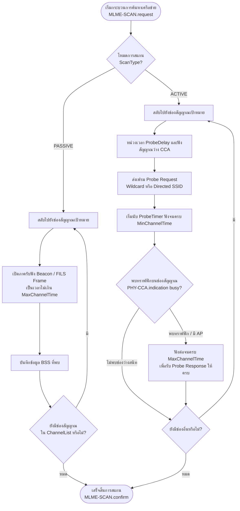
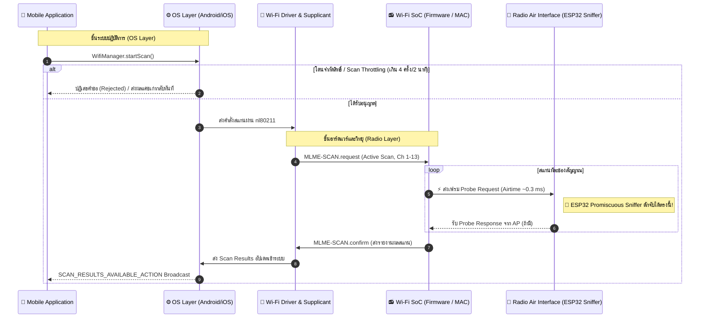

# 📡 IEEE 802.11 Scanning — กลไกการสแกนหาเครือข่ายและการวิเคราะห์เชิงวิศวกรรม

> **หมวดหมู่:** ทฤษฎีและงานวิจัยที่เกี่ยวข้อง (Chapter 2: Literature Review & Theoretical Background)  
> **หัวข้อการศึกษา:** `01 — IEEE 802.11 scanning` (อ้างอิง [`Wi-Fi Study Guide.md`](file:///d:/ProjectCo-op/share_friend/Wi-Fi%20Study%20Guide.md))  
> **มาตรฐานอ้างอิง:** IEEE Std 802.11-2024 (Section 11.1.4: *Acquiring synchronization, scanning*)  
> **เอกสารคู่ขนาน:** [`IEEE 802.11-2024.md`](file:///d:/ProjectCo-op/share_friend/Research/%E0%B8%AA%E0%B8%A3%E0%B8%B8%E0%B8%9B/IEEE%20802.11%20Scanning/IEEE%20802.11-2024.md) (บันทึกข้อกำหนดมาตรฐานย่อย)

---

## 📌 บทนำ (Introduction)

ในโครงงานระบบค้นหาและระบุตำแหน่งผู้ประสบภัยด้วยเทคนิค **Passive Smartphone RF Sniffing** ปรากฏการณ์สำคัญที่สุดที่ทำให้โหนดรับสัญญาณ (Sniffer) สามารถตรวจจับการมีอยู่ของสมาร์ตโฟนได้โดยที่ผู้ประสบภัยไม่ต้องติดตั้งแอปพลิเคชัน คือ **"กระบวนการสแกนหาเครือข่าย Wi-Fi (Wi-Fi Scanning Process)"** ตามมาตรฐาน IEEE 802.11 

การทำความเข้าใจกลไกการสแกนอย่างลึกซึ้งทั้งในระดับชั้นกายภาพ (PHY/MAC Radio Layer) และระดับระบบปฏิบัติการ (OS API Layer) มีความสำคัญยิ่งยวดต่อการออกแบบเฟิร์มแวร์ ESP32 เพื่อให้สามารถดักจับสัญญาณได้อย่างแม่นยำ ไม่สูญหาย และลดอัตราการตรวจจับผิดพลาด (False Positive/Negative)

---

## 1. กลไกการสแกนตามมาตรฐาน IEEE 802.11 (Active vs. Passive Scanning)

ตามมาตรฐาน IEEE 802.11 (รวมถึงฉบับปรับปรุงล่าสุด IEEE Std 802.11-2024 Section 11.1.4) สถานีลูกข่าย (Station: STA เช่น สมาร์ตโฟน) จะเริ่มกระบวนการสแกนผ่านคำสั่งภายในระดับ MAC Sublayer Management Entity เรียกว่า `MLME-SCAN.request` โดยกระบวนการสแกนแบ่งออกเป็น 2 รูปแบบหลัก:

### 1.1 การสแกนแบบรับฟังเฉยๆ (Passive Scanning)
* **หลักการทำงาน:** STA จะสลับความถี่วิทยุไปยังแต่ละช่องสัญญาณ (Channel) ที่ระบุใน `ChannelList` แล้วเปิดภาครับเพื่อ "ดักฟัง (Listen)" เฟรมประกาศเครือข่ายที่ Access Point (AP) ส่งออกมาเป็นระยะ เช่น **Beacon Frames** (ปกติส่งทุกๆ 100 TU หรือประมาณ 102.4 ms), **FILS Discovery Frames**, หรือ **Measurement Pilot Frames**
* **พฤติกรรมทางวิทยุ:** STA **ไม่มีการแพร่คลื่นวิทยุ (No Transmission)** ใดๆ ออกมาจากสายอากาศเลยในขั้นตอนนี้
* **ข้อดี/ข้อจำกัด:** ประหยัดพลังงานแบตเตอรี่ และไม่รบกวนช่องสัญญาณ แต่ใช้ระยะเวลาในการค้นหา AP ช้ากว่า เพราะต้องรอให้ AP ยิง Beacon ออกมา

> [!CAUTION] ผลกระทบสำคัญต่อโหนด Sniffer
> ในช่วงที่สมาร์ตโฟนทำ **Passive Scanning** ตัวดักจับคลื่น (ESP32 Sniffer) **จะไม่สามารถตรวจจับการมีอยู่ของโทรศัพท์ได้เลยผ่านคลื่น Wi-Fi** เนื่องจากไม่มีแพ็กเก็ตหลุดรอดออกมาในอากาศ นี่คือเหตุผลทางวิชาการที่พิสูจน์ว่าทำไมระบบกู้ภัยจึงต้องมีระบบสำรองร่วม (Dual-RAT) เช่น การดักฟังสัญญาณ Bluetooth Low Energy (BLE) ควบคู่ไปด้วยเสมอ

---

### 1.2 การสแกนแบบส่งสัญญาณสอบถาม (Active Scanning)
* **หลักการทำงาน:** STA จะเป็นผู้เริ่มต้นกระตุ้นให้ AP ส่งข้อมูลกลับมา โดยการกระจายสัญญาณเฟรม **Probe Request** (Subtype `0x0040`) ไปยังที่อยู่บรอดแคสต์ (`FF:FF:FF:FF:FF:FF`) หรือที่อยู่เฉพาะเจาะจง
* **ประเภทของการร้องขอ:**
  1. **Wildcard Probe Request (SSID Length = 0):** สอบถามว่า *"มี AP ใดบ้างที่อยู่ในรัศมีนี้?"* AP ทุกตัวที่รับสัญญาณได้จะตอบกลับด้วย Probe Response ทันที
  2. **Directed Probe Request:** ระบุชื่อเครือข่ายชัดเจน เช่น SSID: `"Home_WiFi"` หรือ `"Office_5G"` เพื่อมองหาเครือข่ายที่เคยเชื่อมต่อ
* **พฤติกรรมทางวิทยุ:** มีการยิงคลื่นวิทยุออกมาจากสมาร์ตโฟน ทำให้เกิดคลื่น RF ที่มีค่า MAC Address, Sequence Number, Information Elements (IEs), และระดับความแรงสัญญาณ (RSSI)

---

## 2. เจาะลึกตัวแปรเวลาและช่วงเวลาประจำช่องสัญญาณ (Timing & Channel Dwell Time)

ประสิทธิภาพและความเร็วในการสแกนของสมาร์ตโฟนถูกควบคุมด้วยพารามิเตอร์เวลาตามมาตรฐาน IEEE 802.11 ดังต่อไปนี้:

| พารามิเตอร์เวลา | สัญลักษณ์ / หน่วย | คำอธิบายและบทบาทหน้าที่ | ค่าทั่วไปในสมาร์ตโฟน |
| :--- | :---: | :--- | :---: |
| **Channel Switch Time** | $T_{\text{switch}}$ | เวลาที่วงจรสังเคราะห์ความถี่ (PLL Synthesizer) ใช้ในการจูนความถี่ข้ามช่องสัญญาณ | $2\text{ – }5\text{ ms}$ |
| **Probe Delay** | $T_{\text{probedelay}}$ | เวลาหน่วงก่อนส่ง Probe Request เพื่อตรวจสอบว่าช่องสัญญาณว่าง (Carrier Sense / CCA) | $5\text{ – }20\text{ ms}$ |
| **Minimum Channel Time** | $\text{MinChannelTime}$ | เวลาขั้นต่ำที่ STA จะหยุดรอบนช่องสัญญาณนั้นเพื่อฟังว่ามีคลื่นตอบสนองหรือไม่ | $10\text{ – }20\text{ ms}$ (10–20 TU) |
| **Maximum Channel Time** | $\text{MaxChannelTime}$ | เวลาสูงสุดที่ STA ยอมรอรับ Probe Response หากตรวจพบว่าช่องสัญญาณนั้นมีทราฟฟิก | $30\text{ – }100\text{ ms}$ (30–100 TU) |

### 2.1 กลไก Early Exit Optimization (MinChannelTime vs. MaxChannelTime)
มาตรฐานกำหนดอัลกอริทึมประหยัดเวลาในการสแกนช่องสัญญาณไว้ดังนี้:
1. เมื่อ STA ย้ายมายังช่องสัญญาณใหม่และยิง Probe Request ออกไป ตัวนับเวลา `ProbeTimer` จะเริ่มเดินนับหนึ่ง
2. STA จะฟังการตอบสนองผ่านสัญญาณจากชั้นกายภาพ `PHY-CCA.indication`:
   * **กรณีช่องสัญญาณว่างสนิท (Channel Idle):** หากถึงเวลา $\text{MinChannelTime}$ แล้วยังไม่พบพลังงานคลื่นวิทยุหรือเฟรมใดๆ เลย STA จะสรุปทันทีว่า *"ไม่มี AP บนช่องสัญญาณนี้"* และทำการตัดจบทันที (Early Exit) เพื่อข้ามไปช่องถัดไป ทำให้ไม่ต้องเสียเวลารอนาน
   * **กรณีตรวจพบสัญญาณคลื่น (Channel Busy):** หากพบว่ามีทราฟฟิกหรือได้รับ Probe Response อย่างน้อย 1 เฟรมก่อนครบ $\text{MinChannelTime}$ ตัว STA จะรอต่อไปจนถึง $\text{MaxChannelTime}$ เพื่อเก็บรวบรวมข้อมูลของ AP ทุกตัวในบริเวณนั้นให้ครบถ้วน

### 2.2 แบบจำลองคณิตศาสตร์ของเวลาสแกนรวม (Scan Latency Model)
ระยะเวลาที่สมาร์ตโฟนหยุดอยู่บนช่องสัญญาณหนึ่งๆ เรียกว่า **Channel Dwell Time ($T_{\text{dwell}}$)**:

$$T_{\text{dwell}}(c) = 
\begin{cases} 
T_{\text{switch}} + T_{\text{probedelay}} + \text{MinChannelTime} & \text{ถ้าช่องสัญญาณว่าง (Empty Channel)} \\
T_{\text{switch}} + T_{\text{probedelay}} + \text{MaxChannelTime} & \text{ถ้าพบ AP หรือทราฟฟิก (Occupied Channel)}
\end{cases}$$

เวลารวมในการกวาดสแกนครบทุกช่องสัญญาณย่าน 2.4 GHz ($N = 13$ ช่องสัญญาณในประเทศไทย):

$$T_{\text{scan\_cycle}} = \sum_{c=1}^{13} T_{\text{dwell}}(c)$$

* **ในพื้นที่ป่า/ห่างไกล (สัญญาณว่างเกือบทุกช่อง):** $T_{\text{scan\_cycle}} \approx 13 \times (3 + 5 + 15) \approx 299\text{ ms}$
* **ในพื้นที่ชุมชน/มี AP หนาแน่น:** $T_{\text{scan\_cycle}} \approx 13 \times (3 + 5 + 50) \approx 754\text{ ms}$

---

## 3. การแยกความแตกต่าง: OS API Scan Request vs. Radio-Level Scan

หนึ่งในความเข้าใจผิดที่พบบ่อยในการทำวิจัยด้าน Wi-Fi Sniffing คือการสับสนระหว่าง **"คำขอสแกนของระบบปฏิบัติการ (OS API Request)"** กับ **"การแพร่คลื่นสแกนจริงทางกายภาพ (Radio-level PHY/MAC Scan)"**

### ตารางเปรียบเทียบ OS API Request vs. Radio-Level Scan
| มิติการวิเคราะห์ | 📱 การสแกนระดับระบบปฏิบัติการ (OS API Request) | 📻 การสแกนระดับคลื่นวิทยุ (Radio-Level Scan) |
| :--- | :--- | :--- |
| **ตัวอย่างคำสั่ง** | Android: `WifiManager.startScan()` iOS: `NEHotspotNetwork`, `CoreWLAN` | IEEE 802.11: `MLME-SCAN.request` คำสั่งระดับ Driver/Firmware (nl80211, WPA Supplicant) |
| **การเกิดคลื่นวิทยุจริง** | **ไม่การันตีว่าจะเกิดการยิงคลื่นจริง** ระบบปฏิบัติการอาจส่งผลลัพธ์จากแคช (Cached Results) คืนให้แอป | **มีการยิงคลื่นจริงทางกายภาพ** ส่ง Probe Request ออกจากสายอากาศตามค่าพารามิเตอร์ของชิปเซต |
| **ข้อจำกัด (Throttling)** | • **Android 9–14:** แอปเบื้องหน้าเรียกได้สูงสุด 4 ครั้ง / 2 นาที, แอปเบื้องหลัง 1 ครั้ง / 30 นาที • ต้องเปิดสิทธิ์ Location Permissions (Fine Location) | ถูกควบคุมโดยนโยบายประหยัดพลังงานระดับ Firmware และ Driver (เช่น หน้าจอดับจะยืดรอบการสแกนออกไป) |
| **พฤติกรรมเมื่อจอดับ** | แอปพลิเคชันทั่วไปถูกระงับ (Suspended) โดยสมบูรณ์ผ่าน Doze Mode หรือ Battery Saver | Wi-Fi SoC จะทำงานตามรอบ Autonomous Background Scan นานๆ ครั้ง (ทุก 15–60 วินาที หรือยืดถึง 15 นาที) |
| **ประโยชน์ต่อโครงงาน** | แสดงให้เห็นข้อจำกัดว่า **ไม่สามารถสร้างแอปบนมือถือช่วยค้นหาคนหลงป่าได้จริง** เพราะแอปจะถูก OS บล็อก | **เป็นหัวใจหลักของ Sniffer:** อาศัยการดักฟังเฟรม Probe Request ที่ชิปเซตปล่อยออกมาในระดับวิทยุ |

---

## 4. บทวิเคราะห์ผลกระทบและการประยุกต์ใช้ในการออกแบบ ESP32 Sniffer

จากข้อกำหนดทางทฤษฎีตามมาตรฐาน IEEE 802.11 ในหัวข้อนี้ นำมาสู่หลักการออกแบบระบบตรวจจับผู้ประสบภัยบนบอร์ด **ESP32** ดังนี้:

### 4.1 การตั้งค่ารอบการสลับช่องสัญญาณของ Sniffer (Channel Hopping Tuning)
* **ปัญหาทางวิศวกรรม:** บอร์ด ESP32 มีภาครับวิทยุชุดเดียว (Single Radio) สามารถดักฟังได้ครั้งละ 1 ช่องสัญญาณในย่าน 2.4 GHz (ช่อง 1 ถึง 13) หาก ESP32 สลับช่องเร็วเกินไป (เช่น สลับทุก 10 ms) จะเกิด Packet Drop มหาศาลเนื่องจากเวลาสลับความถี่ ($T_{\text{switch}}$ ของ ESP32 ประมาณ 2–3 ms) แต่หากแช่อยู่ช่องใดช่องหนึ่งนานเกินไป จะพลาดการดักจับโทรศัพท์ที่กำลังสแกนผ่านช่องอื่น
* **เกณฑ์การคำนวณที่เหมาะสม:** 
  * เมื่อสมาร์ตโฟนทำการ Active Scan มันจะหยุดบนช่องสัญญาณเป้าหมายเป็นเวลา $T_{\text{dwell}} \approx 20\text{ – }60\text{ ms}$
  * เพื่อให้มีโอกาสดักจับแพ็กเก็ต Probe Request ได้สูงสุด แนะนำให้ตั้งค่ารอบ Channel Hopping บน ESP32 ไว้ที่ **$250\text{ – }500\text{ ms}$ ต่อช่องสัญญาณ**
  * สำหรับกรณีพื้นที่กว้าง แนะนำให้วนสแกนเฉพาะ **3 ช่องสัญญาณหลักที่ไม่ซ้อนทับกัน (Non-overlapping Channels: ช่อง 1, 6, 11)** ซึ่งเป็นช่องที่สมาร์ตโฟนเกือบทุกรุ่นให้ความสำคัญสูงสุดในการสแกนค้นหา AP

### 4.2 การแก้ไขจุดบอดเมื่อผู้ประสบภัยหน้าจอดับ (Mitigating Doze Mode Blindness)
* การทดลองและทฤษฎียืนยันชัดเจนว่า เมื่อสมาร์ตโฟนหน้าจอดับลงและอยู่นิ่งเป็นเวลานาน (Unassociated & Screen-off) ตัวเครื่องจะลดการทำ Active Scan ลงจนแทบเป็นศูนย์ (ส่งผลให้ไม่มี Probe Request ออกมา)
* **ข้อสรุปทางสถาปัตยกรรม:** ห้ามพึ่งพาการดักจับ Wi-Fi เพียงอย่างเดียว ต้องใช้สถาปัตยกรรม **Dual-RAT Coexistence บน ESP32** โดยแบ่งสัดส่วนเวลา:
  * **$70\%$ ของเวลา (7 วินาที):** สลับไปเปิด BLE Passive Scan ดักจับเฟรม Bluetooth Advertising (เช่น Apple Find My Network Offline Finding หรือ Google Fast Pair) ซึ่งยังคงยิงออกมาทุกๆ 1–3 วินาทีแม้จอดับ
  * **$30\%$ ของเวลา (3 วินาที):** สลับมาเปิด Wi-Fi Promiscuous Mode กวาดรับ Probe Request จากอุปกรณ์ที่กำลังเปิดหน้าจอหรือพยายามค้นหา Wi-Fi

---

## 🔗 เอกสารอ้างอิงและการเชื่อมโยง (References & Links)

* **มาตรฐานหลัก:** IEEE Std 802.11-2024, *IEEE Standard for Information Technology—Telecommunications and Information Exchange between Systems Local and Metropolitan Area Networks—Specific Requirements - Part 11: Wireless LAN Medium Access Control (MAC) and Physical Layer (PHY) Specifications*.
* **บันทึกมาตรฐานย่อย:** [`IEEE 802.11-2024.md`](file:///d:/ProjectCo-op/share_friend/Research/%E0%B8%AA%E0%B8%A3%E0%B8%B8%E0%B8%9B/IEEE%20802.11%20Scanning/IEEE%20802.11-2024.md)
* **หัวข้อศึกษาถัดไป:** [`02 — Probe Request`](file:///d:/ProjectCo-op/share_friend/Wi-Fi%20Study%20Guide.md#02--probe-request) (เจาะลึกโครงสร้างไบนารี Information Elements สำหรับทำ Fingerprint)
* **บอร์ดติดตามสถานะ:** [`TO-DO List Research.md`](file:///d:/ProjectCo-op/share_friend/Todo/TO-DO%20List%20Research.md)
