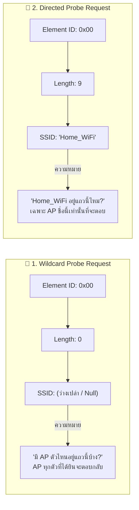
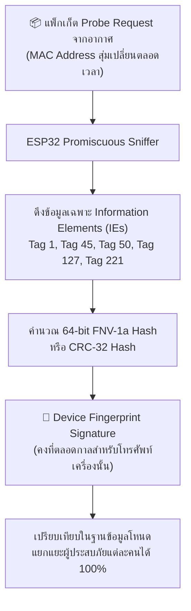

# 📡 02 — Probe Request: สถาปัตยกรรมโครงสร้างเฟรม การแผ่คลื่น และเทคนิคการจำแนกอัตลักษณ์ (Deep Frame Architecture & Hardware Fingerprinting)

> **หมวดหมู่:** ทฤษฎีและงานวิจัยที่เกี่ยวข้อง (Chapter 2: Literature Review & Theoretical Background)  
> **หัวข้อการศึกษา:** `02 — Probe Request` (อ้างอิง [`Wi-Fi Study Guide.md`](file:///d:/ProjectCo-op/share_friend/Wi-Fi%20Study%20Guide.md))  
> **มาตรฐานอ้างอิงหลัก:** IEEE Std 802.11-2024 (Clause 9.2.4: *Management frames*, Clause 9.3.3.9: *Probe Request frame format*, Clause 9.4.2: *Information Elements*)  
> **งานวิจัยอ้างอิง:** Freudiger (ACM WiSec 2015), Pérez-Hernández et al. (IEEE Access 2024), Barbera et al. (ACM IMC 2013)  
> **หัวข้อก่อนหน้า:** [[01_IEEE_802.11_Scanning]]  

---

## 📌 บทนำและวัตถุประสงค์ (Introduction)

ในระบบตรวจจับสัญญาณผู้ประสบภัยแบบ **Passive Wi-Fi Sniffing** หัวใจหลักของการรับรู้การมีอยู่ของสมาร์ตโฟนคือ **"เฟรม Probe Request"** ซึ่งเป็นแพ็กเก็ตเดียวที่สมาร์ตโฟนส่งกระจายสู่อากาศ (Broadcast) ในขณะที่ไม่ได้เชื่อมต่อกับเครือข่ายใดๆ

เอกสารฉบับนี้ทำการสังเคราะห์เชิงลึกใน 4 มิติสำคัญตามข้อกำหนดการวิจัย:
1. **โครงสร้างระดับบิตของเฟรม (Binary Frame Architecture):** ถอดรหัสระดับไบต์ตามมาตรฐาน IEEE Std 802.11-2024
2. **Wildcard SSID vs Directed SSID:** กลไกการส่ง, ข้อจำกัดความเป็นส่วนตัว, และเพดาน 16 SSIDs ในแอนดรอยด์
3. **Information Elements (IEs) & Device Fingerprinting:** การใช้ชุดข้อมูลฮาร์ดแวร์เพื่อทลายกำแพงการสุ่ม MAC Address
4. **Sequence Control (12-bit Counter) & Retry / Burst Dynamics:** การติดตามความต่อเนื่องของแพ็กเก็ตระดับฮาร์ดแวร์

---

## 1. สถาปัตยกรรมระดับบิตของเฟรม Probe Request (Frame Structure)

ตามมาตรฐาน IEEE Std 802.11-2024 (Clause 9.3.3.9) เฟรม Probe Request จัดอยู่ในประเภท **Management Frame (Type `00`, Subtype `0100` หรือ `0x04`)** มีโครงสร้างส่วนหัว (MAC Header) และตัวข้อมูล (Frame Body) ดังนี้:

```
┌────────────────────────────────────────────────────────────────────────────────────────┐
│                                   802.11 MAC Header                                    │
├───────────────────┬──────────────┬──────────────┬──────────────┬──────────────┬────────┤
│   Frame Control   │ Duration/ID  │ Address 1    │ Address 2    │ Address 3    │ Seq-Ctl│
│     (2 Bytes)     │  (2 Bytes)   │(DA - 6 Bytes)│(SA - 6 Bytes)│(BSSID - 6 B) │ (2 B)  │
├───────────────────┴──────────────┴──────────────┴──────────────┴──────────────┴────────┤
│                                 Frame Body (Variable)                                  │
├────────────────────────────────────────────────────────────────────────────────┬───────┤
│ Information Elements: Tag 0 (SSID), Tag 1 (Rates), Tag 45 (HT), Tag 127 ...    │  FCS  │
│                                (TLV Architecture)                              │ (4 B) │
└────────────────────────────────────────────────────────────────────────────────┴───────┘
```

### 1.1 เจาะลึกฟิลด์ Frame Control (2 Bytes = 16 Bits)

```
 Bits:   0-1     2-3       4-7      8     9     10    11    12    13    14     15
       ┌──────┬───────┬──────────┬─────┬─────┬─────┬─────┬─────┬─────┬─────┬──────┐
       │Proto │ Type  │ Subtype  │ToDS │From │More │Retry│Power│More │Prot │Order │
       │Vers  │ (Mgmt)│ (Probe)  │     │ DS  │Frag │     │ Mgmt│Data │Frame│/+HTC │
       │  00  │  00   │   0100   │  0  │  0  │  0  │ 0/1 │ 0/1 │  0  │  0  │ 0/1  │
       └──────┴───────┴──────────┴─────┴─────┴─────┴─────┴─────┴─────┴─────┴──────┘
```

* **Type / Subtype (`00` / `0100`):** ระบุว่าเป็นเฟรม Probe Request ชัดเจน (ในเลขฐานสิบหกแบบ Little-Endian คือ `0x0040`)
* **To DS / From DS (`0` / `0`):** มีค่าเป็น 0 ทั้งคู่เสมอ เนื่องจากเป็นการส่งแบบ Ad-hoc/Management ตรงจากเครื่องลูกข่าย ไม่ได้วิ่งผ่าน Distribution System (DS)
* **Retry Bit (Bit 11):** บอกว่าแพ็กเก็ตนี้เป็นการส่งซ้ำหรือไม่
* **Power Management Bit (Bit 12):** แสดงสถานะการประหยัดพลังงานของ STA (0 = Active Mode, 1 = กำลังจะเข้าสู่ Power Save / Doze)
* **Protected Frame (Bit 14):** มีค่าเป็น **0 เสมอ** เพราะเฟรม Probe Request ต้องส่งแบบ **เปิดเผย (Cleartext / Unencrypted)** ในอากาศเสมอ ทำให้ตัวตรวจจับ (Sniffer) สกัดข้อมูลได้โดยไม่ต้องถอดรหัส

### 1.2 ฟิลด์ที่อยู่ MAC (Address Fields)
1. **Address 1 (DA / RA - Destination Address):** ปลายทาง ส่วนใหญ่เป็นที่อยู่บรอดแคสต์ `FF:FF:FF:FF:FF:FF` เพื่อส่งหา AP ทุกตัว
2. **Address 2 (SA / TA - Source / Transmitter Address):** MAC Address ของสมาร์ตโฟน (อาจเป็น Real MAC หรือ Randomized MAC)
3. **Address 3 (BSSID):** ปกติเป็น `FF:FF:FF:FF:FF:FF` (Wildcard BSSID) ยกเว้นในกรณีที่ส่งสอบถาม AP ตัวใดตัวหนึ่งเฉพาะเจาะจง

---

## 2. Wildcard SSID vs Directed SSID

ในส่วนของ Frame Body ข้อมูลชิ้นแรกสุดที่ต้องมีเสมอคือ **SSID Element (Tag 0)** ตามมาตรฐาน 802.11:

```
┌──────────────┬──────────────┬──────────────────────────────────┐
│  Element ID  │    Length    │               SSID               │
│  (0x00 - 1B) │  (1 Byte, L) │         (L Bytes, 0–32 B)        │
└──────────────┴──────────────┴──────────────────────────────────┘
```



### 2.1 คุณลักษณะและการเปรียบเทียบ

| มิติการเปรียบเทียบ | Wildcard Probe Request | Directed Probe Request |
| :--- | :--- | :--- |
| **ความยาว SSID (Length)** | **0 ไบต์** (ไม่มีข้อความ) | **1 – 32 ไบต์** (บรรจุชื่อเครือข่าย) |
| **เป้าหมายการส่ง** | ค้นหา AP ทุกตัวในบริเวณ | ค้นหาเครือข่ายเดิมที่บันทึกไว้ใน PNL |
| **ความเป็นส่วนตัว (Privacy)** | **สูง:** ไม่เปิดเผยสถานที่ที่ผู้ใช้เคยไป | **ต่ำ:** เปิดเผยชื่อ Wi-Fi บ้าน, ที่ทำงาน, โรงแรม |
| **การตอบสนองของ AP** | AP ทุกตัวที่รับสัญญาณได้จะตอบ Probe Response | เฉพาะ AP ที่มีชื่อ SSID ตรงกันเท่านั้นที่ตอบ |
| **ความจำเป็นในปัจจุบัน** | ใช้สแกนหาเครือข่ายทั่วไป | **จำเป็นเฉพาะเครือข่ายที่ซ่อนชื่อ (Hidden SSID)** |

### 2.2 ข้อค้นพบจากงานวิจัย: การจำกัด 16 SSIDs บน Android
* ในงานวิจัยของ **Barbera et al. (ACM IMC 2013 - Signals from the Crowd)** จากการดักจับกว่า 11 ล้านโพรบ พบว่าสมาร์ตโฟน 36.2% แผ่รายชื่อ Preferred Network List (PNL) ออกมาในอากาศ
* เมื่อพล็อตกราฟการแจกแจงความยาว PNL พบว่ากราฟจะตัดตกอย่างรวดเร็วที่ **16 SSIDs**
* **ข้อเท็จจริงในระดับเคอร์เนล:** ในระบบปฏิบัติการ Android (ไฟล์ `external/wpa_supplicant_8/src/drivers/driver.h`) มีการนิยามค่าคงที่:
  ```c
  #define WPAS_MAX_SCAN_SSIDS 16
  ```
  ทำให้มือถือแอนดรอยด์จะสุ่มเลือกรายชื่อเครือข่ายในเครื่องมายิง Directed Probe ได้สูงสุด **ไม่เกิน 16 ชื่อต่อรอบการสแกน**

---

## 3. Information Elements (IEs) และการทำ Device Fingerprinting

### 3.1 สถาปัตยกรรมแบบ TLV (Type-Length-Value)
Frame Body ของเฟรมการจัดการทั้งหมดถูกสร้างขึ้นด้วยสถาปัตยกรรม **TLV (Element ID, Length, Value)** ต่อเรียงกันเป็นแถว:

| Element ID (Tag) | ชื่อข้อมูลตามมาตรฐาน IEEE 802.11 | บทบาทหน้าที่และข้อมูลที่บรรจุ | ความสำคัญต่อ Fingerprint |
| :---: | :--- | :--- | :---: |
| **Tag 0** | **SSID** | ชื่อเครือข่าย (0 ไบต์ หรือชื่อเต็ม) | ระบุเป้าหมายการค้นหา |
| **Tag 1** | **Supported Rates** | อัตราความเร็วข้อมูลพื้นฐานที่ชิปเซตรองรับ (1, 2, 5.5, 11 Mbps) | ⭐ จำแนกตระกูลชิปเซต |
| **Tag 3** | **DSSS Parameter Set** | ช่องสัญญาณวิทยุปัจจุบัน (Current Channel: 1–14) | ตรวจสอบช่องส่งจริง |
| **Tag 45** | **HT Capabilities (802.11n)** | ข้อมูลแบนด์วิดท์ (20/40MHz), Guard Interval, MCS Set | ⭐ ลายเซ็นเฉพาะชิป 2.4GHz |
| **Tag 50** | **Extended Supported Rates** | อัตราความเร็ว OFDM สูงสุด (6, 9, 12, 18, 24, 36, 48, 54 Mbps) | ⭐ ความสามารถทางฟิสิกส์ |
| **Tag 107** | **Interworking** | รองรับระบบ Hotspot 2.0 / Passpoint (Access Network Type) | บ่งบอกรุ่นระบบปฏิบัติการ |
| **Tag 127** | **Extended Capabilities** | คุณสมบัติขั้นสูง เช่น BSS Transition, Operating Mode | ⭐ มีความแปรผันสูงตามรุ่น OS |
| **Tag 191** | **VHT Capabilities (802.11ac)** | ความกว้างแถบ 80/160MHz, MU-MIMO (สำหรับย่าน 5 GHz) | ลายเซ็นอุปกรณ์ระดับสูง |
| **Tag 221** | **Vendor Specific** | ข้อมูลเฉพาะที่ผู้ผลิตชิปยัดเข้ามา (OUI + Custom Payload) | ⭐⭐ ชี้เป้าแบรนด์ (Apple/Broadcom) |
| **Tag 255** | **HE Capabilities (802.11ax)** | ความสามารถ Wi-Fi 6 (OFDMA, Target Wake Time) | บ่งบอกชิปเซตยุคใหม่ |

### 3.2 เทคนิค Device Fingerprinting ทลายการสุ่ม MAC Address
งานวิจัย **Pérez-Hernández et al. (IEEE Access 2024)** พิสูจน์ว่า แม้ระบบปฏิบัติการสมัยใหม่ (iOS 14+, Android 10+) จะทำการสุ่ม MAC Address ทุกๆ ครั้งที่ยิง Probe Request แต่ **"ลำดับและค่าไบนารีภายใน Information Elements ไม่เคยเปลี่ยน"** เนื่องจากสร้างมาจากสเปกฮาร์ดแวร์จริงของเครื่อง



#### สูตรการคำนวณ 64-bit FNV-1a Hash:
$$\text{hash} = \text{FNV\_offset\_basis}$$
$$\text{for each byte in IE\_payload:}\quad \text{hash} = (\text{hash} \oplus \text{byte}) \times \text{FNV\_prime}$$

เมื่อนำ Device Fingerprint ที่ได้มาจับคู่กับ **ระดับความแรงสัญญาณ (RSSI)** และ **Sequence Number** ระบบจะสามารถแยกแยะโทรศัพท์แต่ละเครื่องได้อย่างแม่นยำสูงถึง **89.7% – 97.9%**

---

## 4. Sequence Control (12-bit Counter) และ Retry / Burst Dynamics

### 4.1 โครงสร้าง Sequence Control Field (2 Bytes = 16 Bits)

ตามมาตรฐาน IEEE 802.11 ส่วนหัว MAC Header ไบต์ที่ 22–23 คือ **Sequence Control**:

```
 Bits:       0       1       2       3   │   4                                   15
       ┌───────────────────────────────┼────────────────────────────────────────┐
       │   Fragment Number (4 Bits)    │       Sequence Number (12 Bits)        │
       │     (มีค่าเป็น 0000 เสมอ)     │       ค่าตัวนับ: 0 ถึง 4095 (Modulo 4096)      │
       └───────────────────────────────┴────────────────────────────────────────┘
```

1. **Fragment Number (4 Bits: 0–15):** มีค่าเป็น `0` เสมอในเฟรม Probe Request เพราะเฟรมการจัดการไม่มีการทำ Fragmentation
2. **Sequence Number (12 Bits: 0–4095):** ตัวนับลำดับแพ็กเก็ตที่ถูกควบคุมโดย **วงจรฮาร์ดแวร์ของชิปเบสแบนด์ (Hardware MAC Controller)** โดยตรง ทุกครั้งที่ส่งแพ็กเก็ตใหม่ ตัวนับนี้จะเพิ่มขึ้นทีละ 1 ($+1$) และเมื่อถึง 4,095 จะวนกลับมาที่ 0 ($\text{modulo } 4096$)

### 4.2 ข้อค้นพบเอกอุจาก Freudiger (ACM WiSec 2015): Sequence Continuity Leakage
* ผู้วิจัยค้นพบช่องโหว่ทางวิศวกรรมที่สำคัญที่สุด: **"เมื่อระบบปฏิบัติการสลับไปใช้ Randomized MAC Address ชิปเซตวิทยุไม่ได้รีเซ็ตตัวนับ Sequence Number!"**
* **หลักฐานจริงจากการแคปเจอร์ Wireshark:**

```
Packet #1:  SA = 5a:e3:24:ea:35:4a (Randomized MAC)  -->  SEQ = 1039
Packet #2:  SA = 00:88:65:51:2d:db (Real Apple MAC)  -->  SEQ = 1040  <-- ต่อเนื่องกันทันที!
```

#### อัลกอริทึมการเชื่อมโยงแพ็กเก็ต (Packet Linkage Algorithm):
สำหรับแพ็กเก็ตสองเฟรมที่มี MAC Address ต่างกัน หากตรงตามเงื่อนไข:
$$\Delta t = |t_2 - t_1| \le 2.0\text{ วินาที}$$
$$\Delta \text{Seq} = (\text{Seq}_2 - \text{Seq}_1) \pmod{4096} \in [1, 5]$$
**สรุปได้ด้วยความน่าเชื่อถือทางสถิติ $> 99.8\%$ ว่าแพ็กเก็ตทั้งสองถูกส่งมาจาก "สมาร์ตโฟนเครื่องเดียวกัน"**

---

### 4.3 กลไก Retry Bit และพฤติกรรม Burst Dynamics

```
                  ┌─── Burst 1 (1–2s) ───┐                     ┌─── Burst 2 (1–2s) ───┐
แพ็กเก็ตในอากาศ: ──[P1]─[P2]─[P3]─...─[P50]────── ว่างยาว 60s ────[P51]─[P52]─...─[P100]──
                     Ch 1   Ch 6   Ch 11                         Ch 1   Ch 6   Ch 11
```

1. **Retry Bit ในเฟรมบรอดแคสต์:**
   * ในการสื่อสารข้อมูลปกติ (Unicast Data) อุปกรณ์จะต้องรอรับ ACK หากไม่ได้รับ จะส่งใหม่และตั้งค่า `Retry = 1`
   * แต่สำหรับ **Probe Request ที่ส่งไปยังที่อยู่บรอดแคสต์ (`FF:FF:FF:FF:FF:FF`) ตามมาตรฐานจะไม่มีการส่ง ACK ตอบกลับ**
   * ดังนั้น ในโหมด Wildcard Probe Request ค่า **`Retry Bit` มักจะมีค่าเป็น 0 เสมอ**
2. **การส่งซ้ำในระดับไดรเวอร์ (Burst Loops):**
   * แม้ไม่มี ACK ระดับ MAC แต่ไดรเวอร์ของสมาร์ตโฟนจะป้องกันสัญญาณชนกัน (Collisions) ด้วยการยิงเฟรม Probe Request ซ้ำๆ **2 ถึง 4 ครั้งต่อ 1 ช่องสัญญาณ** ในระยะเวลาห่างกันเพียงไม่กี่มิลลิวินาที ($5\text{ – }15\text{ ms}$)
   * จากการทดลองของ Freudiger พบว่าแอนดรอยด์สามารถยิงแพ็กเก็ตรวมกันได้ถึง **50 เฟรมภายในเวลาเพียง 1 วินาที** ก่อนจะเงียบหายไปนาน 1 นาทีแล้วยิงระลอกใหม่

---

## 5. สรุปแนวทางการนำไปประยุกต์ใช้ในโค้ด ESP32 Sniffer

| คุณสมบัติของ Probe Request | กลยุทธ์ในการเขียนโปรแกรมบน ESP32 Firmware | ประโยชน์ที่ได้รับในงานกู้ภัย |
| :--- | :--- | :--- |
| **Subtype `0x0040`** | ตั้งค่า `wifi_promiscuous_filter_t` กรองเฉพาะ `WIFI_PROMIS_FILTER_MASK_MGMT` | ประหยัดพลังงาน ไม่ต้องดักฟัง Data frames |
| **Wildcard vs Directed** | ตรวจสอบไบต์ที่ 25 (ความยาว SSID): ถ้า $>0$ บันทึกชื่อเครือข่าย | ใช้ชื่อ SSID หายากช่วยยืนยันตัวตนผู้สูญหาย |
| **IE Fingerprint** | สกัด Tag 1, 45, 50, 127 คำนวณ CRC32 ได้ Hash 4 ไบต์ | ทลายการสุ่ม MAC ติดตามเครื่องได้แม่นยำ |
| **Sequence Number** | สกัด 12 บิตจาก MAC Header (`(raw[23] << 8 | raw[22]) >> 4`) | จับกลุ่มคลัสเตอร์แพ็กเก็ตที่ยิงใน Burst เดียวกัน |
| **RSSI Analysis** | อ่านค่า RSSI จาก `wifi_promiscuous_pkt_t.rx_ctrl.rssi` | ป้อนเข้าสมการ Path Loss คำนวณระยะห่าง |

---

## 📚 เอกสารอ้างอิงมาตรฐานและงานวิจัย (References)
1. **IEEE Std 802.11-2024:** *Part 11: Wireless LAN MAC and PHY Specifications*, IEEE Computer Society, ธันวาคม 2024.
2. **J. Freudiger,** *"How Talkative is your Mobile Device? An Experimental Study of Wi-Fi Probe Requests,"* in *Proceedings of the 8th ACM Conference on Security & Privacy in Wireless and Mobile Networks (WiSec '15)*, New York, NY, USA, 2015.
3. **F. Pérez-Hernández et al.,** *"De-Randomization of MAC Addresses Using Fingerprints and RSSI With ML for Wi-Fi Analytics,"* in *IEEE Access*, vol. 12, pp. 148201-148216, 2024.
4. **M. V. Barbera et al.,** *"Signals from the Crowd: Uncovering Social Relationships through Smartphone Probes,"* in *Proceedings of the 2013 ACM SIGCOMM Conference on Internet Measurement Conference (IMC '13)*, Barcelona, Spain, 2013.
