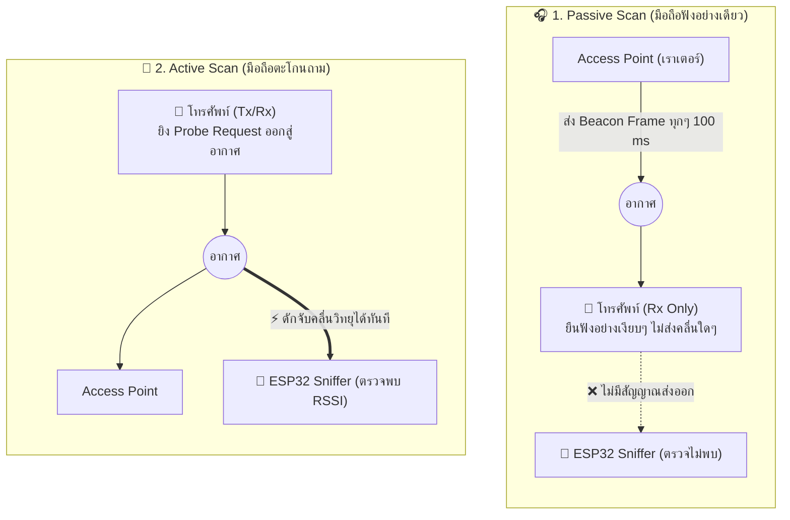

# 📡 03 — Passive vs Active Scan: การเปรียบเทียบกลไก และการแยกแยะกับการดักจับของนักวิจัย

> **หมวดหมู่:** ทฤษฎีและงานวิจัยที่เกี่ยวข้อง (Chapter 2: Literature Review & Theoretical Background)  
> **หัวข้อการศึกษา:** `03 — Passive vs Active Scan` (อ้างอิง [`Wi-Fi Study Guide.md`](file:///d:/ProjectCo-op/share_friend/Wi-Fi%20Study%20Guide.md))  
> **มาตรฐานอ้างอิง:** IEEE Std 802.11-2024 (Clause 11.1.4: *Acquiring synchronization, scanning*)  
> **หัวข้อก่อนหน้า:** [[01_IEEE_802.11_Scanning]] | [[02_Probe_Request]]  

---

## 📌 บทนำและข้อควรระวังสำคัญ (Executive Summary)

ในงานวิจัยด้าน Wi-Fi Sensing จุดที่สร้างความสับสนบ่อยที่สุดคือ **"การปะปนคำว่า Passive ของมือถือ กับ Passive ของนักวิจัย"**:
1. **Passive vs Active Scan (มุมมองของมือถือ):** มือถือเลือกที่จะ "ยืนฟังเงียบๆ" หรือ "ตะโกนถาม"
2. **Passive Capture / Sniffing (มุมมองของนักวิจัย):** อุปกรณ์ดักจับ (ESP32) ทำตัวเป็น "ผู้แอบฟังเงียบๆ" โดยไม่ส่งคลื่นรบกวนใคร

> [!IMPORTANT] กฎเหล็กของระบบ Sniffer
> อุปกรณ์ดักฟังของนักวิจัย (Passive Sniffer) จะสามารถตรวจจับมือถือได้ **ก็ต่อเมื่อมือถืออยู่ในโหมด Active Scan (ตะโกนส่ง Probe Request ออกมา)** เท่านั้น! หากมือถืออยู่ในโหมด Passive Scan ตัว Sniffer จะมองไม่เห็นมือถือเลย เพราะไม่มีคลื่นแพร่กระจายออกมาในอากาศ

---

## 1. เปรียบเทียบ Passive Scan vs Active Scan (ฝั่งโทรศัพท์มือถือ)



| มิติการเปรียบเทียบ | Passive Scan (รับฟังเฉยๆ) | Active Scan (ส่งสัญญาณสอบถาม) |
| :--- | :--- | :--- |
| **พฤติกรรมของมือถือ** | **รับฟังอย่างเดียว (Rx Only):** ไม่มีการส่งคลื่นวิทยุ | **ส่งแล้วรับ (Tx/Rx):** ยิงคลื่น Probe Request ออกมา |
| **สิ่งที่มือถือรอรับ** | เฟรม **Beacon** จากเราเตอร์ (ส่งทุกๆ ~102.4 ms) | เฟรม **Probe Response** ตอบกลับจากเราเตอร์ |
| **ความเร็วในการค้นพบ** | **ช้ากว่า:** ต้องรอให้เราเตอร์ยิง Beacon ออกมา | **เร็วกว่ามาก:** กระตุ้นให้เราเตอร์ตอบทันทีใน 5–15 ms |
| **การใช้พลังงานแบตเตอรี่** | ประหยัดแบตเตอรี่สูงสุด (วงจรส่งวิทยุไม่ต้องทำงาน) | กินแบตเตอรี่มากกว่าเล็กน้อยเพราะต้องจ่ายไฟภาคส่ง (PA) |
| **ผลต่อโหนดดักจับ (Sniffer)** | ❌ **ดักจับไม่ได้เลย** (ไม่มีคลื่นลอยในอากาศ) | ✅ **ดักจับได้สมบูรณ์แบบ** (วัด RSSI + ดึง Fingerprint ได้) |

---

## 2. การแยกแยะ: "การสแกนของมือถือ" vs "การดักฟังของนักวิจัย"

ความสับสนระดับคลาสสิกของนักศึกษาและนักวิจัย คือการใช้คำว่า **"Passive"** ในสองบริบทที่ต่างกันอย่างสิ้นเชิง:

```
┌────────────────────────────────────────────────────────────────────────────────┐
│                       ความแตกต่างของคำว่า "Passive" 2 มิติ                      │
├────────────────────────────────────────┬───────────────────────────────────────┤
│    มิติที่ 1: มือถือทำ Passive Scan      │  มิติที่ 2: นักวิจัยทำ Passive Capture  │
├────────────────────────────────────────┼───────────────────────────────────────┤
│ • ผู้กระทำ: สมาร์ตโฟน                  │ • ผู้กระทำ: อุปกรณ์ดักจับ (ESP32)      │
│ • พฤติกรรม: เปิดหูฟัง Beacon จาก AP    │ • พฤติกรรม: เปิด Promiscuous Mode     │
│ • ไม่ส่งคลื่น $\rightarrow$ ดักจับไม่ได้│ • ไม่ส่งคลื่นรบกวน $\rightarrow$ แอบฟัง │
└────────────────────────────────────────┴───────────────────────────────────────┘
```

1. **Passive Scan (ของมือถือ):** เป็นโปรโตคอลตามมาตรฐาน IEEE 802.11 ที่ลูกข่ายเลือกที่จะ "ไม่ส่งสัญญาณ" เพื่อประหยัดพลังงาน
2. **Passive Capture / Sniffing (ของนักวิจัย):** เป็นสถาปัตยกรรมการตรวจจับที่ตัวรับ (ESP32 Sensing Node) ทำงานในโหมด **Promiscuous Mode (แอบฟัง)** โดยไม่มีการส่งสัญญาณ Probe Request, ไม่มีการทำ Handshake, และไม่มีการเชื่อมต่อ (No Association) เพื่อไม่ให้เปลืองพลังงานแบตเตอรี่ของโหนดตรวจจับในป่า และไม่ละเมิดการทำงานของมือถือ

---

## 3. สรุปคำศัพท์ภาษาอังกฤษและประโยคสำคัญ (Vocab & Key Sentences)

### 📚 คลังคำศัพท์สำคัญ (Vocabulary Bank)

| คำศัพท์ (Vocab) | คำอ่าน | ความหมาย / หน้าที่ |
| :--- | :--- | :--- |
| **Beacon Frame** | บี-คอน เฟรม | เฟรมวิทยุที่เราเตอร์ส่งออกมาเรื่อยๆ ทุก 100 ms เพื่อประกาศว่ามี Wi-Fi อยู่ตรงนี้ |
| **Passive Scanning** | แพส-ซีฟ สแกน-นิ่ง | การค้นหาแบบยืนฟังเงียบๆ มือถือไม่ส่งคลื่นวิทยุใดๆ |
| **Active Scanning** | แอก-ทีฟ สแกน-นิ่ง | การค้นหาแบบตะโกนถาม มือถือยิง Probe Request ออกสู่อากาศ |
| **Passive Sniffing** | แพส-ซีฟ สนีฟ-ฟิง | การแอบดักฟังของนักวิจัย โดยโหนดตรวจจับจะไม่ส่งคลื่นใดๆ ออกไป |
| **Silent Observer** | ไซ-เลนต์ อ็อบ-เซิร์ฟ-เวอร์ | ผู้สังเกตการณ์ที่เงียบสนิท (คำเรียกโหนดตรวจจับที่ไม่ส่งสัญญาณรบกวน) |
| **Channel Dwell Time**| แชน-แนล ดเวล ไทม์ | เวลาที่มือถือหยุดแช่รอฟังคำตอบบนช่องสัญญาณนั้นๆ |

### 💬 ประโยคสำคัญที่ต้องใช้ในรายงาน (Key Sentences with Translations)

1. *"In passive scanning, the mobile station only listens for beacon frames and transmits no radio energy."*  
   *(ในการสแกนแบบพาสซีฟ อุปกรณ์มือถือจะรอฟังเฉพาะเฟรมบีคอนเท่านั้น และไม่มีการส่งพลังงานคลื่นวิทยุใดๆ ออกมา)*

2. *"Passive sniffing by researchers relies on mobile devices performing active scanning to capture their probe requests."*  
   *(การดักฟังสัญญาณของนักวิจัย จำเป็นต้องพึ่งพามือถือที่กำลังทำการสแกนแบบแอกทีฟ เพื่อที่จะดักจับเฟรมโพรบรีเควสต์ของเครื่องได้)*

3. *"A passive sniffer remains undetectable because it never transmits frames into the wireless medium."*  
   *(โหนดตรวจจับแบบพาสซีฟจะไม่มีใครตรวจจับได้ เพราะมันไม่เคยส่งเฟรมใดๆ ออกไปรบกวนในอากาศเลย)*

---

## 📚 เอกสารอ้างอิง (References)
* **IEEE Std 802.11-2024:** Section 11.1.4 *Scanning*, IEEE Computer Society.
* **Li et al. (2020):** *A Case Study of WiFi Sniffing Performance Evaluation*, IEEE Access.
